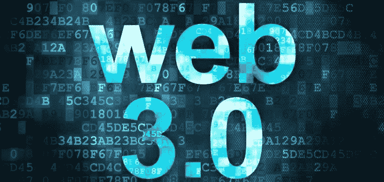

# 什么是 WEB3.0，它是如何工作的？

> 原文：<https://medium.com/coinmonks/what-is-web3-0-and-how-does-work-e7a704eeafcf?source=collection_archive---------25----------------------->

Source photo [web 3 — Bing images](https://www.bing.com/images/search?view=detailV2&ccid=cFxvvfdJ&id=CEA5C2BBACDC9D361DB254CDE17A763F70983D2B&thid=OIP.cFxvvfdJwLbKSs0JoS3cSAHaDg&mediaurl=https%3a%2f%2fwww.cryptocurrencyguide.org%2fwp-content%2fuploads%2f2018%2f06%2fweb3.0-750x356.jpg&cdnurl=https%3a%2f%2fth.bing.com%2fth%2fid%2fR.705c6fbdf749c0b6ca4acd09a12ddc48%3frik%3dKz2YcD92euHNVA%26pid%3dImgRaw%26r%3d0%26sres%3d1%26sresct%3d1%26srh%3d617%26srw%3d1300&exph=356&expw=750&q=web+3&simid=608034904045271854&FORM=IRPRST&ck=6AC86ED7DD299F1B80977330BB131132&selectedIndex=15&ajaxhist=0&ajaxserp=0)

在不久的将来，将会有一个被称为 Web3.0 的互联网新版本。语义网，或读写执行网，是万维网发展的下一步。在 Web 3.0 中，去中心化、开放性和用户有用性是主要的主题。你肯定是对的？

NFT、区块链和加密货币组成了 Web3.0。由于区块链技术，用户的钱包地址是…