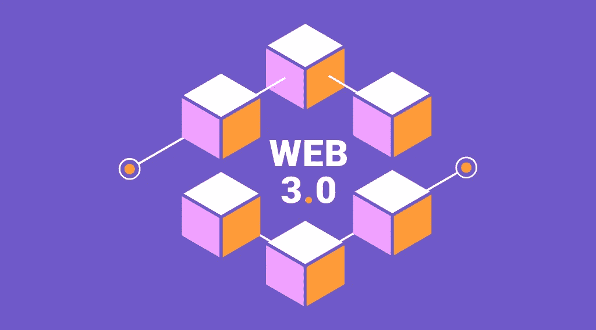

# 什么是 Web3？从今天开始的新互联网时代！

> 原文：<https://medium.com/coinmonks/what-is-web3-the-new-internet-era-starting-today-c47fe5a7a18c?source=collection_archive---------32----------------------->

互联网已经走过了漫长的道路。这些年来，它发展迅速，今天的应用程序与它们的祖先完全不同。想想互联网是如何影响你的日常生活的。想想社会因为它发生了怎样的变化。社交媒体平台。移动应用。千兆字节的内容。流式传输。送货服务。所有这些只是全球互联网发展的第二阶段。现在，互联网正在经历另一场变革。奇怪的是，虽然许多国家面临高失业率，这似乎是由转向新的技术范式引起的，但互联网也在走向一个新的水平。在新的 [StealthEX](https://stealthex.io/) 文章中阅读更多关于 Web3 的内容。

# Web 1.0:这一切是如何开始的？

互联网的发展通常分为三个不同的阶段:Web 1.0、Web 2.0 和 Web 3.0 或 Web 3。

Web 1.0 是万维网的第一次迭代，它可以被称为只读 Web。它的大多数用户是内容消费者，而包含主要以文本或图形格式呈现的信息的网站是由开发者创建的。这个互联网时代始于 1991 年，大致持续到 2004 年。

Web 1.0 由提供静态内容而不是动态 HTML 的网站组成。数据和内容是从静态文件系统而不是数据库中提供的，网站几乎不提供交互性。

# 什么是 Web2 和 Web3？

我们大多数人第一次接触到当前形式的互联网，通常被称为 Web2。你可以把这个阶段想象成一个交互和社交的互联网时代。

在 Web2 的世界里，你不一定要成为开发者才能成为创造者。许多应用程序被设计成任何人都可以发布自己的内容。虽然我们知道万维网在许多方面都是一个很好的工具，但在一些领域我们可以做得更好，其中包括应用程序货币化、用户隐私和安全。

Web3 或 Web 3.0 通常被称为互联网的下一个阶段。这个想法出现在 1991 年左右，当时科学家 W. Scott Stornetta 和 Stuart Haber 启动了第一个区块链——一个给数字文档加时间戳的项目。但这一想法直到 2009 年比特币推出后才为人所知。现在，10 多年过去了，科技公司的高层管理人员正迁移到区块链公司创建 web3。

# Web3 是做什么用的？Web2 vs Web3

什么是虚拟的 Web3？那么，Web3 使用区块链、加密货币和 NFTs 以所有权的形式将权力还给用户。在 Web3 中，应用程序要么在区块链上运行，要么在多个对等节点(服务器)的分散网络中运行，要么在这两种技术的组合中运行，这两种技术形成了一个加密经济协议。这种应用通常被称为 DApps(分散式应用)。

Web2 和 Web3 之间有一些基本的区别，但它们的核心是去中心化的。Web3 改进了我们今天所知的互联网，并增加了一些新功能，如下所示:

*   不可靠的
*   本机内置支付
*   自治的
*   未经许可
*   分布的

为了实现一个稳定和安全的分散网络，其成员(开发者)受到激励并相互竞争，以向使用它的每个人提供最高质量的服务。

Web3 和 Web3 的含义通常与加密项目联系在一起。这是因为加密货币在这些协议中扮演着重要角色。它为那些参与创建、管理、贡献或改进平台的人提供财务激励(代币)。

这些协议通常提供各种服务，如计算、存储、带宽、身份、托管和其他 web 服务，这些服务在过去通常由云提供商提供。你还会发现，由于消费者直接向网络提供商付费，不必要的、通常效率低下的中介被砍掉了。

# Web3 加密项目

根据 Gavin Wood 的说法，Web 3.0 应用和实用程序远远超出了区块链的世界。Gavin Wood 是 Polkadot 的创始人，我们之前提到的 Polkadot T1 和它的原生 T2 DOT coin T3 很可能成为即将到来的 Web3 时代的先驱之一。

其他可能率先进入新阶段的公司还有[以太坊(ETH)](https://stealthex.io/coin/ethereum) 、 [Chainlink (LINK)](https://stealthex.io/coin/chainlink) 、 [Filecoin (FIL)](https://stealthex.io/coin/filecoin) 、[草间弥生(KSM)](https://stealthex.io/coin/kusama) 、 [Stepn (GMT)](https://stealthex.io/coin/stepn) 、 [Theta 网络(THETA)](https://stealthex.io/coin/THETA) 、[氦(HNT)](https://stealthex.io/coin/helium) 。

在我们的下一篇文章中，我们将讨论 Web3 的前景、投资和它的未来。同时，如果你正在寻找如何投资 Web3，欢迎你使用 [StealthEX](https://stealthex.io/) 购买与新互联网时代相关的硬币。我们的加密收藏有 400 多种不同的硬币，您可以立即进行钱包到钱包的转账，没有任何问题。

只需进入[stealth x](https://stealthex.io/)并遵循这些简单的步骤:

1.  选择要兑换的货币对和金额。例如，BTC 到θ。
2.  按下“开始交换”按钮。
3.  提供要将您的加密传送到的收件人地址。
4.  处理交易。
5.  接收您的加密硬币。

在[媒体](https://stealthex-io.medium.com/)、[推特](https://twitter.com/Stealthex_io)、[电报](https://t.me/StealthEX)、 [YouTube](https://www.youtube.com/channel/UCeES_XBesX76ge7xf1meuSw) 和 [Reddit](https://www.reddit.com/user/Stealthex_io) 上关注我们，了解关于 [StealthEX.io](https://stealthex.io/) 和其他秘密世界的最新消息。

在购买任何密码之前，不要忘记做自己的研究。本文表达的观点和意见仅代表作者个人。

*原载于 2022 年 6 月 1 日*[*https://stealthex . io*](https://stealthex.io/blog/2022/06/01/what-is-web3-the-new-internet-era-starting-today/)*。*

> 加入 coin monks[Telegram group](https://t.me/joinchat/Trz8jaxd6xEsBI4p)学习加密交易和投资