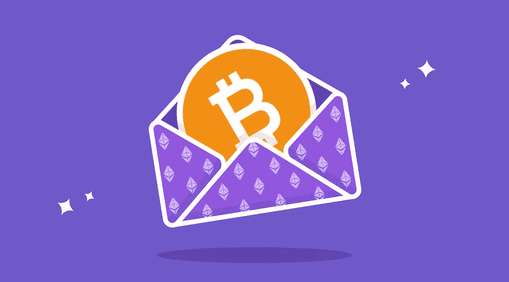

# 什么是包裹比特币 WBTC 和其他包裹硬币？

> 原文：<https://medium.com/coinmonks/what-is-wrapped-bitcoin-wbtc-and-other-wrapped-coins-72ab974b81c6?source=collection_archive---------33----------------------->

比特币是世界上最受认可的加密货币，当然也是市场上流通的最受炒作的数字资产。然而，BTC 只是数字货币进化的第一步。在过去的十年中，其背后的技术经历了大量的更新和改进，创造了以太坊等智能合约区块链，并最终形成了[去中心化金融(DeFi)](https://stealthex.io/blog/2022/04/27/what-is-defi-in-crypto-is-decentralized-finance-the-future/) 生态系统。这就是包装比特币的用武之地。在新的 [StealthEX](https://stealthex.io/) 文章中阅读更多关于什么是包装比特币和其他包装加密的信息。

# 什么是包装比特币？

为了在以太坊的 DeFi 生态系统中使用比特币，开发者必须发明一种代表比特币的 ERC-20 令牌。[包装比特币(WBTC)](https://stealthex.io/coin/wrapped-bitcoin) 旨在通过将比特币的价值和流动性引入充满活力和快速发展的 DeFi 世界，结合两个世界的最佳之处。包装好的比特币更像是比特币本身的稳定币。本质上，包装令牌可以被定义为两个独立区块链之间的桥梁。

锁定比特币并将其转化为 ERC20 令牌的过程被称为“包装”，在这种情况下，它是包装加密。原始资产被“包装”到一个数字保险库中，并创建一个新生成的令牌在其他平台上进行交易。包装比特币(WBTC)可以 1:1 的比例兑换 BTC。

WBTC 于 2019 年 1 月在[以太坊](https://stealthex.io/coin/ethereum)主网上推出，只有 WBTC 分散自治组织(DAO)的管理成员才能决定协议的重大升级和更改。

# 包装比特币(WBTC)与比特币(BTC):特点

BTC 持有者可以使用包裹 BTC 参与以太坊的分散金融(DeFi)生态系统。一枚比特币可以很容易地转换成一枚包装好的比特币，反之亦然。唯一的主要区别是，WBTC 比普通比特币快得多，费用也低得多。WBTC 的关键优势在于它融入了以太坊钱包、去中心化应用(dApps)和智能合约的世界。

为了增加信任和透明度，包装好的比特币会定期接受审计:比特币和以太坊网络的所有链上交易和验证都会在登记册中公布，以避免任何错误、欺诈或误解。

## 包装比特币的优势

WBTC 和其他包装好的比特币替代品可以在 Uniswap 这样的分散交易所交易。除了交易 WBTC，你还可以把它放在 Uniswap 上，根据交易费赚取回报。

以太坊的整体价值远低于比特币，这限制了该系统未来的发展。比特币有助于这些协议的发展，并提高它们的流动性。包装比特币还允许比特币持有者将其作为资产持有，同时也可以使用像 Compound 这样的 DeFi dApps 来借钱或借钱。

## 包装比特币的缺点

WBTC 几乎没有缺点，然而，在 ETH 平台上运行比特币的整个想法多少削弱了 BTC 的目的。此外，最大类型的包装比特币是 WBTC，由于它是最初的包装加密，它由 BitGo 控制，BitGo 是一家容易受市场波动影响的中央集权公司。与任何公司一样，它可以破产或冻结账户，并阻止人们赎回他们包装好的比特币。

最后，尽管定期审计包装 BTC 可能永远不会有同样的安全水平，因为它的控制和检查的人，这是 WBTC 的主要缺陷。与纯代码管理的比特币不同，包装 BTC 依赖于人类，可能会因人为错误而受损。

# WNXM 硬币:包装 NXM，保险的新选择

包装比特币并不是唯一流行的数字“包装”加密。另一个众所周知的加密资产是 [Wrapped NXM (WNXM)](https://stealthex.io/coin/wrapped-nxm) ，这是由 Nexus Mutual 发布的硬币，Nexus Mutual 是一个分散的自治组织和平台，代表了保险的分散替代方案。它使用以太坊的力量，因此人们可以共同分担风险，而不需要保险公司。

包装好的 NXM 代币可以自由转让，这是一种原产于 [Nexus Mutual](https://stealthex.io/coin/nexus) 的包装好的会员代币。只有 NXM 会员可以包装和打开代币，因为 NXM 的核心代币供应必须符合监管标准。然而，WNXM 令牌超出了 Nexus Mutual 或 NXM 的能力范围。任何以太坊地址都可以拥有 WNXM。此外，它还可以被 Uniswap 等自动做市商收购。WNXM 的优势可以被许多密码爱好者所利用，并且代表了一个投资机会。

除了 WBTC 和 WNXM，还有许多其他包装的加密货币，包括包装的 TRON (WTRX 硬币)，包装的 BNB (WBNB 硬币)，包装的 AVAX (WAVAX 硬币)等。

# 结论

WBTC 的加密世界很受欢迎:在短短一年多的时间里，价值约 8 亿美元的比特币被转换成包装比特币:该行业的资本总额足够大，crypto analytics 可以说 WBTC 和其他包装代币已经占据了市场份额。包装硬币提高了交易所的流动性和资本效率，因为它们有助于在多个链条之间转移资产。目前，这些代币的前景看好，如果它们得到进一步发展，我们可以预计对包装 BTC 及其替代品的需求将会增加。

# 哪里可以买到 WBTC 密码？

[StealthEX](https://stealthex.io/) 来帮你买包装好的比特币。你可以私下做这件事，不需要注册服务。我们的加密收藏有 400 多种不同的硬币，您可以立即进行钱包到钱包的转账，没有任何问题。

# 如何购买 WBTC 硬币？

只需去 [StealthEX](https://stealthex.io/) 并遵循这些简单的步骤:

1.  选择要兑换的货币对和金额。比如， [BTC](https://stealthex.io/coin/bitcoin) 到 [WBTC](https://stealthex.io/coin/wrapped-bitcoin) 。
2.  按下“开始交换”按钮。
3.  提供要将您的加密传送到的收件人地址。
4.  处理交易。
5.  接收您的加密硬币。

在 [Medium](https://stealthex-io.medium.com/) 、 [Twitter](https://twitter.com/Stealthex_io) 、 [Telegram](https://t.me/StealthEX) 、 [YouTube](https://www.youtube.com/channel/UCeES_XBesX76ge7xf1meuSw) 和 [Reddit](https://www.reddit.com/user/Stealthex_io) 上关注我们，了解关于 [StealthEX.io](https://stealthex.io/) 和其他加密世界的最新消息。

在购买任何密码之前，不要忘记做你自己的研究。本文表达的观点和意见仅代表作者个人。

*原载于 2022 年 6 月 9 日*[*https://stealthex . io*](https://stealthex.io/blog/2022/06/09/what-is-wrapped-bitcoin-wbtc-and-other-wrapped-coins/)*。*

> *加入 Coinmonks* [*电报频道*](https://t.me/coincodecap) *和* [*Youtube 频道*](https://www.youtube.com/c/coinmonks/videos) *了解加密交易和投资*

# 另外，阅读

*   [3 商业评论](/coinmonks/3commas-review-an-excellent-crypto-trading-bot-2020-1313a58bec92) | [Pionex 评论](https://coincodecap.com/pionex-review-exchange-with-crypto-trading-bot) | [Coinrule 评论](/coinmonks/coinrule-review-2021-a-beginner-friendly-crypto-trading-bot-daf0504848ba)
*   [莱杰 vs n 格拉夫](/coinmonks/ledger-vs-ngrave-zero-7e40f0c1d694) | [莱杰纳诺 s vs x](/coinmonks/ledger-nano-s-vs-x-battery-hardware-price-storage-59a6663fe3b0) | [币安评论](/coinmonks/binance-review-ee10d3bf3b6e)
*   [Bybit Exchange 审查](/coinmonks/bybit-exchange-review-dbd570019b71) | [Bityard 审查](https://coincodecap.com/bityard-reivew) | [Jet-Bot 审查](https://coincodecap.com/jet-bot-review)
*   [3 commas vs crypto hopper](/coinmonks/3commas-vs-pionex-vs-cryptohopper-best-crypto-bot-6a98d2baa203)|[赚取加密利息](/coinmonks/earn-crypto-interest-b10b810fdda3)
*   最好的比特币[硬件钱包](/coinmonks/hardware-wallets-dfa1211730c6) | [BitBox02 回顾](/coinmonks/bitbox02-review-your-swiss-bitcoin-hardware-wallet-c36c88fff29)