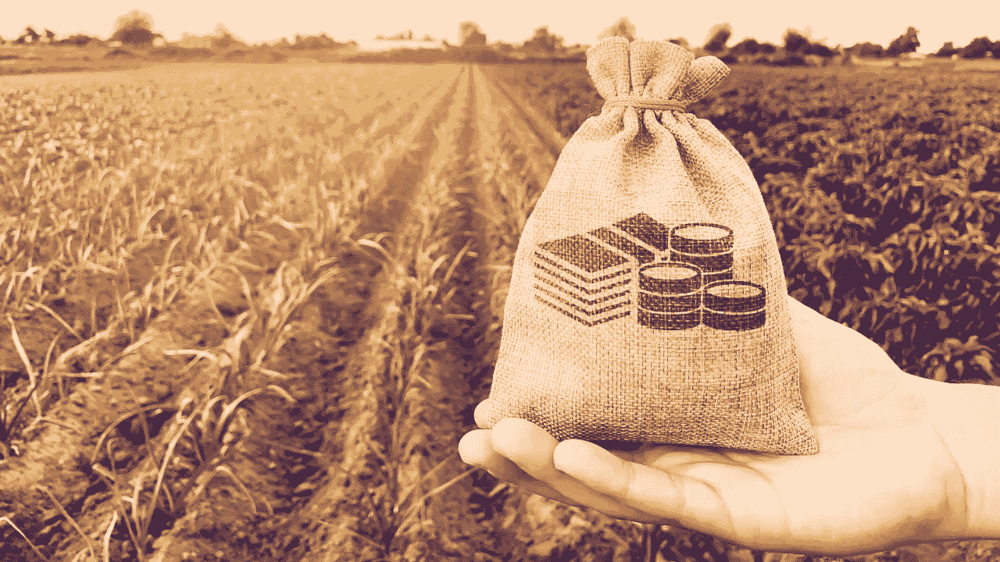

# 什么是产量农业？

> 原文：<https://medium.com/coinmonks/what-is-yield-farming-5e7ac42e4d0b?source=collection_archive---------30----------------------->

# 介绍

随着基于**无信任**、**无中介**交易的**Defi**的流行。Defi 是区块链运动的最大受益者。随着几乎每天都有不同的协议和令牌出现，Defi 在经济上也变得更加有利可图。产量农业就是这样一个有益的新概念。

**Yield Farming** 是一个**协议**(智能合约)，让你从你持有的密码中赚取更多的密码。它包括**用协议锁定**你的密码，而**将**借给别人，并从中赚取**利息**。

在更详细地讨论产量农业及其工作原理之前，让我们先讨论一下什么是产量？

# 产量

简单来说，

> 收益率定义为**投资金额获得的**利息。

通常，产量是根据年化利率(APR)每年估算的。

例子:考虑一个债券的例子，你投资了 5000 印度卢比，一年内获得 500 印度卢比的利息。因此，债券的年利率为 10%(500*100/5000)。

# 高产农业

收益农业是一种**无许可流动性**协议，其中**流动性提供者**或密码持有者将密码添加到**流动性池**中，以从其持有的资产中产生回报。典型的，基于以太坊的 [ERC-20 代币](https://ethereum.org/en/developers/docs/standards/tokens/erc-20/)用于农耕。

什么是流动性池？这是一个聪明的合同，有限合伙人提供的所有资金都存放在这里。作为流动性的回报，他们将获得代币奖励(在[复合](https://compound.finance/)的情况下，您还将获得**复合**治理代币奖励)。

对于那些长期投资 cryptos 的有限合伙人来说，产量农业是一个很好的被动收入来源(著名的是 [HODL](https://www.investopedia.com/terms/h/hodl.asp) )。

# 产量农业是如何运作的？

产量养殖与**自动做市商**密切相关。通常涉及流动性池和有限合伙人。流动性池为用户可以借出、交换或借入资产的市场提供动力。

这些费用反过来用于奖励有限合伙人，在某些情况下，根据有限合伙人在资金池中的份额，作为激励有限合伙人参与的额外象征。存放在池中的资金通常在**稳定硬币**中，尽管这不是一般情况。

什么是**自动做市商(AMM)** ？AMM 是一种**分散交易(DEX)** 协议，它依靠数学公式来为资产定价，而不是使用**订单簿**来发现价格。

例如: [Uniswap](https://uniswap.org/) AMM 的工作方式类似于 **X*Y = K，**其中 **X** 是一个令牌的令牌数量，而 **Y** 是另一个**的令牌数量。**使得 **K** 保持不变，意味着总流动性始终保持不变。基于此，如果假设 **X** 的代币数量下降，那么 **X** 的代币价格就会上涨。

# 如何贷款？

一般来说，如果你想贷款，你需要把一些东西作为抵押，作为贷款的保险。那么借款人需要放多少抵押品呢？嗯，这取决于协议，该协议定义了所谓的**抵押比率**。

抵押率是指抵押品价值占所借贷款的百分比。如果抵押品的价值低于协议规定的**阈值**，那么协议将开始在公开市场清算资产。

> 抵押率=抵押品价值/贷款价值

一些协议也有**超额抵押**的概念，这意味着借款人需要增加比他们想借的更多的价值。通常来说，为了在市场动荡时期降低市场的波动性。

一般来说，抵押率大于 100%，这意味着借款人必须拥有比贷款价值更多的抵押品价值。在市场动荡时期的对冲协议。

# **产业园的质量**

随着 Defi 的流行，Yield Farm 正在成为一个吸引 Hodler 的目的地，以停放他们的资产并赚取额外的 cryptos。但这也伴随着风险。由于流动性，产量农场通常面临许多风险。

流动性应该是投资前检查农场质量的一个主要参数。**总值锁定(TVL)** 检查流动性的参数，代表借贷和农场生态系统中锁定了多少密码。

TVL 也是检查不同协议的**市场份额**的重要指标。 [**Defi Pulse**](https://www.defipulse.com/) 是寻找 TVL 的好地方，会让你对产量农场的状态有个大概的了解。

# 风险

一般来说，任何能带来中高回报的投资都伴随着风险。跨不同协议的一些最常见的风险是:

1.  **流动性风险**:有限合伙人无法以任何期望的价格进行买卖，或者由于交易量或参与活动减少，订单执行时间过长。
2.  **非永久性损失的风险:**在一个池中，你将代币成对等值放置；如果在一个 ETH/USDC 对中添加一个 ETH，并且 1 个 ETH 是 2000 个 USDC，则必须添加 1 个 ETH 和 2000 个 USDC。
    因此，由于**价格波动**，与你将代币放入**流动性池**相比，你的代币在**公开市场**的价值损失。
    随着代币价格因套利机会而在不同平台上上涨，这种损失是短暂的。但这可能会带来严重的风险，因为不同代币的价格变化很大。
3.  **Defi 智能合同风险:** Yield farming 是一个智能合同代码，由开发人员或开发人员团队编写。代码中出现的任何错误都可能导致潜在的黑客攻击，导致资金损失或使您的奖励价值为零。
4.  **欺诈和不公平的风险:**收益农业主要由创始人或早期投资者控制，他们拥有资金池的多数股权。
    他们的任何抛售(泵送和倾倒方案)都可能导致流动性不足，由于买卖价差较大，价格需要由小投资者支付。

# 平台

现在你已经有了高产农业的基本知识，这意味着你已经准备好开始赚钱了？不，没那么快。每个协议都有自己的一套**规章制度**，你在投入所有资金之前必须了解这些规章制度。

没有单一的**黄金**策略可以为你赚钱，相反，由于协议的快速变化和其他持有者使用类似的策略，过去适用于你的策略在未来可能不适用，从而降低回报。

因此，在部署任何策略之前，你必须小心谨慎，并采取适当的**风险管理**策略来**保护**你的账户。考虑到这一点，有如此多的平台可以促进借贷活动。一些受欢迎的是:

1.  [**复合**](https://compound.finance/)
2.  [**Uniswap**](https://uniswap.org/)
3.  [Aave](https://aave.com/)
4.  [**向往。财务**](http://yearn.finance/)
5.  [**曲线金融**](https://curve.fi/)

# 结论

产量农业正变得越来越受欢迎，并被广泛用作霍德勒的被动收入方式。毫无疑问，高产农场创造的经济和社会价值是巨大的。

无信任、无许可、无中介的 Defi 是区块链的一个伟大应用，并且有可能触及社会中服务不足的部分。

我希望，以上文章对你有所帮助。如果你做到了，请鼓掌(**👏非常感谢，与朋友分享给我动力，让我在类似的主题上写更多。**

> 加入 Coinmonks [电报频道](https://t.me/coincodecap)和 [Youtube 频道](https://www.youtube.com/c/coinmonks/videos)了解加密交易和投资

# 另外，阅读

*   [有哪些交易信号？](https://coincodecap.com/trading-signal) | [Bitstamp vs 比特币基地](https://coincodecap.com/bitstamp-coinbase) | [买索拉纳](https://coincodecap.com/buy-solana)
*   [ProfitFarmers 点评](https://coincodecap.com/profitfarmers-review) | [如何使用 Cornix Trading Bot](https://coincodecap.com/cornix-trading-bot)
*   [十大最佳加密货币博客](https://coincodecap.com/best-cryptocurrency-blogs) | [YouHodler 评论](https://coincodecap.com/youhodler-review)
*   [my constant Review](https://coincodecap.com/myconstant-review)|[8 款最佳摇摆交易机器人](https://coincodecap.com/best-swing-trading-bots)
*   [MXC 交易所评论](/coinmonks/mxc-exchange-review-3af0ec1cba8c) | [Pionex vs 币安](https://coincodecap.com/pionex-vs-binance) | [Pionex 套利机器人](https://coincodecap.com/pionex-arbitrage-bot)