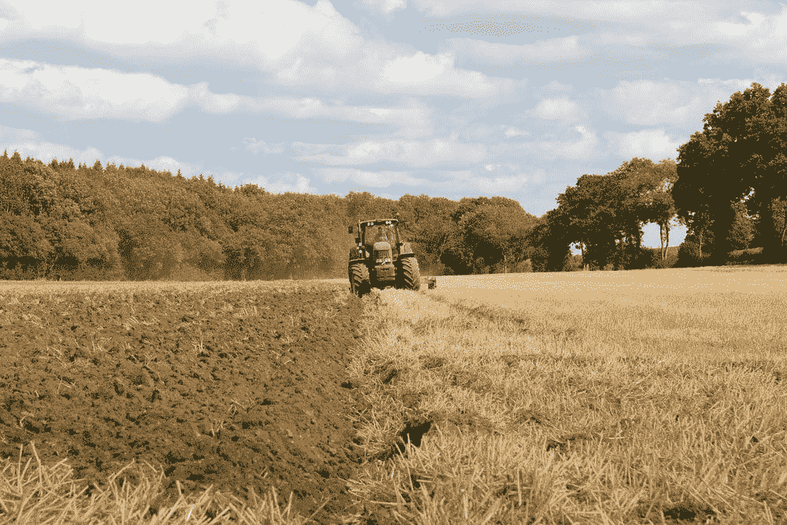
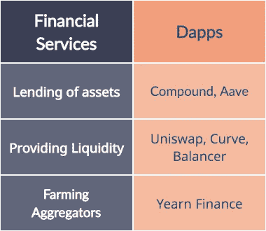

# 什么是产量农业？把你的钱投入工作(创造被动收入)

> 原文：<https://medium.com/coinmonks/what-is-yield-farming-put-your-money-to-work-generate-passive-income-69d1875ecdb5?source=collection_archive---------38----------------------->

你不需要有广泛的加密知识来让你的钱发挥作用。但令人惊讶的是，大多数散户投资者仍将投资放在集中化的实体上，而这些实体给他们带来的只是一点点好处。

你只需要在教育上投资几个小时，你就可以给自己设定一份轻松的被动收入来帮助支付你的账单。让我们回顾一下在分散平台上赚取收益带来的好处和风险。

Yield farming resembles farming in a way where patience and work are rewarded with harvest.

# 什么是产量农业？

产量农业是一种通过锁定不同协议的加密资产获得被动收入的方式。收益率通常比你的银行高得多，然而，由于加密的分散性，你负责你的安全。

如果你信任的资金协议是一个骗局，你会失去你的资金。你应该提防提供令人垂涎的回报的可疑网站，因为这可能是一个骗局。

Do not quite if there are many scams out there — learn how to identify and avoid them.

然而，这不应该阻止你参加下面列出的经过战斗考验的 DeFi 平台。

# 什么是锁定的总价值(TVL)？

衡量 DeFi 平台整体运行状况最常用的指标是锁定总值(TVL)。它是平台上所有资金池的总流动性。

但 TVL 在很大程度上取决于该项目的总市值有多大。这就是为什么你会经常发现市值/ TVL 比率也提供了。

Market cap / TVL ratio is a common health indicator of any DeFi platform.

理论上，这个比例越低，项目越好。较低的比率意味着项目中有更多的流动性，而令牌的价格(以市值的形式)尚未赶上它。

然而，请始终注意，你应该检查大量的其他指标，然后再决定自己是否有足够的把握锁定你的流动性。

# 产量农业是如何运作的？

主要有两种方式，放贷和提供流动性。在这两种选择中，贷款的风险较小。你可以借出你的加密资产，赚取借款人支付的利息，所有这些都是通过智能合同自动执行的。

借款是有抵押的，这意味着借款人必须锁定价值高于其借款价值的抵押品。这确保了即使借款人破产，贷款人也会得到偿还。

# 流动性提供了什么？

尽管在一个中央集权的世界里，贷款是一个熟悉的概念，但在一个去中心化的交易所里提供流动性是一个相当新的、但却是革命性的方法。

If DeFi platforms are the water mills, the liquidity is the water that powers it.

集中式加密交易所使用一个包含买卖盘的指令簿，而 Uniswap 是一个自动做市商，它使用一个数学公式来计算一对令牌之间的汇率(x*y=k)。

为了向某个令牌对提供流动性，你必须在钱包中同时持有 x 和 y 令牌，并将它们锁定在流动性池中——通常两种资产的金额相等。

作为交换，你可以获得 LP(流动性提供者)代币，它代表你在资金池中的份额，可以随时换回 x 和 y 代币。

唯一的问题是，由于非永久性的损失，你可能得不到相同数量的 x 和 y，解释如下。

# 有哪些产量养殖平台？

要开始获得回报，你首先要决定上述两种策略中哪一种适合你的风险承受能力。

根据提供的产出服务类型，主要以太坊分散应用如下:

Risks are much lower on an battle-tested platform with good reputation.

无论你选择哪一种，记住收益率每天都在变化。你必须定期检查你的资产，以保持对投资的掌控，并将风险降至最低。

# 有什么风险？

## 非永久性损失

这是提供流动性时遇到的最基本和最常见的风险。因为你总是需要流动性池中两个代币的**相同的** **值** **，如果其中一个资产的价值偏离另一个，你的**持有量就会改变**。**

如果资产 A 的价格相对于资产 B 上涨，你持有的资产 A 会减少，而资产 B 会增加(反之亦然)，以维持 LP 中两个代币的相同价值。

简单来说，非永久性损失是锁定流动性池中的令牌和在一段时间内将它们放在你的钱包中的价值差异。

## 流动性地毯拉力

这种类型的风险与所谓的诈骗令牌相关联。恶意行为者铸造一个新代币，然后将其一部分锁定在与 ETH(或任何其他资产)配对的流动性池中。

他们通常在社交网络上通过虚假的登陆页面和制造炒作来吸引交易者。

在某一点上，他们只是从池中移除所有的 ETH，而买家现在只剩下毫无价值的诈骗令牌。因为不再有流动性(也没有其他上市的交易所)，持有者不能出售代币。

You would lose your balance and fall if somebody were to pull the rug from underneath you.

## 退出-诈骗地毯拉

另一种类型的地毯拉可以发生在阴暗的产量农业供应商。他们一度关闭了官方网站，从 Wayback 机器、谷歌缓存和类似的聚合器中删除了副本，关闭了所有社交媒体渠道，删除了 GitHub 存储库，并带着所有锁定的令牌逃跑了。

如果你不被诈骗项目的巨大 APYs 冲昏头脑，并使用已建立的 DeFi 协议，这是可以避免的。

## 智能合同风险

智能合同代码是不可变的，这就是为什么如果一个智能合同写得不好，它可以被利用而没有追索权的可能性。

换句话说，如果黑客利用智能合同损害资金，拿回你的资产的机会几乎为零。

这种风险被聪明的合同审计公司降低了，他们审查代码并在项目中提供更多的保证。

## 清算风险

当你的抵押品价值低于你的贷款价值时，清算就发生了。你的抵押品被用来偿还债务，一切都通过智能合约自动执行。

如果你的抵押品价值下降或贷款价格上升，清算就会发生。

You need to fully accept, identify and learn how to avoid any risks that come with DeFi. Only you are in charge.

# 结束语

高产农业是收回你的财务控制权的体现。它带来了 DeFi 必须提供的所有额外好处和风险。

一方面，你将从流动性中获得比任何银行、交易所或基金都要高的被动收入。另一方面，你必须对任何行为承担全部责任。

被骗并不难，但如果你采取适当的措施来提高安全性，你将永远不会停止种植甜蜜的加密收益。