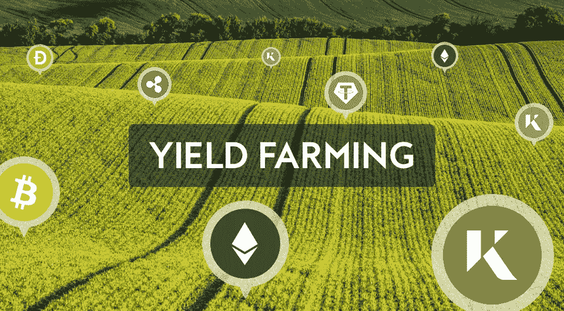
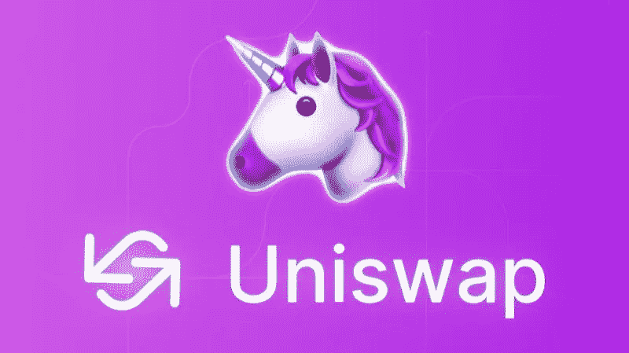

# 什么是产量农业？你应该知道什么

> 原文：<https://medium.com/coinmonks/what-is-yield-farming-what-you-should-know-310a38f6b42?source=collection_archive---------17----------------------->

## 分散金融中的高产农业概述

Yield Farming

**收益农业**是利用**分散金融【DeFi】**实现收益最大化的过程。用户在 DeFi 平台上出借或借用密码，并通过服务赚取加密货币。在这篇文章中，你将学习**什么是 DeFi 的高产农业，以及你应该了解的高产农业**。

想要增加产量的农民可以采用更复杂的策略。例如，收益农民可以不断地在多个贷款平台之间转移他们的密码，以优化他们的收益。

# 高产农业:几个简单的事实:

*   收益农业是代币持有者在各种 DeFi 平台上最大化奖励的过程。
*   收益农民向各种代币对提供流动性，并以加密货币赚取回报。
*   高产农业协议包括 Aave、Curve Finance、Uniswap 和许多其他协议。
*   由于价格波动、拉地毯、精明的合同黑客等原因，高产农业可能是一种有风险的做法。

# 产量农业是如何运作的？

收益农业允许投资者通过将硬币或代币放入分散应用程序(dApp)来获得收益。dApps 的例子包括加密钱包、dex、分散式社交媒体等等。

产量农民一般使用[分散交易所(dex)](https://blog.cryptostars.is/what-are-decentralized-exchanges-how-do-dexs-work-4e54fd477e0e)借出、借入或押注硬币来赚取利息，并对价格波动进行投机。DeFi 的产量农业由智能合同推动，智能合同是两方或多方之间自动达成金融协议的代码片段。

# 高产农业的类型:

*   **流动性提供者**:用户向 a [DEX](https://blog.cryptostars.is/what-are-decentralized-exchanges-how-do-dexs-work-4e54fd477e0e) 存入两枚硬币，提供交易流动性。交易所收取少量费用来交换这两种支付给流动性提供者的代币。这项费用有时可以用新的流动性池(LP)代币支付。
*   **贷款**:硬币或代币持有者可以通过智能合同将 crypto 借给借款人，并从贷款利息中获得收益。
*   **借款**:农民可以用一个代币作为抵押，从另一个代币获得贷款。然后，用户可以用借来的硬币耕种。通过这种方式，农民保留了他们最初持有的硬币，随着时间的推移，这些硬币可能会增值，同时也从他们借来的硬币中获得收益。
*   **赌注**:在 DeFi 的世界里有两种形式的赌注。最主要的形式是区块链，用户向网络抵押他们的令牌以获得安全保障。第二种是用流动性来抵押从提供 DEX 中获得的 LP 代币。这使得用户可以赚取两倍的收益，因为他们为 LP 代币提供流动性而获得报酬，然后他们可以下注以赚取更多的收益。

# 计算产量农业回报

预期收益率回报通常是年化的。预期收益是在一年的时间里计算出来的。

两种常用的衡量方法是年百分率(APR)和年收益率(APY)。APR 没有考虑复利——将收益再投资以产生更大的回报——但是 APY 考虑了。

请记住，这两个测量值仅仅是预测和估计。即使是短期优势也很难准确预测。为什么？高产农业是一个竞争激烈的快节奏行业，激励机制瞬息万变。

如果高产农业策略在一段时间内成功了，其他农民就会蜂拥而至利用它，而它最终会停止产生显著的回报。

因为 4 月和 APY 是过时的市场指标，DeFi 将不得不建立自己的利润计算。由于 DeFi 的快速发展，每周甚至每天的预期回报可能更有意义。

# 流行的产量农业协议

# 曲线金融:

就锁定的总价值而言，curve 是最大的 DeFi 平台，平台上有近 190 亿美元。凭借其自己的做市算法，Curve Finance 平台比任何其他 DeFi 平台都更好地利用了锁定资金——这对互换者和流动性供应商都是一种有益的策略。

Curve 提供了一个与法定现金挂钩的稳定现金池的大列表，这些现金池具有良好的年利率。Curve 的年利率一直很高，从 1.9%(针对流动代币)到 32%不等。只要代币不失去其挂钩，稳定的硬币池是相当安全的。非永久性损失可以完全避免，因为它们的成本在相互比较时不会发生剧烈变化。像所有指数一样，曲线也有暂时亏损和精明合约失败的风险。

曲线也有自己的令牌，CRV，用于治理曲线[道](/coinmonks/what-are-daos-why-do-we-need-them-23738ab528df)。

Curve Finance

# Aave

Aave 是使用最广泛的稳定玉米产量农业平台之一，锁定价值超过 140 亿美元，市场价值超过 34 亿美元。

Aave 也有自己的本土符号，AAVE。该令牌通过提供费用节省和治理投票权等好处来激励用户使用网络。

AAVE

当谈到产量农业时，经常会发现流动资金池在一起工作。Gemini dollar 的存款 APY 为 6.98%，借款 APY 为 9.69%，是 Aave 上收益最高的稳定货币。

# Uniswap

Uniswap 是一个 [DEX](https://blog.cryptostars.is/what-are-decentralized-exchanges-how-do-dexs-work-4e54fd477e0e) 系统，支持无信任的令牌交换。流动性提供者投入相当于两个代币的资金来创造一个市场。然后，交易者可以针对流动性池进行交易。作为提供流动性的回报，流动性提供者从其资金池中发生的交易中收取费用。

由于其无摩擦的性质，Uniswap 已成为最受欢迎的无信任令牌交换平台之一。这对高产农业系统很有用。Uniswap 也有自己的[道](/coinmonks/what-are-daos-why-do-we-need-them-23738ab528df)治理令牌 UNI。

Uniswap

# 薄饼交换

PancakeSwap 的工作方式类似于 Uniswap，但是，PancakeSwap 运行在币安智能链(BSC)网络上，而不是在以太坊上。它还包括一些额外的游戏化功能。BSC 代币交换、生息赌注池、不可替代代币(NFT)甚至还有一个赌博游戏，玩家可以在这个游戏中猜测币安硬币(BNB)的未来价格。

PancakeSwap 面临与 Uniswap 相同的风险，例如由于价格大幅波动和智能合约失败而造成的暂时损失。PancakeSwap 池中的许多代币市值较小，这使它们面临暂时亏损的危险。

PancakeSwap 有自己的令牌，称为 CAKE，可以在平台上使用，也可以用于对平台的提案进行投票。

PancakeSwap

# 高产农业的风险

产量农业是一个复杂的过程，借贷双方都面临金融风险。当市场动荡时，用户面临更大的暂时损失和价格下滑的风险。与高产农业相关的一些风险如下:

# 地毯拉手

Rug Pulls 是一种退出骗局，加密货币开发商为一个项目收集投资者的现金，然后放弃它，不向投资者偿还资金。根据 CipherTrace 的一份研究报告，拉地毯和其他出口诈骗(农民特别容易受到这些诈骗的影响)占 2020 年下半年大型诈骗案的 99%左右。

# 监管风险

加密货币监管仍笼罩在不确定性之中。美国证券交易委员会(Securities and Exchange Commission)宣布，一些数字资产是证券，将其置于其管辖范围内，并允许其对其进行监管。州监管机构已经对 BlockFi、Celsius 等集中式加密贷款网站发布了停止令。如果 SEC 宣布 DeFi 借贷生态系统为证券，它们可能会受到打击。

虽然这是事实，但 DeFi 被设计为不受任何中央权威机构的约束，包括政府法规。

# 波动性

波动性是指投资价格向两个方向变动的程度。波动性投资是指短期内价格波动较大的投资。当代币被锁定时，它们的价值可能会下降或上升，这对收益农民来说是一个巨大的风险，尤其是当秘密市场经历熊市时。

## 什么是无常的失去？

在高波动时期，流动性提供者可能会经历非永久性的损失。当流动性池中的代币价格发生变化，随后改变池中代币的比率以稳定其总价值时，就会发生这种情况。

**举例**:

Alice 将 1 ETH 和 2，620 DAI(美元稳定值:1 DAI = 1 美元)存入流动性池，因为一个 ETH 的价值为 2，620 美元(在撰写本文时)。假设该资金池只有三个其他流动性提供者，他们每个人都向资金池存入了相同的金额，使资金池的总价值达到 4 ETH 和 10，480 DAI，即 20，960 美元。

每个流动性提供者都有权获得资金池资金的 25%。如果他们想以目前的价格退出，他们每个人将获得 1 个 ETH 和 2，620 DAI。但是 ETH 价格下跌会怎么样呢？

如果 ETH 的价格开始下跌，这意味着交易者正在为戴卖出 ETH。这导致池子的比例移动，从而变得更重。Alice 在资金池中的份额仍为 25%，但她现在拥有的 ETH 与 DAI 的比率更高。她在资金池中 25%份额的价值现在将低于她最初存入资金时的价值，因为交易者正在以低于 Alice 向资金池添加流动性时的价值出售他们的 ETH。

这被称为非永久性损失，因为这种损失只有在从资金池中提取流动性时才会发生。如果流动性提供者决定将他们的资金留在资金池中，随着时间的推移，流动性价值可能会也可能不会达到平衡。在某些情况下，通过提供流动性赚取的费用可以抵消非永久性的损失。

# 智能合同黑客

与高产农业相关的大多数危险都与支撑它们的智能合同有关。通过更好的代码审查和第三方审计，这些合同的安全性正在得到改善，然而，DeFi 中的黑客攻击仍然很常见。

DeFi 用户应在使用任何平台之前进行研究和尽职调查。

# 产量养殖有利可图吗？

是的。然而，这取决于你愿意在高产农业上投入多少金钱和精力。尽管某些高风险策略承诺了丰厚的回报，但它们通常需要彻底掌握 DeFi 平台、协议和复杂的投资链才能最有效。

如果你正在寻找一种无需投入大量资金就能获得一些被动收入的方法，尝试将一些加密货币放入一个经过时间考验的值得信赖的平台或流动性池，看看它能赚多少钱。在你建立了这个基础并建立了信心之后，你可能会转向其他投资，甚至直接购买代币。

# 产量养殖有风险吗？

风险农业有许多风险，投资者在开始之前应该了解。欺诈、黑客攻击和波动性导致的损失在 DeFi yield 农业领域并不罕见。对于任何希望使用 DeFi 的人来说，第一步是研究最值得信赖和经过测试的平台。

# 结束语

我们已经了解了加密货币领域的最新热潮——收益农业。

这种去中心化的金融革命还能带来什么？很难预见在这些现有组件的基础上，未来会涌现出什么样的新应用。然而，不可信的流动性协议和其他 DeFi 产品无疑处于金融、密码经济学和计算机科学的前沿。

毫无疑问，DeFi 货币市场有助于创建一个更开放、更易使用的金融系统，任何人只要有互联网连接就可以使用。

另外，阅读

 [## 加密中的 DeFi:2022 年最值得投资的 5 种 DeFi 硬币

### 2022 年最值得投资的硬币

blog.cryptostars.is](https://blog.cryptostars.is/defi-in-crypto-the-top-5-defi-coins-to-invest-in-2022-1f25e05cf7a4) 

## 在 Linkedin 上关注我，保持联系

【https://www.linkedin.com/in/ishanshahzad/ 号