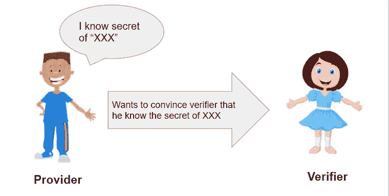

# 什么是零知识证明

> 原文：<https://medium.com/coinmonks/what-is-zero-knowledge-proofs-9c1c62e4ecdc?source=collection_archive---------22----------------------->

Image : Concept of Zero Knowledge Proof

零知识证明是一种协议，它使被称为**证明者**的一方能够说服另一方**验证者**某个陈述是真实的，而不会透露该陈述真实性之外的任何信息。例如，证明者可以为如下语句创建证明:

*   *“我知道对应于这个公钥的私钥”*:在这种情况下，证明不会泄露关于私钥的任何信息。
*   *“我知道一个私钥，它对应于这个列表中的一个公钥”*:和以前一样，证明不会揭示关于私钥的信息，但是在这种情况下，相关联的公钥也将保持私有。
*   *“我知道这个散列值的前像”*:在这种情况下，证明将显示证明者知道前像，但是它不会揭示关于该前像的值的任何信息。
*   *“这是一个不产生负结余的区块链数据块的散列值”*:在这种情况下，证据不会显示数据块中所包含的交易的金额、来源或目的地的任何信息。

**非交互式零知识证明** NIZK 是一种特殊类型的零知识证明，其中证明者可以在不与验证者交互的情况下生成证明。NIZK 协议非常适合以太坊区块链应用，因为它们允许智能合约充当验证者。这样，任何人都可以生成一个证明，并将其作为交易的一部分发送到智能合约，智能合约可以根据证明是否有效来执行一些操作。

让我们从绝对的零开始。考虑以下多项式:-

这里，`a`、`b`、`c`、`d`、`e`、`f`、`g`、`h`为常量。假设我们有一对`(x,y)`，我们想验证`(x,y)`是否满足这些等式。为了验证，我们可以将提供的值`(x,y)`代入方程，并检查两个方程的 LHS = RHS。

现在，想象我们有数百万个方程和数百万个变量要验证。我们该怎么做？我们可以在云上获得一些好的硬件并进行验证。

然而，现在想象一下，我们想要一个智能合约来验证这数百万个方程和变量。由于区块链上的资源有限，您可能希望避免在链上执行这数百万次检查。这就是零知识证明的用武之地。

ZK 允许我们生成一个“证明”，证明一组变量满足一组方程。这个证明令人惊叹的地方在于它很小，大小固定(64 字节)，与它要证明的方程和变量的数量无关。任何人都可以得到这个证据并“验证”它。验证这一证明的计算资源既便宜又稳定(以太坊上的大约 300K 气体)

因此，与其在智能合约中执行数百万次计算，不如为它们创建一个 zk 证明，并将其提供给智能合约。智能合约应实现证据验证算法，如果证据通过检查，智能合约可以使用变量进行进一步计算。这就像计算压缩。

ZK 的另一个惊人的特性是你可以以加密的形式提供变量。这意味着我可以证明某组变量满足给定的方程，而不需要透露变量的值。

最后，我想提一下，用多项式的形式来表示所有的计算是可能的。因此，ZK 可以用来证明一般的计算。

> *加入 Coinmonks* [*电报频道*](https://t.me/coincodecap) *和* [*Youtube 频道*](https://www.youtube.com/c/coinmonks/videos) *了解加密交易和投资*

# 另外，阅读

*   [Bookmap 评论](https://coincodecap.com/bookmap-review-2021-best-trading-software) | [美国 5 大最佳加密交易所](https://coincodecap.com/crypto-exchange-usa)
*   最佳加密[硬件钱包](/coinmonks/hardware-wallets-dfa1211730c6) | [Bitbns 评论](/coinmonks/bitbns-review-38256a07e161)
*   [新加坡十大最佳加密交易所](https://coincodecap.com/crypto-exchange-in-singapore) | [购买 AXS](https://coincodecap.com/buy-axs-token)
*   [红狗赌场评论](https://coincodecap.com/red-dog-casino-review) | [Swyftx 评论](https://coincodecap.com/swyftx-review) | [CoinGate 评论](https://coincodecap.com/coingate-review)
*   [投资印度的最佳密码](https://coincodecap.com/best-crypto-to-invest-in-india-in-2021)|[WazirX P2P](https://coincodecap.com/wazirx-p2p)|[Hi Dollar Review](https://coincodecap.com/hi-dollar-review)