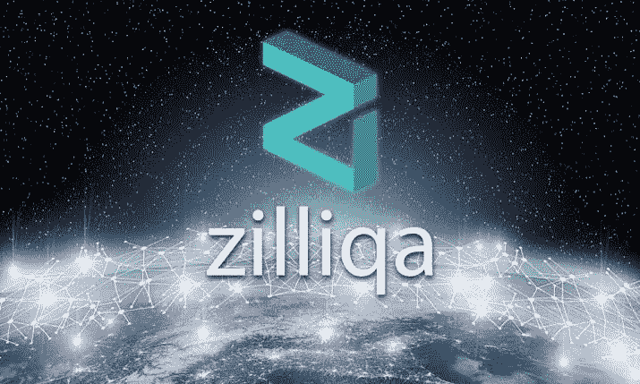

# 什么是(ZIL ),为什么 zilliqa 区块链是独一无二的？

> 原文：<https://medium.com/coinmonks/what-is-zil-and-why-is-zilliqa-blockchain-unique-44d20f96640f?source=collection_archive---------26----------------------->

在这篇文章中，我们将分解 Zilliqa 区块链，为什么它是一个独特的项目。

现在我们来谈谈齐力卡·区块链？Zilliqa 是一款无需许可的区块链，旨在提供高吞吐量，能够每秒完成数千笔交易。它试图通过采用分片作为第二层扩展解决方案来解决区块链可扩展性和速度的问题。

Zilliqa 硬币(ZIL)是 Zilliqa 区块链的本地加密硬币。ZIL 实际上是用来执行程序和用来支付区块链上的交易。这些费用用于奖励执行计算以运行区块链的节点。

# Zilliqa 有什么独特之处

Zilliqa 使用分片来最大化每秒可以确认的事务数量。此外，区块链使用了一种不常见的共识机制。这些概念将在下面详细解释:

# Zilliqa 分片

区块链是一组账户余额和交易历史的记录。该记录由大量独立的计算机(称为节点)共享，这些计算机必须在确切的细节上相互一致。每次添加新交易时，所有节点都检查它是否是欺诈性的，然后将其添加到它们的记录副本中。

可以将这个记录分成更小、更简单的部分，以便更容易(因此也更快)添加。主记录的每个较小部分称为一个碎片。

节点组被分配给每个碎片，它们执行和以前一样的操作，添加和检查新的事务。每隔一段时间，一个单独的节点组会将每个分片的记录组合起来，在再次分片之前统一信息。

通过这种方式，分片允许整个网络有效地访问余额和交易数据，但不需要网络上的每个节点都有自己的整个记录的巨大副本。节点只处理分配给它们的碎片。

# Zilliqa 共识

区块链共识机制允许独立节点共享相同的“真相”。换句话说，所有区块链帐户的余额和交易历史记录都具有相同的值。

有许多不同类型的共识，但它们都是通过使一个节点(或一小组节点)很难或很昂贵地欺骗网络的其余部分接受欺诈交易来起作用的。

共识允许所有参与者在没有中央权威的情况下保持良好的行为。

Zilliqa 使用一种不寻常的共识机制，结合了工作证明(PoW)和实用拜占庭容错(pBFT)。

PoW 使得欺骗其他节点变得困难，因为这样做需要大量的计算能力。只有当新记录(块)是第一个建议的记录时，才会添加它。第一个成功提出新区块的节点在 ZIL 获得区块奖励。

pBFT 使得欺骗其他节点变得困难，因为在添加新块之前，所有节点必须一致同意新块的真实性。

添加欺诈交易的唯一方法是同时控制所有节点。参与一致决策的每个节点都获得一小部分块奖励。

Zilliqa 团队声称，PoW 和 pBFT 共同创建了一种安全机制，允许以较低成本的计算进行挖掘。

Zilliqa 上确实还有其他主要功能。

你可以加入他们的官方电报社区来了解更多关于 Zilliqa 区块链的信息。

链接 https://t.me/zilliqachatbelow⬇️

更多文章请关注我的媒体。

> 交易新手？试试[加密交易机器人](/coinmonks/crypto-trading-bot-c2ffce8acb2a)或者[复制交易](/coinmonks/top-10-crypto-copy-trading-platforms-for-beginners-d0c37c7d698c)