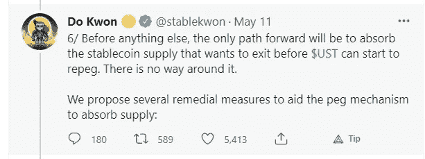

# 我从 Terra 的崩溃中学到了什么

> 原文：<https://medium.com/coinmonks/what-ive-learnt-from-the-collapse-of-terra-88c03ee5b177?source=collection_archive---------5----------------------->

## 痛苦时期的教训，这一集的主要收获

好吧，这次我会为这篇文章做一些不同的事情。我只想简单说说我对最近发生的事情的想法和看法。

你们大多数人现在应该已经听说了，Terra 崩溃了。在 UST 开始衰退后，它进入了死亡螺旋。尽管他们试图用外汇储备来捍卫联系汇率，但最终没有奏效。抛售压力实在太大了。

已经有很多很好的文章和推文解释了整个事件发生的时间和过程，所以我就不再赘述了。

像往常一样，欣赏这张 2 只熊猫在一起放松的照片吧！

Photo by [Pascal Müller](https://unsplash.com/@millerthachiller?utm_source=medium&utm_medium=referral) on [Unsplash](https://unsplash.com?utm_source=medium&utm_medium=referral)

好，我们开始吧。我被认为很幸运。虽然我持有 LUNA，但这是一个非常小的仓位，因为大部分都在 UST。它占了我密码投资组合的 30%以上。如果这件事不是最近发生的，我会不断地投入更多的钱，逐渐地。

我在网上听说和阅读了许多故事，人们贷款，卖掉他们的房子或汽车，只是为了筹集资金投资到 Anchor protocol，以利用有吸引力的 19+% APY 获得可观的被动收入，这真的很不幸。
随着 LUNA 的崩溃和市场极度看跌，这确实是一些强有力的组合。

但是，我们都知道市场有起有落。只要我们不放弃，我们最终还是会成功的。前提是我们从经验或教训中学习。

所以，撇开阴谋论不谈，在“研究”或调查这样的项目时，我还能做得更好吗？

一个项目看起来很有潜力，但是我应该花更多的时间去正确理解它的缺点，而不仅仅是它的好处。

当我们处于牛市时，很容易被蒙蔽。一切似乎都很容易赚钱。每个人似乎都在赚 100 美元.突然间，每个人似乎都知道自己在说什么或做什么。我应该多看看多想想，

*   有什么关键问题会导致它失败吗？
*   是否正在制定或已经制定了任何应对措施？
*   有人有可能轻而易举地利用这个弱点吗？

2 仅仅因为一个项目在过去的几个月、几年里做得很好，并不意味着这个轨迹会继续下去

Photo by [Guillermo Ferla](https://unsplash.com/@gferla?utm_source=medium&utm_medium=referral) on [Unsplash](https://unsplash.com?utm_source=medium&utm_medium=referral)

就像在大规模的事情中，一个项目的诞生到现在只是时间线上的一个小飞艇，成就是有的，但却毫无意义。在加密世界里，不断有许多事情发生。新的 NFT 诞生了，新的项目上线了，协议被利用了或者变得拥挤了。

事情会变，有时会变得很快。它的优势(表现良好)可能已经被侵蚀掉了。跟踪项目的频繁更新，并考虑这是否符合项目的最大利益。

3 开发商的社会形象
项目的形象

这可以被视为众多营销策略中的一种。与社区保持联系，在那里出现真的对项目有帮助。但是，当这个项目的形象在网上变得傲慢，当其他人可能会或可能不会提出合法的问题时，左右逢源，会发生什么呢？也许是时候重新审视事物了。这些问题是真的突出了一个缺陷还是他们只是想传播 FUD？

*   当其他开发人员面对棘手的问题时，他们是如何处理问题的？
*   这是对这些问题的一个精心制作的回答吗？还是它们只是被侮辱或误导而置之不理，让你感到更加困惑？

还有一点，在网上嘲讽别人一般不是个好主意。我个人觉得这只是太多的热量，风险和太多的利害关系。就像一个项目不可能从一开始就 100%完美或万无一失。一路上肯定会有一些小问题。现在牵扯到这么多美元或 TVL，不经过深思熟虑就说出你想要的是相当鲁莽的。

*或者这也是一种营销策略？一个扑灭 FUD 火焰、激发人们对该项目新信心的策略？也许我还生活在 40 年代，而其他人已经生活在 40 年代了。*

永远不要把别人的话当真。如果我仍然不明白或者看不出这是一个实际的解决方案，我应该挖得更深或者尽我的铲子所能带来的努力，至少现在是这样。

我的错误是，当第一次去标记(回到 0.93，再也没有)发生时，我愚蠢地认为有一个实际的计划。

有计划帮助 UST 恢复造币厂(1164 号提案——将造币能力从 2 . 93 亿英镑提高到 1 . 2 亿英镑),但这并不是什么新鲜事，实施之前也需要一些时间。(“耶”，为了分权！)所以对这种情况不会有多大帮助。最后，我认为它只是增加了抛售压力，因为它没有获得太多的信心。

This is a tweet

“唯一的出路是，在 UST 开始复苏之前，吸收那些想要退出的稳定的货币供应。**没有办法绕过去。**

这真的很让人难过。

看到这条推特，我就知道没希望了。如果有一种方法可以将弱手牌、纸手牌、普通手牌、铜手牌一直分类到方块手牌，这将有效地将许多手牌变成“**卖手牌**”。我不是说我有一个完美的解决方案，但这样做，难道不会让更多的人对它失去信心，并引发所有不同类别的手开始想卖掉 UST 吗？从而使它更难重复，甚至到了无法回头的地步。

**如果有办法阻止卢娜的价格下跌会怎么样？尽管卢娜面临巨大的铸造压力，但卢娜的美元只是横向徘徊，我们看到 ust 爬回盯住美元。这会给所有投资者信心，让他们停止抛售或不考虑抛售吗？
但说起来容易做起来难，如何连一枚硬币都吸收这么多抛售压力？*

从经验来看，我们都知道把惩罚作为一种威慑形式并不奏效。(费)
如果唯一的办法是阻止它达到临界点，这就是为什么所有的自信在它发生之前就行动了呢？

Out of the 14,000,605 possibilities, absorbing the exits is the only way?

我走之前还有几个问题/想法…

他们发布了一个新的恢复计划，这是对̶f̶o̶r̶k̶的连锁反应。

**编辑

New chain will be created

***#卢娜比 UST 还多？***

但这是真的吗？

我认为稳定的货币是区块链的主要卖点？还是一路上变了？
我不会否认在生态系统中仍然有价值，现有的开发人员，已经建立的协议。

鸡现在已经灭绝了。卢纳基金会鸡(LFC)现在将销售羊肉作为他们的主要替代。仍然是 LFC 还是应该是 LFM？当然，我理解某些企业为了生存而偏离核心业务是可能的。制作一个新的链有点意义，但仍然…

是什么让 Terra 从其他链中脱颖而出？比如索拉纳？Fantom？雪崩？

Photo by [Timur M](https://unsplash.com/@tim_front?utm_source=medium&utm_medium=referral) on [Unsplash](https://unsplash.com?utm_source=medium&utm_medium=referral)

如果你喜欢阅读文章或有建议，请留下评论或关注，谢谢！

> 加入 Coinmonks [电报频道](https://t.me/coincodecap)和 [Youtube 频道](https://www.youtube.com/c/coinmonks/videos)了解加密交易和投资

# 另外，阅读

*   [3 商业评论](/coinmonks/3commas-review-an-excellent-crypto-trading-bot-2020-1313a58bec92) | [Pionex 评论](https://coincodecap.com/pionex-review-exchange-with-crypto-trading-bot) | [Coinrule 评论](/coinmonks/coinrule-review-2021-a-beginner-friendly-crypto-trading-bot-daf0504848ba)
*   [莱杰 vs Ngrave](/coinmonks/ledger-vs-ngrave-zero-7e40f0c1d694) | [莱杰 nano s vs x](/coinmonks/ledger-nano-s-vs-x-battery-hardware-price-storage-59a6663fe3b0) | [币安评论](/coinmonks/binance-review-ee10d3bf3b6e)
*   [Bybit Exchange 评论](/coinmonks/bybit-exchange-review-dbd570019b71) | [Bityard 评论](https://coincodecap.com/bityard-reivew) | [Jet-Bot 评论](https://coincodecap.com/jet-bot-review)
*   [3 commas vs crypto hopper](/coinmonks/3commas-vs-pionex-vs-cryptohopper-best-crypto-bot-6a98d2baa203)|[赚取加密利息](/coinmonks/earn-crypto-interest-b10b810fdda3)
*   最好的比特币[硬件钱包](/coinmonks/hardware-wallets-dfa1211730c6) | [BitBox02 回顾](/coinmonks/bitbox02-review-your-swiss-bitcoin-hardware-wallet-c36c88fff29)
*   [BlockFi vs 摄氏](/coinmonks/blockfi-vs-celsius-vs-hodlnaut-8a1cc8c26630) | [Hodlnaut 点评](/coinmonks/hodlnaut-review-best-way-to-hodl-is-to-earn-interest-on-your-bitcoin-6658a8c19edf) | [KuCoin 点评](https://coincodecap.com/kucoin-review)