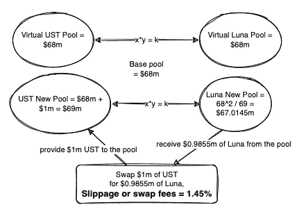

# ust 怎么了？稳定币 UST 机制解释

> 原文：<https://medium.com/coinmonks/what-just-happened-to-ust-stablecoin-ust-mechanism-explained-f150d82a482d?source=collection_archive---------6----------------------->

在过去的 3 天里，我们看到风险资产中普遍的避险情绪引发了卢纳和 UST 价格的巨大波动。UST·德佩格再次出现，在我写这篇文章时，它的交易价格低于 0.8。在 Anchor protocol 中，我们看到 TLV 的存款大幅减少了 100 亿美元(减少了一半)，其中大部分是由于存款大幅提现(两天内从 140 亿美元减少到 70 亿美元)。

这是一个经典的“银行挤兑”场景，我们在之前的[文章](/coinmonks/should-depositors-in-anchor-protocol-pay-attention-to-ust-de-peg-risk-8b59849d75bf)中已经深入讨论过。回顾一下我们之前说过的:如果 UST 脱钩再次发生，可能是由以下原因造成的:(1)加密货币的崩溃，(2)Terra/Luna 协议中的任何设计缺陷，(3)建立在 Terra 生态系统之上的外部项目，以提高 UST 的风险敞口。算法挂钩机制本质上是脆弱的，尤其是在 Luna 代币大幅抛售期间，这会导致“银行挤兑”情景，导致 UST 脱钩和 Luna 进一步下跌。

Luna foundation guard 在周末做出了非常迅速的反应，试图捍卫挂钩。他们将执行以下措施:1)向场外交易公司贷款价值 7.5 亿美元的 BTC，以帮助保护 UST 盯住美元的汇率制度；2)随着市场状况正常化，贷款 7.5 亿美元的 UST，以积累 BTC。我们不清楚这将如何实现。我们最好的猜测是，贸易公司将使用 7.5 亿美元的 BTC 只是购买 UST 链外。鉴于 UST 在过去 24 小时内的交易量超过 20 亿美元，7.5 亿美元可能不够。更不用说 BTC 价格目前也在快速下降，接近 30k 的水平。一旦未来几天市场稳定下来，UST 的联系汇率制度很有可能得到保护。与此同时，Luna 的抛售也很有可能会继续，Luna 价格可能会在未来以更低的价格结算。在撰写本文时，Luna 的交易价格低于 20 美元。

虽然市场上有很多噪音，但我们想回到基本面，深入研究稳定的 UST 机制。首先，我们将讨论 UST 稳定币机制如何与新引入的外汇储备(仍在提案阶段)一起工作。然后，我们将以 100 万美元的即时流动性为例，讨论虚拟 AMM 流动性池是如何工作的。最后，我们将讨论链上交换池中的关键参数。我们将着眼于今天的环境，并试图回答这个关键问题——连锁机制是否足够强大，足以捍卫钉住汇率制度？

# UST 外汇储备

在过去的 2 个月里，有两条主要新闻被公布:(1) LFG (Luna Foundation Guard)宣布向一些知名风投公司(如 Jump Crypto、3 AC 和 DeFinance)出售 10 亿美元的私人令牌。随后，TFL (Terraform Lab)向 LGF 捐赠了 1200 万 Luna 代币(相当于 10 亿美元)。筹集的资金将用于建立一个主要以比特币为主导的 UST 外汇储备。截至本文撰写之时，BTC 的外汇储备约为 30 亿美元，根据 Do Kwon 的说法，他的计划是将外汇储备增加到相当于 BTC 的 100 亿美元。(2) LFG/TFL 宣布与 Avalanche protocol 结盟，其中 LFG 购买了 1 亿美元的 AVAX (Avalanche 的原生令牌)作为 UST 外汇储备的一部分，实际上允许 UST 成为 AVAX 原生令牌。此外，TFL 宣布了一项价值 1 亿美元的 Luna <> AVAX 令牌交换，以促进进一步合作。

# UST 稳定机制

下面的流程图包括提议的 UST 外汇储备

source: [www.algotune.com](http://www.algotune.com/)

概括一下——UST 是一种算法分散的稳定币。它得到了月神的支持，月神是 Terra 区块链的本土象征。该机制设计是为了激励个人在挂钩偏离时参与套利活动:(1)当 UST 交易超过 1 美元时，用户可以从链外交易所购买 luna，通过链内协议燃烧 Luna 以铸造新的 UST(支付少量掉期费用)，并在链外市场以溢价出售 UST，将差价收入囊中作为利润；(2)当 UST 交易低于 1 美元时，用户可以从链外交易所购买 UST，通过链上协议燃烧 UST 以铸造新的卢纳(支付少量掉期费用)，并出售卢纳以获得更多的 UST 并获利。基本上，套利者通过减少/增加 UST/UST 的供应量，帮助将美元/美元的汇率固定在 1:1。然而，这种机制本质上是脆弱的，尤其是在 Luna 代币大幅抛售期间，这会导致“银行挤兑”情景，从而导致 UST 与美元脱钩和 Luna 进一步下跌。它也被称为“死亡螺旋”,因为我们在各种算法稳定点(如 Iron/Titan 和最近的 USDN/Waves)上看到了多次去盯住事件。

那么，引入外汇储备如何有助于降低体系的自反性？

这个想法其实很简单。根据 Terra 的官方网站，“储备的功能是释放压力，从 UST 到 LUNA on-chain，通过减少严重收缩期间 LUNA 供应的稀释，实时恢复盯住，并在 Terra 协议本身之外维持替代套利机会，抑制系统的反身性。”正如我们在上面的流程图中所展示的那样，套利者现在可以去储备市场，将他们在 UST 的股份兑换成比特币或其他非本地代币(例如 AVAX)，而不是仅仅依靠 UST <> LUNA 的链上掉期。然而，互换并不是 1:1，否则储备会从 UST <> LUNA 互换中拿走所有的流动性，这绝对不是 Terra 想要的。基本上，套利者可以用 1 美元的 UST 兑换 0.98 美元的 BTC 或 AVAX。还要注意的是，这种互换并没有燃烧或铸造任何 UST——它只是用 UST 替换了储备中的 BTC。为了防止准备金消耗过快，还将设置每日赎回上限(上限是总准备金的 10%还是 30%仍在讨论中)。

为了总结这在未来的工作方式，我们根据 UST 的价格将其分为 4 个阶段:

*   **UST =[0.98–0.995]——在危机期间，当 UST 交易低于 1 但仍高于 0.98 时:套利者在链外买入 UST->在链内与卢纳互换(支付 50 个基点的利息)- >在链外卖出卢纳- >实现盈利**
*   **UST = [ < 0.98] —在危机期间，当上述互换机制无法正常工作(互换费用上升)，UST 进一步跌破 0.98 时:套利者链外买入 UST->通过储备向链内 BTC 互换- >链外卖出 BTC->实现盈利**
*   **UST =[1.001–1.005]—危机后，当 UST 重新盯住美元，交易价格略高于 1 时:套利者在链外买入 BTC->通过储备以 1:1 的比率在链内与 UST 互换(支付少量费用~ 10 个基点)- >在链外卖出 UST->实现盈利**
*   **UST = [ > 1.005] —危机后，当 UST 需求进一步回升，UST 交易高于 1.005 时:套利者链外买入卢纳- >与 UST 链内互换(支付 50 个基点的利息)- >链外卖出 UST->实现利润(另请注意，在此过程中烧掉的部分卢纳用于为 UST 外汇储备买入 BTC)**

本质上，这有助于在赎回要求较高时，为 UST 增加额外的流动性。目前的链上互换能力可以处理 2%利差的 5.6 亿美元。如果 Terra 可以将外汇储备增加到 100 亿美元，10%的每日上限将意味着在危机时期可以额外利用 10 亿美元的流动性。

**不幸的是这还没有实现。否则，我们会猜测，depeg 不会发生得如此之快，偏差幅度也不会如此之大。*

# 虚拟 AMM 流动性池如何运作

为了确保套利机制正常运行，必须遵循以下两条规则:

1.  链外流动性必须高于链上。

> *否则可能会有* [*甲骨文攻击*](/algotune/20-yield-3dc46aa077d3#ed1c) *。如果链外流动性太弱，也会对套利机制产生负面影响，因为套利者依赖链外流动性进行套利交易。*

2.链内流动性应该与链外流动性相匹配，这样套利者的动机才能保持完整。

虚拟 AMM 流动性池遵循常数乘积公式 x * y = k，但与传统的 AMM 模型有 2 个主要区别:(1)不是将价格移动到新的均衡，UST/卢纳价格保持不变，因为它依赖于甲骨文价格，(2)不是回复流动性提供者，该协议设置池大小参数，并因此得名“虚拟”。

目前的基本池规模定为 6800 万美元。对于 100 万美元的即时流动性，互换费用约为 1.45%，如下式所示:互换费用= 1-(68–68/69)/1 = 1.45%

这个公式基本上意味着当你用 100 万美元的 UST 换卢娜时，你会得到价值 98.5 万美元的卢娜。15 万美元的差额基本上就是你最终支付给验证者的交换费。互换后，100 万美元的 UST 被加入 UST 池，价值 98.5 万美元的卢娜被从卢娜池中取出。

source: [www.algotune.com](http://www.algotune.com/)

# 如何设计协议参数

Terra 协议使用 3 个关键参数来控制链上流动性。它们是:(1)基本池，(2)池恢复期，和(3)最小价差

在撰写本文时，参数值投票如下:(1) Basepool = $68m，(2) PoolRecoveryPeriod = 36 个块，即 3.6 分钟(每个块 6 秒)，以及(3) MinSpread = 0.5%。

我们使用这些参数来提供下表，以显示即时流动性与互换费用和等价 ADV 之间的相关性。例如，如果您愿意接受 0.87%的滑点(蓝色突出显示)，您可以即时互换 60 万美元的 UST。该池每 3.6 分钟恢复到 basepool。因此，这意味着你可以每 3.6 分钟重复相同数量的互换，滑移率为 0.87%。等价的 ADV 是 2.4 亿美元，这意味着你可以在一天内用 2.4 亿美元的 UST 换取 0.87%的滑点公差。

source: [www.algotune.com](http://www.algotune.com/)

参数设置是否公平？让我们检查每个参数。

**基本池= 6800 万美元**

*   规则(1)链内流动性
*   规则(2)链内流动性匹配链外流动性:如上表所示，流动性池可以处理约 2.4 亿美元的 ADV，滑移率为 0.87%。这与 UST 的 5 亿美元预付款非常吻合。在正常情况下，套利者应该有足够的链内流动性来捍卫盯住美元的汇率机制。规则(2)已检查！

**PoolRecoveryPeriod = 36 块**

*   我们假设需要 50 个基点的滑点和 40 万美元的即时流动性。如果我们将 PoolRecoveryPeriod 设置为 36 个块，它将转化为 1.6 亿美元的 ADV，这比 Luna 的 20 亿 ADV 要小，并且与链外 UST 流动性匹配得很好。
*   下表显示了各种 PoolRecoveryPeriod 的相应 ADV。如果它设置得太低，如 1 块，链上流动性在这种情况下将太大(57.6 亿 ADV)。
*   公平地说，36 个街区是正确的，但考虑到卢纳和 UST 的市值在过去一年中增长的速度。将它调整得更低可能是合理的，例如每 10 个块。

source: [www.algotune.com](http://www.algotune.com/)

# 最后的想法

当我写这篇文章时，卢娜继续下降，UST·德佩格继续。在过去的 24 小时内，露娜的交易量超过 50 亿美元，而 UST 的交易量高达 20 亿美元，其中大部分都流向了 UST->USDT 或露娜->USDT。Basepool 和 PoolRecoveryPeriod 参数似乎都被定得太低，套利者无法进入。最重要的是，我们在 Anchor protocol 有超过 50 亿美元的 UST 存款，正在寻找出路。根本没有足够的链上流动性来促进顺利赎回。当恐慌开始时，最明智的做法是脱手所有 UST，压低 UST 盯住美元的汇率。

我们正在思考几个问题:(Terra 是否应该通过算法调整参数以适应不断变化的环境，以便在极端抛售发生时，链上流动性可以促进更平稳的赎回？(2)外汇储备有所帮助，但当储备是与 Luna 表现出高度相关性(BTC、AVAX)的资产时，它可能会失去储备的目的。想象一下，外汇储备机制获得批准，BTC 在如此短的时间内下跌如此之快，套利者进来将 UST 换成 BTC 可靠吗？(3) Anchor 协议是 Terra 的杀手级应用，但同时 Terra 过于依赖 Anchor。当 Luna 抛售发生时，借款方的清算将进一步推低 Luna。储户的 UST 占总发行量的 70%以上。当储户担心 UST·德佩格时，他们只是尽快提取流动性。如果这些赎回通过链上互换，它铸币更多的 Luna 出售给市场，因此导致进一步的 Luna 抛售。最终，链上的流动性枯竭，存款人只是出售他们的 UST 链外推动 UST 德佩格进一步。这正是过去 48 小时内发生的事情。

如果你喜欢关注我们的工作，欢迎在我们的邮件列表上注册[这里](http://www.algotune.com/)或者在[推特](https://twitter.com/algo_tune)上关注我们。

**主播礼仪入门篇系列**

*   深入了解 Anchor 协议第 1 部分:[简介](/coinmonks/20-yield-lunacy-or-brilliance-part-1-deep-dive-into-anchor-protocols-business-model-12b5450efd66)
*   深入探讨锚协议第 2 部分:[针对生态系统中的主要参与者](/coinmonks/20-yield-lunacy-or-brilliance-part-2-deep-dive-into-anchor-protocols-business-model-aba1a2e0152a)
*   深入探讨锚协议第 3 部分: [UST 脱钩风险](/algotune/20-yield-3dc46aa077d3)
*   深入探讨锚协议第 4 部分:[缓解和潜在解决方案](/algotune/20-yield-lunacy-or-brilliance-part-3b-deep-dive-into-anchor-protocols-business-model-c84486b3305a)

> 加入 Coinmonks [电报频道](https://t.me/coincodecap)和 [Youtube 频道](https://www.youtube.com/c/coinmonks/videos)了解加密交易和投资

# 另外，阅读

*   [新加坡十大最佳加密交易所](https://coincodecap.com/crypto-exchange-in-singapore) | [购买 AXS](https://coincodecap.com/buy-axs-token)
*   [投资印度的最佳加密软件](https://coincodecap.com/best-crypto-to-invest-in-india-in-2021) | [WazirX P2P](https://coincodecap.com/wazirx-p2p)
*   [7 个最佳零费用加密交易平台](https://coincodecap.com/zero-fee-crypto-exchanges)
*   [最佳网上赌场](https://coincodecap.com/best-online-casinos) | [期货交易机器人](/coinmonks/futures-trading-bots-5a282ccee3f5)
*   [分散交易所](https://coincodecap.com/what-are-decentralized-exchanges) | [比特 FIP](https://coincodecap.com/bitbns-fip) | [宾邦评论](https://coincodecap.com/bingbon-review)
*   [用信用卡购买密码的 10 个最佳地点](https://coincodecap.com/buy-crypto-with-credit-card)