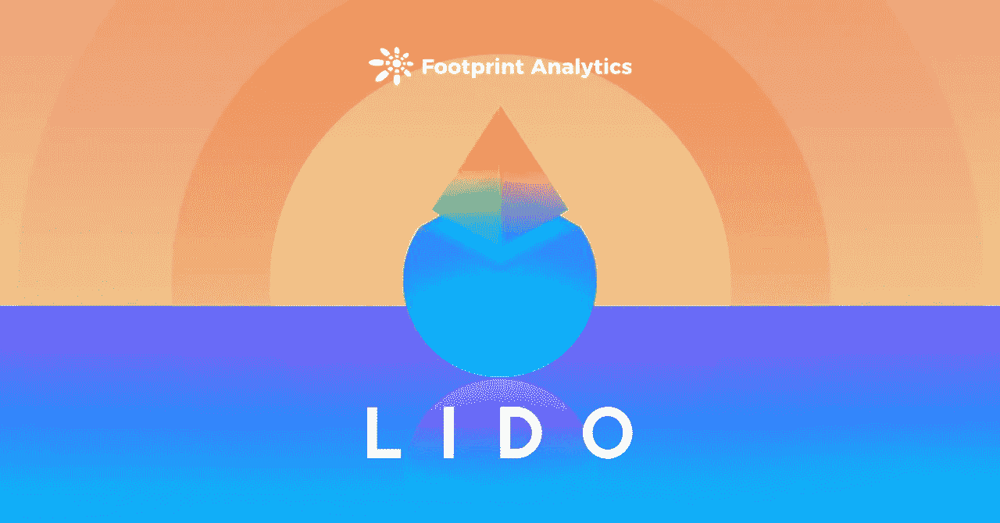

# 是什么让丽都成为顶尖的 ETH 跑马圈地平台？

> 原文：<https://medium.com/coinmonks/what-made-lido-a-top-eth-staking-platform-e99e2ece3848?source=collection_archive---------32----------------------->

赚取 12%至 14%的 4 月利率为赌注在丽都协议。

2022 年 2 月

数据来源:足迹分析— [丽都仪表板](https://www.footprint.network/guest/dashboard/lido-dashboard-fp-6c99d8b2-55e9-403c-940f-1ce9be34b0b4?date_filter=past90days&channel=ENG-210#secret=84DEC3F36077B488EFDCD9371AB49528)

[Lido](https://www.footprint.network/guest/dashboard/lido-dashboard-fp-6c99d8b2-55e9-403c-940f-1ce9be34b0b4?date_filter=past90days&channel=ENG-210#secret=84DEC3F36077B488EFDCD9371AB49528) 是一个建立在以太坊 2.0 的信标链上的平台。用户在不锁定 ETH 的情况下获得奖励，并获得 1:1 的令牌 stETH，他们可以进一步使用或利用该令牌。

在短短 3 个月内，丽都已经达到创纪录的 139.8 亿美元的 TVL，并超越 [AAVE](https://www.footprint.network/guest/dashboard/aave-dashboard-fp-56591e43-d624-4d00-bfa6-da5c4ab62b52?date=past3months~&channel=ENG-210#secret=B0849E968D95C0A81AD7909FD8DD1C1B) 和[凸金融](https://www.footprint.network/guest/dashboard/convex-dashboard-fp-0a32a016-e732-4680-a452-a8734f4c8a2f?days=past3months~&name=convex-finance&date=2021-12-17&channel=ENG-210#secret=C2523B3B5C3E1BFA4DCF8376FB6B48EB)在 DeFi 协议中排名第三。

让我们来分析一下 TVL 增长迅速的丽都是否是一个值得使用的平台。

# 丽都支持多区块链，具有创新的令牌组学

丽都的业务是 PoS 区块链的赌注池服务，目前支持以太坊 2.0、 [Terra](https://www.footprint.network/guest/dashboard/terra-dashboard-fp-93068a5f-8263-4538-9471-216c65d27ea5?days=past3months~&name=convex-finance&date=2021-12-17&channel=ENG-210#secret=2A850FDE1103F24E5A14A87453D572F5) 、 [Solana](https://www.footprint.network/guest/dashboard/solana-analysis-dashboard-fp-e22e8f10-57e5-4ce8-bb34-aa8d1c65bbe1?date_filter=2021-02-28~&channel=ENG-210#secret=D4A5B4D23807B960B7BEA23282375D57) 和[草间弥生](https://www.footprint.network/guest/chart/kusama-tvl-fp-3136de0f-f221-4ad1-92d6-c899a1faf584?channel=ENG-210#secret=52540AAE31E4D71025690AE49C87D729)。根据 Footprint Analytics 的数据，截至 3 月 1 日，利多的 TVL 创下 139.8 亿美元的历史新高，其中 Terra 所占份额最大(56%)，其次是以太坊(41%)。

*Footprint Analytics — TVL of Lido*

通过支持这 4 个区块链，利多可以整合许多头部协议，并发行相应区块链的代币衍生品，为权益持有人的资产提供流动性。用户可以入股 ETH、SOL、LUNA 和 KSM，获得相同比例的 Token stETH、stSOL、stLUNA 和 stKSM，同时还可以获得 4.5%到 18%的 APR。

*Screenshot Source — Lido website*

丽都还发行了本土代币 LDO，截至 3 月 1 日的价格为 2.08 美元，与上述四种代币相比价格较低。LDO 主要用于投票和治理，不在更大的去中心化交易所，所以整体价格走势与利多的 TVL 不成正比。

*Footprint Analytics — ETH & KSM & SOL & LUNA & LDO Token Price*

这将 Lido 与 MakerDAO 和 Liquity 等协议区分开来。例如，MakerDAO 奖励 DAI 存款 ETH，而 Lido 则要求赌注 ETH、SOL 和 Luna 等代币，以相同的价格获得衍生代币，享受体面的年化回报，不受原生代币 LDO 价格的影响。

# 利多的多重投资选择

如果要独立参与以太坊 2.0，需要跑马圈地 32 个整数倍的 ETH，对于散户来说非常不友好。在下注数量方面，Lido 更加人性化，因为用户可以下注任意数量的 ETH 来参与以太坊 2.0。

截至 3 月 1 日，ETH 总持仓量为 198 万。我们以质押 ETH 为例，分析一下如何在丽都上赚得更多。

*   用户下注任意数量的 ETH，可获得 1:1 的 stETH，并可获得 4.5%的 APY。相比之下，在 AAVE，储蓄乙醚产生 0.2%的年利率
*   用户可以将原本计息的 stETH 资产证书转化为流动性，并通过参与其他 DeFi 协议(如 Curve、AAVE 和 Convex Finance)获得更多收益。
*   用户通过投资 stETH in Curve 可以获得大约 3%的 APY。

*Footprint Analytics — Curve website*

曲线上赚的收益也可以放到凸金融上再赚。用户将 steth 存入 Curve 得到 LP 后，可以存入凸金融的 stETH 池，赚取 5.1%左右的 APR。

*Footprint Analytics — Convex Finance website*

总之，用户可以在 Lido 平台上下注任何数量的 ETH，用于其他 DeFi 平台，以赚取 12%至 14%的 APR，这对用户来说是一笔可观的收入。曲线和凸金融是网络上排名前 5 的协议，不仅有风险控制，而且没有清算风险，完全是单币跑马圈地模式。

# 丽都的优势和劣势

优势:

*   方便用户的
*   灵活地签订外部合同，以获得更高的 APY
*   单一货币赌注模式

缺点:

*   重置机制

Lido 是一个建立在以太坊 2.0 信标链上的平台，其中用户下注的令牌被提出，然后存储在信标链上。它有奖惩机制。当换基发生时，代币的供应根据以太坊链中的赌注奖励(或削减惩罚)在算法上增加或减少。当先知报告信标统计时，会发生重置。

*   收入不稳定

stETH 的余额每天 24:00 UTC 更新，如果 stETH 余额增加，将给予一定的奖励，如果 stETH 余额减少，将失去一定数量的代币 stETH。两者分开计算。

*   以太坊的燃气费也是小额用户的一个成本考虑

这篇文章由[足迹分析](https://www.footprint.network/)社区提供。

Footprint 社区是一个世界各地的数据和加密爱好者相互帮助了解和获得关于 Web3、元宇宙、DeFi、GameFi 或区块链新兴世界任何其他领域的见解的地方。在这里，你会发现活跃的、不同的声音相互支持，推动着社区向前发展。

> 加入 Coinmonks [电报频道](https://t.me/coincodecap)和 [Youtube 频道](https://www.youtube.com/c/coinmonks/videos)了解加密交易和投资

# 另外，阅读

*   [加拿大最佳加密交易机器人](https://coincodecap.com/5-best-crypto-trading-bots-in-canada) | [KuCoin 评论](https://coincodecap.com/kucoin-review)
*   [火币加密交易信号](https://coincodecap.com/huobi-crypto-trading-signals) | [HitBTC 审核](/coinmonks/hitbtc-review-c5143c5d53c2)
*   [如何在 FTX 交易所交易期货](https://coincodecap.com/ftx-futures-trading) | [OKEx vs 币安](https://coincodecap.com/okex-vs-binance)
*   [OKEx vs KuCoin](https://coincodecap.com/okex-kucoin) | [摄氏替代品](https://coincodecap.com/celsius-alternatives) | [如何购买 VeChain](https://coincodecap.com/buy-vechain)
*   [ProfitFarmers 回顾](https://coincodecap.com/profitfarmers-review) | [如何使用 Cornix Trading Bot](https://coincodecap.com/cornix-trading-bot)