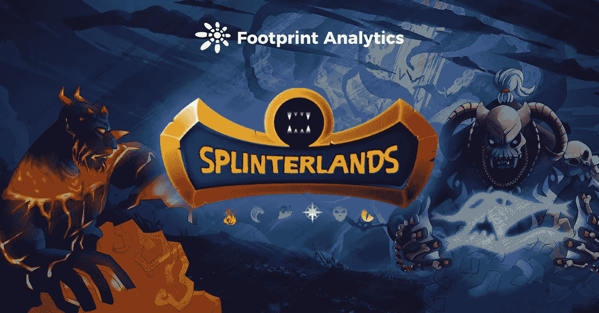
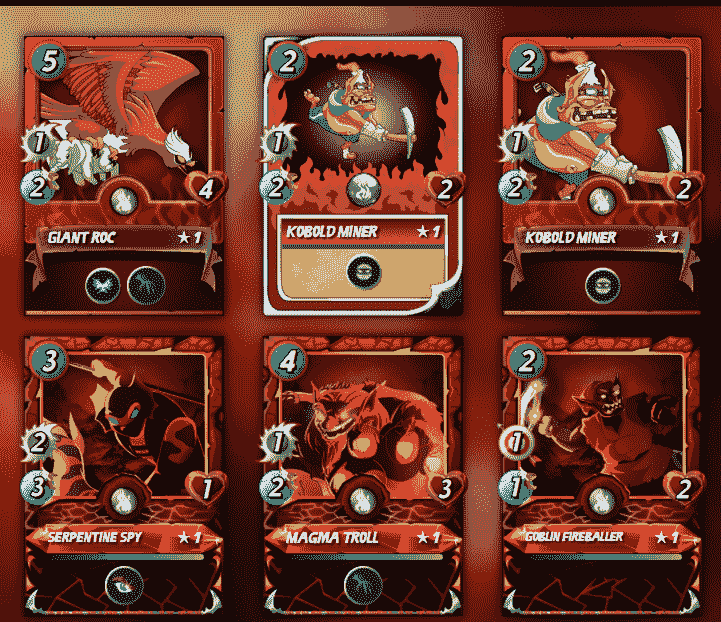
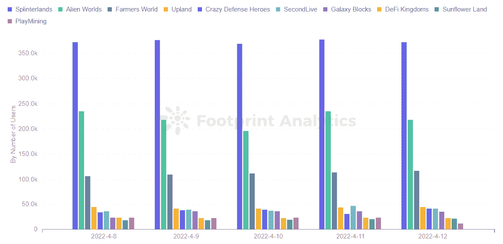
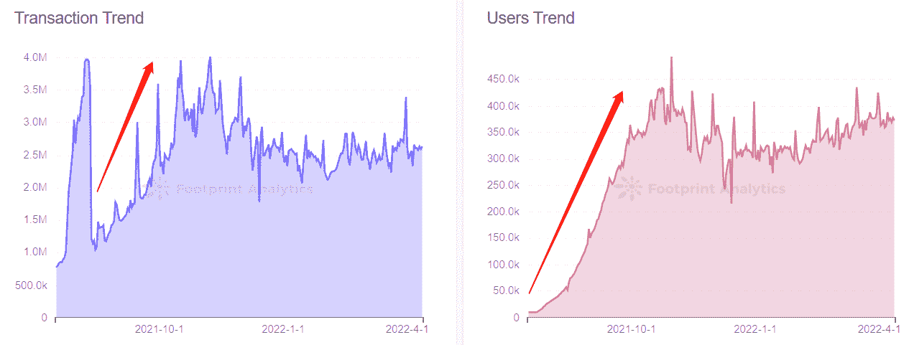
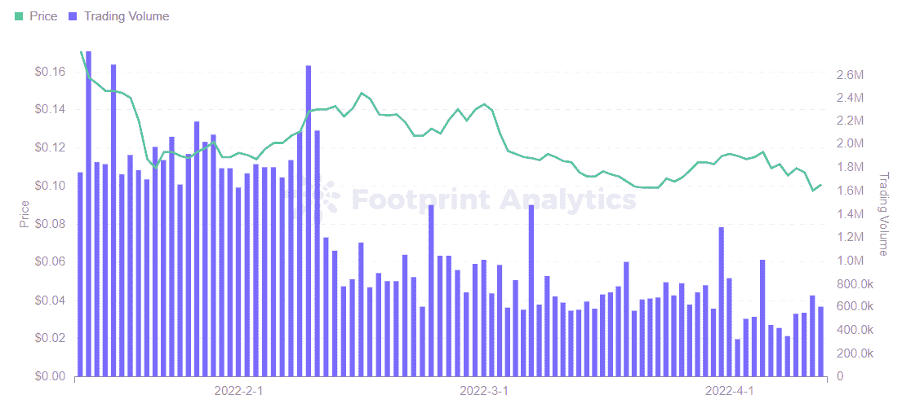
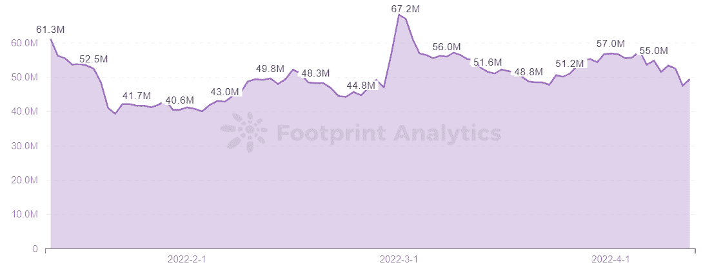

# 是什么让 Splinterlands 成为最活跃的区块链游戏？

> 原文：<https://medium.com/coinmonks/what-made-splinterlands-the-most-active-blockchain-game-447fdd434358?source=collection_archive---------53----------------------->

夹板地是蜂巢链上的回合制卡牌战斗游戏。

2022 年 4 月

数据来源:足迹分析— [夹板式仪表板](https://www.footprint.network/guest/dashboard/Splinterlands-Dashboard-fp-63a55b31-7b13-4f79-bf39-b520b271e35c?date_filter=past120days&channel=EN-237#secret=8CC84406F413195F19D76FD51AF8A5F0)

自 2018 年推出以来，[《夹板王国》](https://cryptoslate.com/here-are-3-alternative-play-to-earn-card-games-like-axie-infinity/)的成功展示了这款游戏的潜力及其对游戏玩家的巨大吸引力。截至 4 月 12 日，Splinterlands 日活跃用户数排名第一，日均用户数超过 35 万，比第二名[外星世界](https://www.footprint.network/@nsm/GameFi-Alien-Worlds-Dashboard-1832623319?day=past30days&game_name=Alien%20Worlds&channel=EN-237)领先约 10 万用户。

在[splitter lands](https://www.footprint.network/guest/dashboard/Splinterlands-Dashboard-fp-63a55b31-7b13-4f79-bf39-b520b271e35c?date_filter=past120days&channel=EN-237#secret=8CC84406F413195F19D76FD51AF8A5F0)中，玩家只需 10 美元即可参与游戏，相对于同类游戏来说，这是一个较低的准入门槛。玩家可以通过玩游戏、换卡、租赁、跑马圈地获得收入，可以迅速与其他玩家竞争，产生稀缺而有价值的 NFT。

以下是 Splinterlands 在一个大多数项目都在努力争取普通用户的行业中变得如此活跃的原因。

# 关于夹板岛

夹板地是蜂巢链上的回合制卡牌战斗游戏。

玩家有自己的一系列不同属性和能力的卡片，可以组合不同的套牌与其他玩家对战，每场比赛只需 2 到 3 分钟。赢得一场战斗后，用户将获得卡片和 12 美元的奖励。

卡牌可以在战斗中使用，升级，出售或出租给其他玩家，稀有卡牌具有更大的收藏价值。

*Screenshot Source — Splinterlands Website*

根据 Footprint Analytics，截至 4 月 12 日，Splinterlands 以超过 35 万的日活跃用户排名第一，将第二、第三名远远甩在后面。

*Footprint Analytics — Top 10 Games Ranking by Players（Latest 5 days）*

## 为什么旋转大陆如此具有可玩性？

2021 年 7 月后，随着交易卡游戏在元宇宙流行，见证了夹板岛前所未有的增长。根据 Footprint Analytics 的数据，用户和交易的数量逐渐增加并趋于稳定。

*Footprint Analytics — Splinterlands Transaction Trend & Users Trend*

Splinterlands 单枪匹马地推动了 Hive 的发展，主要是由于以下因素:

*   简单多样的游戏方式

Splinterlands 的玩法简单多样。这款游戏的准入门槛很低，玩家只需要 10 美元就可以参与，并且有能力在游戏中赚取。方法如下:

*   完成日常任务以获得奖励。按照要求赢得五场比赛将有机会打开一个随机奖励的宝箱，如$DEC 或卡片。目前青铜(游戏共有 6 个联赛等级，青铜为游戏联赛第二等级，最高为 6 级冠军等级)每天只能打开一个宝箱。等级越高，完成任务可以开的奖励就越多。
*   参加排位赛。玩家可以通过参加排名赛获得暗能量水晶($DEC)奖励。但参赛需要支付一些$DEC 作为门票，即使是初学者和经验丰富的玩家也可以提高他们的资格赛技能。
*   卖卡。每张卡都是独一无二的，可以在市场上交易。卡的等级越高，获得的统计数据越好；当达到最大值时，该卡可以获得特殊能力。
*   卡出租。在收集了大量卡片后，玩家可以将它们出租给其他玩家以获得收入，同时仍然保持卡片的所有权。
*   为收益认捐 100 美元.
*   还有卖地和租地。

因此，每个进入游戏的玩家都有不同的目标，它可以是赚钱，进入锦标赛，联赛，收集卡片或只是为了好玩。

*   卡片信息化

Splinterlands NFTs 各种卡牌增加卡牌流动性，解决了部分卡牌游戏不允许玩家交易或出售游戏资产给其他玩家的问题。

*   战斗速度快，每场比赛只需 2 到 3 分钟

Splinterlands 的创新空间更大，比如陆基的元宇宙世界，支持玩家创建公会(目前进入公会的门槛较高，需要达到一定的积分排名才能进入)，建造城堡，打造更具创新性的元宇宙空间。

## 令牌组学的碎片

Splinterlands 使用双币模型，用$SPS 作为治理令牌，用$DEC 作为游戏令牌。

*   $SPS

$SPS 作为治理令牌，其值代表游戏的价值。$SPS 的作用主要是社区治理投票，游戏内奖励，获得认捐奖励。最有影响力的是治理投票，持有人承诺$SPS 令牌参与投票并决定项目中的变更。

根据 Footprint Analytics 的数据，在过去 3 个月中，$SPS 的整体价格没有太大变化，徘徊在 0.1 美元以上。

*Footprint Analytics — $SPS Token Price & Trading Volume*

从$SPS 的市值走势来看，价格波动有助于其所有卡的总市值增减。

*Footprint Analytics — $SPS Market Cap*

*   十二月美元

$DEC 主要用于游戏内购买各种卡包、道具、地、提升个人排名等。它类似于 Axie Infinity 的令牌$SLP。它可以通过以下两种方式获得:

*   通过赢得比赛和完成任务。
*   在游戏之外购买。

用$DEC 可以购买更多的卡牌，从而提高玩家在战斗中的胜率，获得更多的稀有卡牌和战斗奖励。

# 摘要

Splinterlands 已经成为 GameFi 中用户最活跃的游戏项目，入门门槛低，玩法简单，战斗速度快，奖励体系独特。

这篇文章由[足迹分析](https://www.footprint.network/)社区提供。

Footprint 社区是一个世界各地的数据和加密爱好者相互帮助了解和获得关于 Web3、元宇宙、DeFi、GameFi 或区块链新兴世界任何其他领域的见解的地方。在这里，你会发现活跃的、不同的声音相互支持，推动着社区向前发展。