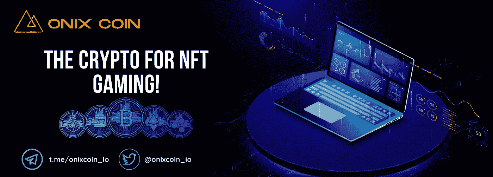

# 怎样才能成为一名优秀的甲板建造者(NFT·CCG，TCG)？NFT 博彩

> 原文：<https://medium.com/coinmonks/what-makes-a-good-deck-builder-nft-ccg-or-tcg-nft-gaming-659d87b41017?source=collection_archive---------41----------------------->

2022 年 3 月 9 日

NFT 甲板建造商和 CCGs 的未来

什么是甲板建设者？

很简单，卡片组生成器是一种游戏，它授予玩家一套基本的卡片，并指导他们收集新卡，直到你构建了一副卡片组，你可以做一些很酷的事情，如打怪物，完成任务或与其他玩家玩。近年来，像 Ratropolis、SteamWorld Quest 和 Signs of Sojourner 这样的游戏吸引了游戏市场。像这些游戏成功的原因是什么？甲板建造者非常擅长激发你的创造力，奇怪的是，奖励玩家让愚蠢的事情工作或礼貌地说，有创意。这些甲板建设者允许玩家混合和匹配独特的卡，以形成协同作用和组合，有许多不同的可能性，让创意领域敞开大门。

什么使得一个好的 NFT 收藏卡牌游戏或可交易的卡牌游戏？

在这篇文章中，我将使用一些基本的标准来分解什么是一个好的甲板建设游戏，以及需要注意什么:

对策略的需求是成功的 CCG/TCG 的最高优先级之一，因为它在解决了比赛带来的一系列挑战后给玩家一种成就感和满足感。没有什么比参与一场激烈的斗智斗勇并最终胜出更令人满意的了。能够提前计划，并且能够节俭地克服战斗中的任何障碍并取得胜利，同时对每一个决定负责，这是令人振奋的。

Hearthstone

在过去的两年里，像[炉石](https://playhearthstone.com/)这样的游戏因其暗示的策略和自动战斗功能而对牌组生成器流派产生了巨大影响，游戏中的战斗专注于你做出的决定和你做出决定的时间，以及你的牌组中正确的卡片组合，以决定你是否获胜。

当一张卡有自己独特的亮点和功能时，它会带来独特的优点和缺点。每张卡都需要有自己独特的能力，例如火、水、土或风，作为元素的选择，结合攻击、防御、治疗或增益技能。每张卡都有这些属性的独特组合，这为非正统的创意创造了环境。

Army of Crypto

这是一个基本的例子，使用各种效果，技能，魔术或战术动作，给游戏的每张卡的必要性。一些甲板建造者未能专注于原创性，只是严格地追求攻击力或防御力。这可能会使游戏中的许多牌不受欢迎，并且无法最大限度地发挥令人愉快的 CCG/TCG 的全部能力。随着 NFTs 和区块链技术的发展，身份被带到了一个新的高度。玩家现在可以拥有每张卡，使用加密令牌来唯一识别资产。借助 NFTs 和区块链技术，玩家还可以向游戏中添加新卡，而在以前的平台上，这仅限于开发者在中央服务器上更新游戏。TCG 的 NFT·CCG 彻底改变了这一流派，并一直保持下去。卡片设计有独特的机制和美学，并附有一个故事，使玩家很容易记住卡片，并有更多的时间享受游戏体验。

除了赋予卡片独特的机械主题之外，让卡片留在玩家脑海中并让他们思考潜在用途的一个奇妙方法是通过他们所谓的“味道”，也就是说卡片的美学和主题设计。[万智牌](https://www.mtgsalvation.com/)在这方面很棒，这也是为什么它的起草模式——你的任务是从随机卡片中制作一副牌——可以说是最古老和最受欢迎的纸牌制作者之一。以这张卡为例，阿尔卑斯山 Houndmater:-

Alpine Houndmaster Card

这是一张有着惊人的 8 行规则文本和两种截然不同的效果的卡片，对于一个新玩家来说，这是一个需要记住的大量信息，甚至不考虑卡片的实际战术应用。幸运的是，神奇的设计者将这张卡片变成了一个小故事，让你更容易理解它。这个家伙是一个 houndmaster，他喜欢狗，所以当你玩他的时候，他会在你的甲板上搜索一只狗来陪伴他的旅程，每当他们一起攻击时，他会变得更强大。

Alpine Watchdog Card

Igneous Cur Card

他搜索的两张特定的卡甚至出现在卡牌艺术中。新玩家不必记住一堆复杂的规则，所有新玩家必须做的是在他们的草稿包中寻找那两只特定的狗，以及一般的狗，因为它们都有助于侵略性的游戏风格，你可以同时用一群 a 生物攻击-这是一个完整的策略，由一张卡片提供信息。通过机械或主题设计为玩家提供卡片的心理速记，极大地减少了玩家需要花费在记住他们有什么卡片和他们做什么的脑力量，并释放了心理资源用于游戏的实际乐趣，将不同的卡片组合在一起以创造酷的效果，换句话说，协同作用。

甲板建造者需要有一个强大的机制来对抗富人越来越富。甲板建造者有一种趋势，即领导者在游戏中不受控制。有两个游戏在这方面做得很好，一个是有胜利点数卡的 Dominion，另一个是帝王谷，在那里你经常不得不把你最有用的卡埋起来。

Dominion Deck Builder Game

在《帝王谷》中，在将一张牌留在你的牌组中(使用它)还是“埋葬”它(将它从你的牌组中移出以获得点数)之间的决定是牌组构建中最有趣的决定之一。这些方面允许一个更平衡的游戏，并鼓励玩家保持社区的一部分，延长游戏的寿命。在大多数其他游戏中，富人越来越富，谁在开始时获得边际奖金，谁就有一条直接而清晰的胜利之路，这往往会赶走新来者和没有相同时间或资源投入到实际游戏中的玩家。

Valley of Kings Deck Builder Game

随着技术进步给我们带来了区块链技术和现在的 NFTs，结合前面讨论的这些标准，CCG/TCG 流派看起来将达到新的高度。像 NFT 游戏的区块链[on excoin](https://onixcoin.io/)这样的项目为任何开发者设计了将他们的游戏集成到区块链上所必需的平台，允许更广泛的玩家接触，以及在任何时间、任何地点、低成本和安全环境中进行游戏的分散平台。区块链技术还允许更好的玩家-开发者关系，通过形成新的合作提供新的途径来继续开发游戏，这在区块链之前是不可能的。玩家可以通过对游戏实现的智能合约进行更改来建议对规则、卡片和用户体验进行更改。现在游戏能够随着玩家的需求不断发展。

Onixcoin — The Crypto for NFT Gaming

跨链互操作性是另一个主要因素，它可以将你的 NFT 卡带到另一个链上，在其他游戏中使用。这项技术现在可供开发者发挥他们的创造力，并提供一些有趣的新方法来玩 ccg/tcg。

作者:Trey Trillionaire

*最初发表于*[T5【https://www.reddit.com】](https://www.reddit.com/r/NFTGames/comments/ta25zr/what_makes_a_good_deck_builder_nft_ccgtcg/?utm_source=share&utm_medium=web2x&context=3)*。*