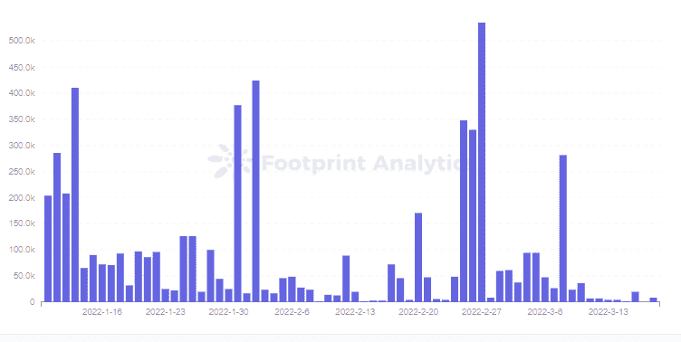

# 是什么让羊驼成为 BSC 的第三大协议？

> 原文：<https://medium.com/coinmonks/what-makes-alpaca-bscs-3rd-biggest-protocol-f2447c0e2108?source=collection_archive---------71----------------------->

羊驼项目于一年前启动，通过团队出色的机制和快速迭代，已成为 BSC 的第一杠杆收益农业项目和第三 DeFi 项目。

2022 年 3 月，西蒙

数据源:[足迹分析羊驼仪表板](https://www.footprint.network/guest/dashboard/alpaca-dashboard-fp-17cb8992-e281-496c-ab92-f22fba9dc983?days=past3months~&name=alpaca-finance&date=2021-12-17&channel=ENG-223)

[羊驼金融](https://www.footprint.network/guest/dashboard/alpaca-dashboard-fp-17cb8992-e281-496c-ab92-f22fba9dc983?days=past3months~&name=alpaca-finance&date=2021-12-17&channel=ENG-223)是一个集贷款、流动性挖掘和稳定投资于一体的项目，已成为 TVL 第三大 BSC 协议。

该团队在看到 Ethereum 上的[高额汽油费后创建了羊驼，并希望通过流动性挖掘来实现](https://www.footprint.network/guest/dashboard/gas-dashboard-fp-89595153-6c23-44ad-a81e-a5f49b05632f?date=past6months~&channel=ENG-223#secret=840A15642C53AE770D427CCE63B11999) [BSC](https://www.footprint.network/guest/dashboard/binance-dashboard-fp-01e51da5-394d-4f63-a89b-f16375a8d62f?date=2021-04-30~&channel=ENG-223#secret=01FF9E4187CD3DB9153D895465B59084) 的全部潜力。自 2021 年 2 月以来已经一年多了，它仍然坚持是一个公平的启动项目，没有预售，没有投资者，也没有预购。

在本文中，我们将结合[足迹分析](https://www.footprint.network/?channel=ENG-223)和[足迹 DeFi 360](https://www.footprint.network/defi360) 的数据，了解羊驼是如何实现所有这些目标的。

# 不同的人有多种选择

在羊驼上，用户可以:1。收益农场，通过有限的资本杠杆化收入的好方法。通过贷款赚钱。结合这些主要功能和其他功能，不同级别的用户可以为自己选择合适的投资。

1.新手

对于新投资者来说，用户可以通过贷款和入股两个简单的步骤投资一项资产。

“借出”界面提供 8 种主流资产的存款，包括 BNB、ETH、Stablecoin、BTCB 和羊驼，这将产生一个 ibToken。然后，可以在 Graze 用平台令牌羊驼或合作伙伴令牌对 ibToken 进行下注和奖励。

贷款人从借款人支付的利息中获利，每个资产池的 APY 与其利用率相关联。因为羊驼允许借款人使用杠杆借款，利用率和利率通常是其他贷款协议的两倍以上。

借款人不会从平台上撤回贷款，而羊驼将把贷款投资于流动性挖掘。因此，贷款的使用和归还将受到协议的监督，给贷款人一个更安全的保证。

*Alpaca Finance — Available Lending Pools*

2.中间的

希望从流动性挖掘中获得更高回报但希望保持低风险的用户可以选择在农场中进行无杠杆挖掘，或选择在稳定币-稳定币养殖池中进行杠杆挖掘。

对于非杠杆化挖掘，用户只需将杠杆倍数设置为 1 倍，目前 PancakeSwap 和 MDEX 中的 59 个池都支持这种挖掘。

用户只存一个 token，羊驼会 50:50 转换成两个资产，存到 DEX。羊驼还会自动为用户将在池中赚取的奖励再投资。

对于第一次想尝试杠杆挖矿的人来说，最好从 stablecoin-stablecoin 养殖池的杠杆挖矿开始。由于稳定的货币价格基本上与美元挂钩，价格波动很小，因此清算风险更容易控制。

3.先进的

对于专业投资者来说，杠杆养殖不稳定的玉米有更高的风险和更高的回报。除了流动性挖掘奖励和羊驼代币奖励之外，通过对非稳定铜币做多/做空还可以获得额外的做多/做空收益。

用户可以存放一项资产并设置超过 2 倍的杠杆，选择 Lend 池中的 8 项资产中的任何一项进行借款，Alpaca 将自动为用户将该资产转换为 50:50 的流动性池。

用户应该永远记住，存放的资产是长期的，借入的资产是短期的。初始净风险敞口是两者之和。

由于杠杆的放大，借款利息也会成倍增长，2 倍以上的杠杆需要额外的气费才能将资产转为股权。请注意，增加的资本也可能产生更大的滑点。虽然杠杆可能有高回报，但它也有较高的初始成本。

如果多头/空头头寸失败，可能会导致更多损失，但更高级的用户可能会选择同时开立两个头寸，一个多头，一个空头，以对冲两个头寸的风险。

这种双边杠杆收益农业使初始风险敞口保持中性，但随着象征性价格的变动，风险敞口将发生变化，随着价格上涨，风险敞口变短，反之亦然。因此，用户也有必要权衡潜在损失，这也可以通过增加抵押品或在平仓后重新开仓来重置。

*Alpaca Finance — Hedging with Double-Sided Borrowing*

代币

与羊驼相关的令牌是羊驼和 AUSD，前者是平台的治理令牌，后者是平台铸造的稳定币。

*   羊驼

羊驼的总发行量为 1.88 亿只，将在两年内逐步释放。只有 8.7%的羊驼将被分配用于资助开发和扩大团队，4.3%用于未来的战略开支，其余 87%将公平分配给协议的用户。

羊驼因为燃烧机制，长期会通缩。平台会提供一部分协议费回购代币烧掉，比如 80%的清算费，10%的贷款利息，清算机器人收到的清算赏金的 4%。这有助于羊驼的价值在未来继续上升。

羊驼目前距离两年解锁期结束还有 11 个月，发行量约为 1.5 亿只。虽然烧钱机制一直在进行，但离通缩还有一段距离，目前的代币价格约为 0.4 美元。

*Footprint Analytics — ALPACA Token Price & Volume*

用户以类似于 Curve 的方式获得治理投票权，通过锁定羊驼 1 周到 1 年的不同时间长度来获得不同数量的 xALPACA 令牌。下注羊驼的用户还可以从收益养殖的奖励部分获得 5%的收入。

*   AUSD

在 Lend 中存放资产后，用户可以选择在股份中赚取额外的回报，或者通过超额抵押 ibToken 获得稳定的 AUSD，有点类似于 [Abracadabra](https://www.footprint.network/guest/dashboard/abracadabra-dashboard-fp-4f6fcbea-5477-4d70-9ef8-0694beef7d78?name=abracadabra&date=past3months~&channel=ENG-223#secret=C869715EA3CE4D520C5AD91A6DEE4859) 。然后，用户可以使用 AUSD 投资或转换成其他代币，提高他们的资本效率。

AUSD 通过套利交易者与美元挂钩。从 [Footprint Analytics](https://www.footprint.network/?channel=ENG-223) 的数据来看，AUSD 并没有明显不锚定，但价格大部分时间都略低于 1 美元。

*Footprint Analytics — AUSD Token Price*

就交易量而言，AUSD 离其他稳定的城市还有很长的路要走。作为后来者，羊驼需要提供更丰富、更有价值的效用。

*Footprint Analytics — AUSD Token Volume*

借出池数据

羊驼以杠杆产量养殖为特色，但也可能看到贷款池中的贷款人和杠杆养殖借款人。来自 [Footprint DeFi 360](https://www.footprint.network/defi360) 的数据显示，BSC 贷款池的总供应量最高的是 BNB，其次是 BUSD 等稳定国家。

*Footprint Analytics — Alpaca Total Supply of Lend Pool*

借款人将哪些资产放入资产池的选择受到资产池 APY 的影响，而 APY 则受到农场中借款资产数量的影响。当一项资产的利用率较高时，该项资产将获得更多的借入利息进行分配。借款人青睐的资产排名也类似于贷款人存放的资产排名。

*Footprint Analytics — Alpaca Total Borrow of Lend Pool*

在过去的 90 天里，借款总额保持平稳，除 BNB 外，总供应量相对稳定。这导致 BNB 的利用率变化很大。

*Footprint Analytics — Alpaca Lend Pool Utilization*

贷款池和农场池相互作用。前两个池(BNB 和 BUSD)的利用率在 90 天内都在下降。

BNB 的借款 APY 曾经在 10%以上，利用率在 60%以上，但现在只有 3.56%的 APY 和 34%的利用率。这也导致了羊驼 TVL 的减少。

羊驼需要通过增加贷款 APY 来吸引更多的贷款人，以获得更高的 TVL，而更高的 APY 来自于更高的利用率。然而，更高的利用率会提高借款利率，借款人需要更高的回报来弥补增加的成本。

杠杆养殖户的收入主要来自流动性挖掘奖励+手续费收入+羊驼奖励敞口价格变化的收益/损失。

随着羊驼发行量的下降，到 2023 年 2 月，可能不会再有羊驼奖励了。流动性挖掘奖励和费用收入都在很大程度上受到 DEX 平台的影响。羊驼如果想持续给用户足够高的 APY，就需要创新更多的商业模式。

虽然前面几项收入几乎没有显著增长，但羊驼进一步试图通过即将推出的自动化金库来优化杠杆农业中的做空/做多风险。

高级用户可以通过创建多头和空头头寸来对冲风险，但随着象征性价格的变动，最初的中性风险敞口也会发生变化。

与手动调整不对称风险相比，自动化保管库可帮助用户自动将资产重新平衡至中性风险，杠杆高达 8 倍，无清算风险，自动复利，无锁定。

# 摘要

羊驼队是 BSC 的第三大协议，因为它的团队很棒。它涵盖了从初学者到高级的各种策略，反应迅速，而且需要更多的专业知识来投资高级水平。

此外，该团队非常重视安全性。羊驼已经进行了 20 次安全审计，用羊驼卫队保护 Chainlink 免受攻击，推出了一个 Bug 赏金计划，为发现 Bug 的人提供高额奖励，对于那些想购买保险的人，集成了 Nexus Mutual Coverage 和 InsurAce。

羊驼还推出了 Alpies NFT，为第二季度发布 play-to-earn 游戏铺平道路，羊驼未来将进入 GameFi 领域。羊驼的创新永远值得等待。

这篇文章由[足迹分析](https://www.footprint.network/?channel=ENG-223)社区提供。

Footprint 社区是一个世界各地的数据和加密爱好者相互帮助了解和获得关于 Web3、元宇宙、DeFi、GameFi 或区块链新兴世界任何其他领域的见解的地方。在这里，你会发现活跃的、不同的声音相互支持，推动着社区向前发展。