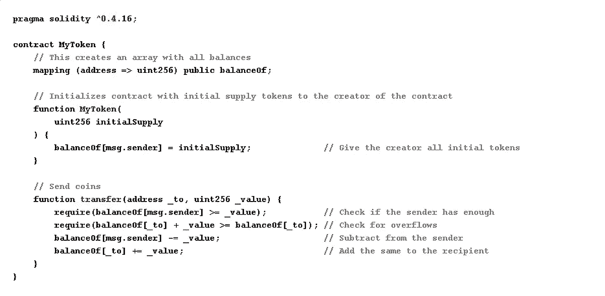

# 是什么让智能合约变得“智能”？

> 原文：<https://medium.com/coinmonks/what-makes-smart-contract-smart-a81f943cd4b0?source=collection_archive---------19----------------------->

在我解释什么是智能合同之前，我将首先解释什么是合同。

合同可以被看作是两个或更多个人之间的协议。就像你签署了一份协议，你将与一家公司合作一段时间，他们将支付 500 美元/月。

基本上，这个合同的条件是，个人向客户提供他/她的技能，客户每月支付 500 美元作为回报。

A Contract. PC: Google

现在这个使用企业区块链平台的合同可以被翻译成软件程序。

有不同类型的软件程序可以编写智能合同，solidity 就是其中之一。

因此，合同的条件是用软件代码编写的，因此整个过程将是自动化的。

自动化是许多公司的事情之一，这样就不需要手动操作，也可以防止人为错误。智能合同用于实现自动化。

## 那么，什么是智能合约呢？

根据 Nick Szabo 的说法，智能合同是一组以数字形式规定的承诺。就像我之前举的例子一样，交互不是物理发生的，而是通过使用智能契约以数字方式发生的。

它也是一组数字代码，用于交换或转移资产，如货币、股票或财产，无需任何中介

> **Vitalik Buterin** 将智能合约描述为在程序中转移资产或货币的一种方式。他补充说，程序根据代码中定义的条件执行代码。这些执行是自动完成的，并根据获得的信息验证信息。
> 
> 一旦满足条件，智能合约就会执行。如果条件不满足，智能协定将根据提供的条件执行，如果没有条件可用或条件被篡改，则执行失败
> 
> 他还提到，分散式分类帐会复制智能合同，以建立不变性和安全性。

## 智能合同示例

在这个例子中，我不会讲技术，但会使用我们都可以联系到的东西。

房地产是智能合同最受欢迎的用例之一。所以有一项资产要出售，但不是一次性付款。你先预付 30%,其余的分期付款。

卖方创建一个智能合同，所有这些条件都在合同中编程和声明。买方通过签署合同并启动合同来启动智能合同。

随着时间的推移，买方支付分期付款，所有这些将被智能合同记录。所有付款完成并转移给卖方后，所有权立即转移给买方。这是自动完成的，不需要任何中介。

与物理和传统的方式相比，它需要更少或没有努力，而且是安全的。

另一个例子是把钱从你那里转给你的朋友。智能合同是这样写的，当你签署合同时，你就开始了一笔交易，当你被记入借方，你的朋友被记入贷方时，交易就完成了。

这种交易发生在非常短的时间内，相比之下，使用银行可能需要几分钟，有时甚至几天，特别是如果你在不同的国家。

## 为什么说契约是智能的？

**它是自主的:**你知道一个聪明学生的方法之一是，当你举一个例子时，他/她可以解决任何其他事情，而不会遇到阻碍或问题。

智能合同也是如此，一旦部署，他们可以在没有任何干扰或阻碍的情况下自己执行和完成流程。这不是很聪明吗

**快:**我有一个中学同学，我们叫他计算器，因为他计算甚至小数都超级快。智能合约速度超快。与使用传统方式的数小时相比，他们可以在几秒钟和几分钟内执行。

**这是不可改变的:**这可能是一个缺点，但因为安全，这是一个更好的优点。不变性意味着一旦部署，就不能恢复，也不能进行更改。如果你以前的合同有问题，你必须重新部署，你不能更新以前的合同。

这就是为什么您必须在将智能合约部署到区块链之前对其进行充分测试。

## 用于编写智能合同的编程语言。

有两种流行的编程语言可以用来编写智能合同。这些是；

**Solidity:** Solidity 是由 Christian Reitwiessner 和几位以太坊核心贡献者共同开发的。它是最古老的编程语言之一，语法类似于 javascript，但有一些不同。

索拉纳·区块链带来了 Rust 的流行，很多项目和区块链都是用这种语言建造的。

## 这个智能合同是什么样子的…

A simple contract showing how a simple transaction is done

## 结论

智能合同正在塑造我们签署协议和执行协议的方式。它可用于不同领域，实现无缝、无信任、快速、高安全性的交易。

这是区块链技术的主要优势之一，它将很快应用于所有领域。

如果你学到了一些东西，请分享这篇文章，并在 medium 和 [Twitter](https://twitter.com/GraceOmole3) 上关注我，获取更多有教育意义的文章。

> 加入 Coinmonks [电报频道](https://t.me/coincodecap)和 [Youtube 频道](https://www.youtube.com/c/coinmonks/videos)了解加密交易和投资

# 另外，阅读

*   [去中心化交易所](https://coincodecap.com/what-are-decentralized-exchanges)|[Bitbns FIP](https://coincodecap.com/bitbns-fip)|[Bingbon 评论](https://coincodecap.com/bingbon-review)
*   [用信用卡购买密码的 10 个最佳地点](https://coincodecap.com/buy-crypto-with-credit-card)
*   [加拿大最佳加密交易机器人](https://coincodecap.com/5-best-crypto-trading-bots-in-canada) | [Bybit vs 币安](https://coincodecap.com/bybit-binance-moonxbt)
*   [阿联酋 5 大最佳加密交易所](https://coincodecap.com/best-crypto-exchanges-in-uae) | [SimpleSwap 评论](https://coincodecap.com/simpleswap-review)
*   购买 Dogecoin 的 7 种最佳方式
*   [最佳期货交易信号](https://coincodecap.com/futures-trading-signals) | [流动性交易所评论](https://coincodecap.com/liquid-exchange-review)
*   [用于 Huobi 的加密交易信号](https://coincodecap.com/huobi-crypto-trading-signals) | [Swapzone 审查](/coinmonks/swapzone-review-crypto-exchange-data-aggregator-e0ad78e55ed7)