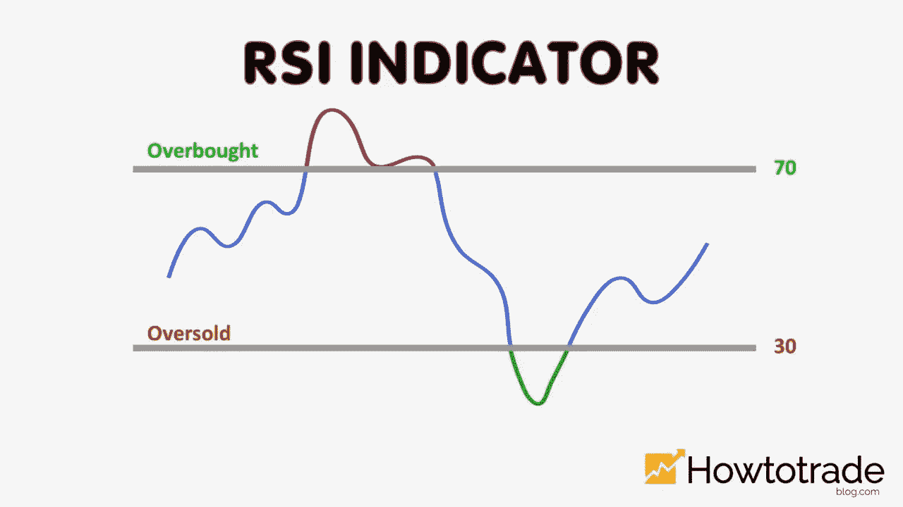

# 技术分析中的 RSI 指标是什么意思？

> 原文：<https://medium.com/coinmonks/what-mean-rsi-indicator-in-the-technical-analyse-f86f2d6a494f?source=collection_archive---------47----------------------->

Source photo [rsi — Bing images](https://www.bing.com/images/search?view=detailV2&ccid=7QYMP5PZ&id=8A048D660724C7A125AE760B41D3193B5F37D009&thid=OIP.7QYMP5PZFcH59EUP2m19hAHaEK&mediaurl=https%3a%2f%2fcdn.howtotradeblog.com%2fwp-content%2fuploads%2f2020%2f12%2f09191713%2fwhat-is-the-rsi-indicator.jpg&cdnurl=https%3a%2f%2fth.bing.com%2fth%2fid%2fR.ed060c3f93d915c1f9f4450fda6d7d84%3frik%3dCdA3XzsZ00ELdg%26pid%3dImgRaw%26r%3d0&exph=720&expw=1280&q=rsi&simid=608050069625527757&FORM=IRPRST&ck=16A5EF96569C85D89D1485343D7DFDA0&selectedIndex=3&ajaxhist=0&ajaxserp=0)

# RSI =相对强度指数

作为一个动量指标，相对强弱指数(RSI)自带尺度。动量是价格变化的速度。一条从 0 到 100 的线表明市场处于超买和抛售状态。超买的市场价值超过 70，超卖的市场价值低于 30…