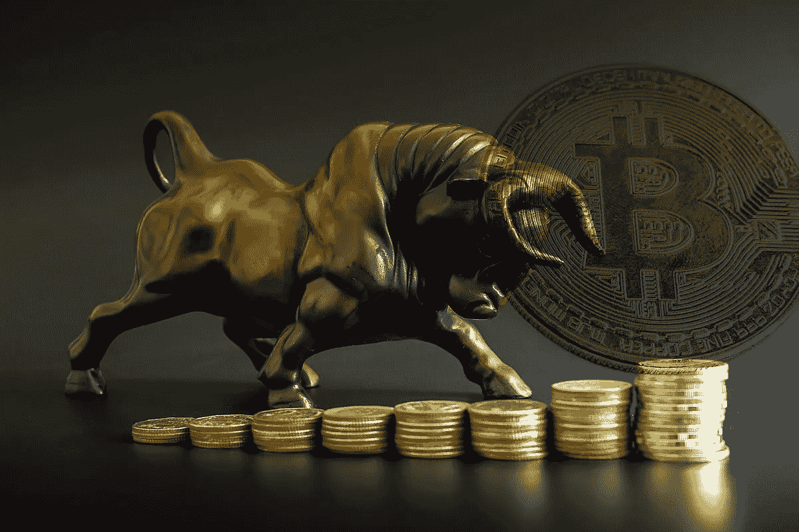
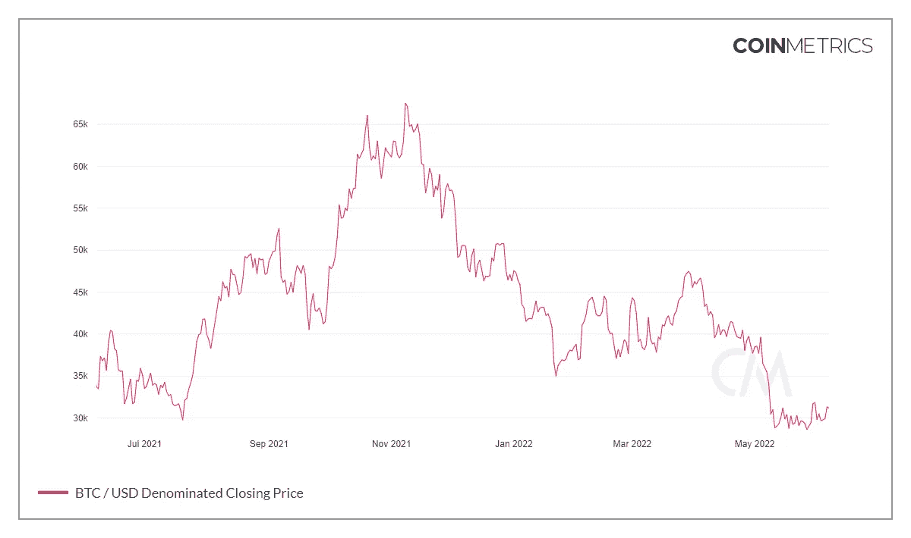

# 哪些叙事将推动下一轮加密牛市？

> 原文：<https://medium.com/coinmonks/what-narratives-will-drive-the-next-crypto-bull-market-9db648f540d?source=collection_archive---------8----------------------->

## 比特币的未来

## 有足够的理由期待新一轮反弹吗？

# 是什么推动了 2021 年的牛市？

2021 年世界变了，再也不会是原来的样子了。50 年后，我们会告诉我们的孙辈，那个时候整个地球因为疫情和随之而来的一切而关闭。

奇怪的是，同一个疫情是 crypto 成为主流流行的主要驱动力，其后果也是如此，包括:

*   人们被锁在家里，空闲时间太多
*   锁定期间的刺激方案(没有什么可以花这些钱的)
*   以前所未有的速度疯狂印钞(每个有基本经济学常识的人都知道这会带来通货膨胀)
*   各国政府越来越多的独裁措施，以及对个人权利的全球性侵犯
*   对公共机构普遍失去信任和信心

Photo by [Alexander Schimmeck](https://unsplash.com/@alschim?utm_source=medium&utm_medium=referral) on [Unsplash](https://unsplash.com?utm_source=medium&utm_medium=referral)

所有这些因素以近乎完美的顺序发生，导致:

*   货币供应过剩
*   对保护个人财富越来越感兴趣
*   维护个人和个人权利的积极斗争的增长。

> 要是有一种技术既能作为价值储存手段，同时又能抵抗缩减，不受任何中央机构的控制就好了！

你明白讽刺的意思。当然，一开始有无数资金涌入比特币，这正是所发生的事情。

Altcoins 紧随其后，这一次是由数十亿风险投资基金和机构投资者推动的。结果呢？史上最伟大的奔牛节密码。

但是现在呢？

# 密码市场降温

进入 2022 年，随着世界回归“正常”，密码市场开始崩溃。

为什么？政治家们终于意识到，世界上没有一个人会买他们的“暂时性通货膨胀”的屁话，所以他们必须采取行动，否则他们最大的恐惧就会成为现实:他们会被投票剥夺特权地位。

什么？你认为会是人们因为糟糕的货币政策而受苦吗？不，他们不关心那个。

随着通货膨胀上升到 70 年来的最高水平，货币在封锁和限制结束后充斥街头，政府开始提高利率，以努力吸收过量的流通货币。

美国国债被认为是世界上最安全的投资，所以当美联储以更高的利率发行新债券时，看到巨额资金流入它们并不奇怪。只是这一次，这笔钱被投资于加密和科技股。

这两种资产类型的资本疯狂外流导致了我们在 3 月和 4 月看到的崩盘。

这仅仅是 50 个基点(0.5%)的增长。预计今年还会有几次加息。此外，由我们时代最卑鄙的超级恶棍之一克里斯蒂娜·拉加德(Christine Lagarde)执掌的欧洲央行也可以说是类似的情况。

# 那么，什么能引发复苏呢？

随着启动 2021 年加密牛市的大部分因素消失，以及美联储和欧洲央行加息，似乎不会有任何支持牛市复苏的说法-至少在短期内。

还是有？以下是可能将密码市场推向新的历史高点的故事。

Photo by [Markus Spiske](https://unsplash.com/@markusspiske?utm_source=medium&utm_medium=referral) on [Unsplash](https://unsplash.com?utm_source=medium&utm_medium=referral)

## 通货膨胀和比特币作为价值储存手段

50 个基点远不足以缓解 70 年来最高的通胀。我们不要忘记，流通中的美元总量的 40%是在去年印刷的。

此外，随着利率的提高，衰退也随之而来。很快，美联储将不得不在继续抗击通胀或拯救美国经济之间做出选择。无论哪种情况，美国人民在不久的将来都将面临艰难时期，美元价值将继续下跌。

在美联储投降的情况下，失望的投资者流入比特币的资本是一种真实的可能性，可能会使橙色硬币回到历史高点。然而，这种情况对 alts 来说并不太好，他们可能会在 BTC 站后反弹，但不会回到他们以前的辉煌。

## 提高监视状态

一些政府管理疫情的方式简直令人厌恶。加拿大、澳大利亚、法国、意大利和阿根廷是如何利用突发卫生事件实施独裁监控的例子。

这些政权以人民的健康为借口，强加了荒谬的限制和要求，为警察对和平抗议者的暴力辩护，摧毁了他们国家的整体经济，剥夺了个人权利。当然，所有这些都是为了寻求对人口的全面控制。

> 我们永远不会忘记懦夫特鲁多冻结了对被称为“自由车队”的抗议者的捐赠和资产。但是当时人们做了什么呢？你猜对了，比特币。

这些专制措施中的大部分今天仍然存在，并且在冠状病毒消失很久之后还会继续存在。为什么？因为疫情是借口，而不是问题。

在一个越来越多的国家推动金融和社会监控的世界里，许多加密货币作为一个不受暴政控制的点对点货币网络激增。

Photo by [Maxim Hopman](https://unsplash.com/@nampoh?utm_source=medium&utm_medium=referral) on [Unsplash](https://unsplash.com?utm_source=medium&utm_medium=referral)

## 社会觉醒

在上一次牛市期间，数百万新用户来到 crypto 寻求赚钱。然而，随着这些收益被抹去，那些留下来的人是因为哲学而留下来的。

这些人理解比特币和加密货币的价值超出了它们的价格。相信金钱和国家分离以及个人主权概念的人。那些不愿忍受自己的权利被那些迫使他们投票的骗子剥夺的人。

随着争取个人权利的斗争越来越激烈，比特币也会越来越强大。他们彼此紧密相连。货币是政府最有效的控制工具，而比特币是人类摆脱货币的最佳资源。

# 教育至关重要

如果普通大众不能理解比特币背后的真正价值，这些叙述都是不够的。正如我所说，大多数人进入比特币是为了赚钱。这需要改变。

事情的发展方向是，下一波比特币和加密用户不会寻求金钱。他们会寻求自由。

> 我们比特币创造者需要教育人们比特币给个人带来的真正好处，以及为什么这些好处远远大于交易所给它定的价格。

财务自由、抵制审查、不受政府约束的价值储存、隐私和去中心化只是其中的一小部分。

现代社会正走向一条黑暗的道路。如果我们不反击，可能会有去无回。现在，比特币是我们最好的工具。

## 你喜欢这个故事吗？

我很高兴你这么做了！我叫桑蒂。我喜欢并写作视频游戏、加密货币和流行文化。如果你想阅读更多类似的内容，请关注我的****和 [**推特**](https://twitter.com/SantiagoSchw_) 。我真的很感激！****

## ****如果你喜欢这个，你应该读…****

**** [## 如何将隐秘的熊市变成改变人生的机会

### 隐秘的冬天来了——你准备好了吗？

medium.com](/coinmonks/how-to-turn-the-crypto-bear-market-into-a-life-changing-opportunity-fa3f778021be)  [## 突破点:比特币是人类获得真正自由的最后机会

### 比特币革命已经到来，这是我们唯一的出路

medium.com](/coinmonks/could-bitcoin-reorganize-the-world-12398d1ae377)  [## 发现这些危险信号将为您的 DeFi 投资节省数千美元

### 在投资前要留意这些方面，以避免损失

medium.com](/coinmonks/spotting-these-red-flags-will-save-you-thousands-of-dollars-on-your-defi-investments-6406b46d07b8) 

> 加入 coin monks[Telegram group](https://t.me/joinchat/Trz8jaxd6xEsBI4p)学习加密交易和投资****