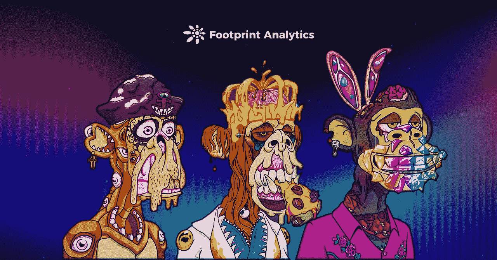
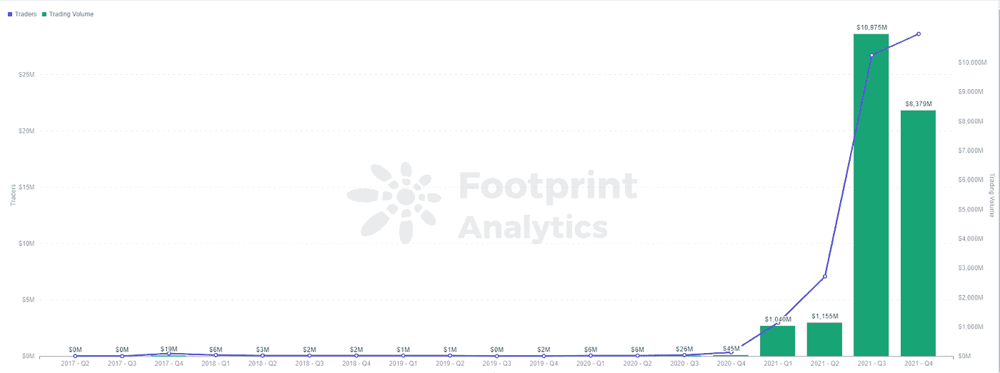
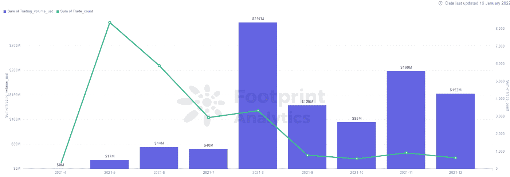
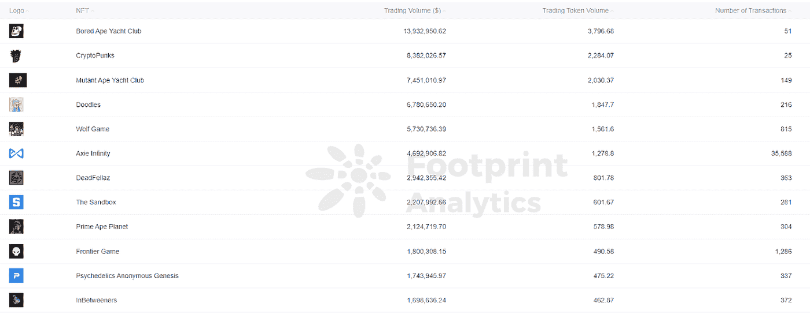
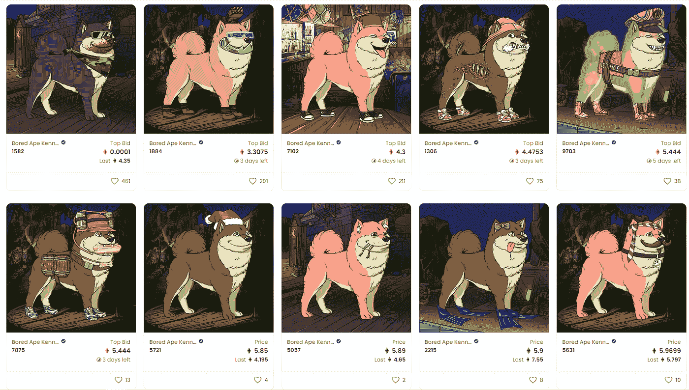
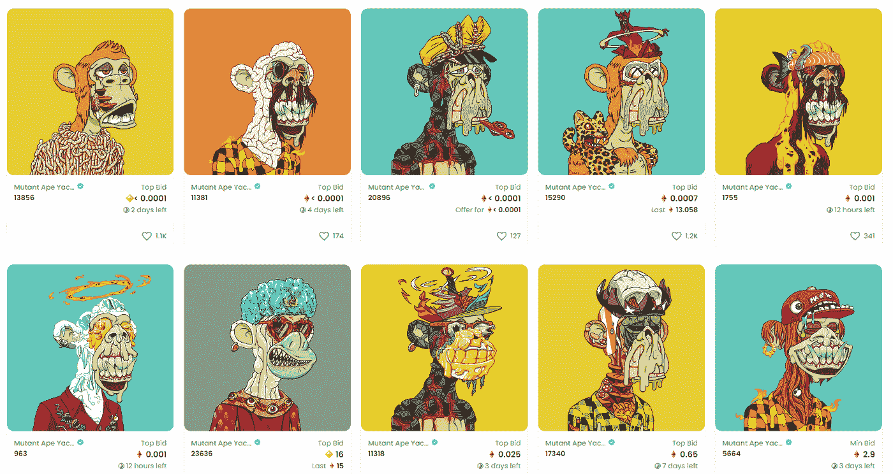

# NFT 的项目从 BAYC 的成功中学到了什么？|足迹分析

> 原文：<https://medium.com/coinmonks/what-nft-projects-learn-from-baycs-success-footprint-analytics-a83a1ff5c7a2?source=collection_archive---------8----------------------->

数据来源:足迹分析

2021 年 12 月，Bored Ape 游艇俱乐部(BAYC)的底价超过了 NFT 收藏品 crypto 朋克中由来已久的黄金标准。

CryptoPunks 于 2017 年发布，首次成为地板价最高的 NFT。

*Footprint Analytics — NFT Trading Volume*

NFT 是自 2017 年以来发展起来的独特数字收藏，但[最终在 2021 年第三季度爆发](https://www.footprint.network/guest/chart/nft-traders-trading-volume-before-2022-fp-c03737bd-8733-448d-b570-930156cde719)。

*Footprint Analytics — BAYC Trading Volume & Trader in 2021*

与最古老的 NFT 密码朋克类似，BYAC 是由 10，000 个随机计算机组合生成的数字收藏品。BAYC 于 4 月 23 日发布，有 10，000 个 NFT，在社交媒体上引起了一波关注。

*Footprint Analytics — Top Trading Volume of NFT Projects*

[根据足迹分析](https://www.footprint.network/guest/chart/top-10-nft-projects-by-trading-volume-in-2021-fp-c194a0f9-b650-4bd8-8786-e6b7cc3c0556)，BAYC 是 2021 年交易量最高的 NFT 项目。

# 为什么是 BAYC？

*   社会资本

拥有一个 BAYC 不仅仅是拥有一个数字收藏品，它就像加入了一个俱乐部。NFT 已经成为身份的象征，俱乐部里的每个人都会互相关注，并在 Twitter 等在线平台上联系。由于 BAYCs 的稀缺性，设置 NFT 头像的用户也得到更多的关注。

换句话说，拥有一辆 BAYC NFT 是一种身份的象征，让持有者在其他持有者中“吃得开”。许多名人也把他们的社交媒体头像换成了鲨鱼，包括 NBA 球星斯蒂芬·库里。

*   多种玩法

BAYC 运营良好，拥有一家 BAYC 还有许多其他好处。例如，BAYC 的所有者可以访问官方网站上的协作涂鸦板来创作艺术品。

此外，BAYC 还在游戏《沙盒》(The Sandbox)中购买了一块土地，作为俱乐部成员的聚集地。一些 BAYC 的支持者甚至在俱乐部附近购买了土地。6 月 18 日，BAYC 团队向每位用户空投了一件可穿戴帽衫，让他们能够快速识别彼此。

*   版权

NFT 的大部分版权不属于买方，但 BAYC 买方可以拥有自己的权利，并制作许多衍生产品。

11 月 12 日，环球音乐集团与 NFT 收藏家吉米·麦克尼尔(Jimmy McNeils)联手组建了环球音乐乐团。

*Universal Music Group — Kingship*

服装经销商凯尔·斯文森(Kyle Swenson)推出了《无聊猿报》(Bored Ape Gazette)，报道社区趋势。

此外，BAYC 还有自己的服装品牌、主题小说和周边商品。这一系列的 NFT 通过转播权获得了更大的知名度。

# 来自同一系列的 BAYC 派生 NFT

*   无聊猿养狗俱乐部

早在 2021 年 6 月，BAYC 团队推出了 Bored Ape Kennel Club，这是一项针对 BAYC 的社区福利，BAYC 社区的成员可以获得一只免费的 NFT 狗。狗舍 NFT 不是官方提供的，获得它的唯一途径是拥有 BAYC。

*OpenSea — Bored Ape Kennel Club*

在撰写本文时，Bored Ape Kennel Club 的底价为 5.85 ETH。

*   变异猿游艇俱乐部

MAYC 也是该系列的副产品，是在奥格斯推出的以基因突变为主题的 BAYC。BAYC 的主人空投了一小瓶诱变血清，将 BAYC 变成了变异程度不同的 MAYC。MAYC 包含多达 20，000 只变异猿，只能通过将现有的无聊猿暴露于血清中或通过官方出售来获得。MAYC NFT 以 3 ETH 的公开发行价格发售，一小时内销售一空。

*OpenSea — Mutant Ape Yacht Club*

在撰写本文时，变种人猿游艇俱乐部的底价为 15.8 ETH。

# BAYC 和 NFTs 的未来

许多传统品牌已经开始发布 NFT。然而，这些项目中的大部分只是抢钱，忽视了社区建设方面的长期发展。大多数 NFT 项目在启动后就消失了。

正如其 BAYC 的发展所示，通过创建实际应用程序和建立社区共识，维持 NFT 项目是可能的。

**什么是足迹分析**

足迹分析是一个一体化的分析平台，用于可视化区块链数据和发现见解。它清理和整合链上数据，因此任何经验水平的用户都可以快速开始研究令牌，项目和协议。凭借一千多个仪表板模板和一个拖放界面，任何人都可以在几分钟内构建自己的定制图表。发掘区块链数据，利用足迹进行更明智的投资。

*足迹网址:*[*https://www . Footprint . network*](https://www.footprint.network/)

*不和:*[*https://discord.gg/3HYaR6USM7*](https://discord.gg/3HYaR6USM7)

*推特:*[*https://twitter.com/Footprint_DeFi*](https://twitter.com/Footprint_DeFi)

*电报:*[*https://t.me/joinchat/4-ocuURAr2thODFh*](https://t.me/joinchat/4-ocuURAr2thODFh)

*Youtube:*[*https://www.youtube.com/channel/UCKwZbKyuhWveetGhZcNtSTg*](https://www.youtube.com/channel/UCKwZbKyuhWveetGhZcNtSTg)