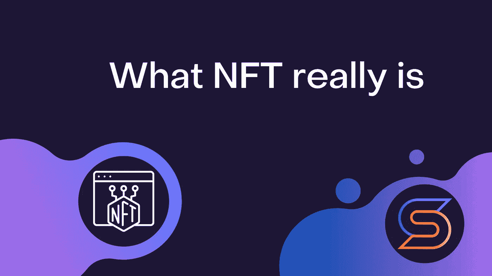

# NFT 到底是什么

> 原文：<https://medium.com/coinmonks/what-nft-really-is-cf13836c90d1?source=collection_archive---------20----------------------->

## 唯一的问题是，很少有人知道 NFT 是什么，以及它到底是如何运作的。是时候揭开 NFT 的神秘面纱，深入探究他们是如何运作的，以及在 NFT 王国里有多少欺骗了。

# NFT 到底是什么？

大家都知道与收藏品的类比。不幸的是，这种类比往好里说是完全不恰当的，往坏里说显然是有害的。

作为一个术语，NFT 意味着网络上的每个数字令牌都是唯一的。每个令牌都包含少量该令牌独有的数据。就是这样。它们只是在区块链不同地址间移动的小型数据容器。

现在，区块链以太坊上的 NFT 有许多让他们非常受欢迎的特色。如果其他网络尚未实现这些功能，也可能会实现其中的部分或全部功能。

1.  NFT 创建者的地址被存储为 NFT 的一部分。因此，关于 NFT 当前所有者的信息是公开的。
2.  NFT 代币可以设置版税百分比。当 NFT 在任何时候在任何两个 ETH 地址之间交易时，来自该“销售”的版税将被重定向到令牌创建者的地址。

现在，在我们继续之前，重要的是要了解另一个方面。NFT 非常非常小。在区块链中存储真实数据，即使是像 64x64 jpg 这样小的文件，也是极其昂贵的。大多数 NFT 只会存储几个字节的数据。例如，序列号或 URL。

简而言之，NFT 本质上是一张带有序列号、密码或网址的独特的纸。

# 什么不是非功能性测试

NFT 不是数字媒体内容商店。他们不在区块链上存储数字内容(文件)。如果你购买 NFT 的图片或歌曲，你实际上会得到一个令牌，上面有歌曲或图片的 URL，存放在一个随机的网络服务器上。

NFTs 并不阻止复制、更改、删除或以其他方式处理它们所涉及的任何数字或物理对象。

NFT 本身并不授予与其相关的任何资产的所有权或版权。

让我们再快速总结一下:NFT 只是独特的可交易纸片，上面刻有一点点信息。

# NFT 有几种潜在的方式来表达真正的意义

1.  **当连接到外部系统时，NFT 可以解锁功能。**NBA Topshot 项目就是一个例子。代币具有通过与外部系统接口来显示网站上的“体育时刻”的价值。如果网站关闭，这些代币会立即变得无用，因为无法访问“NBA 时刻”。隐猫也是一样。如果网站宕机，CryptoKitty 令牌就没有意义，也不起作用。在这两种情况下，NFT 只是一个可交易的序列号，与项目所有者服务器上的“时刻”或“小猫”相关联。另一个例子:可以发送到应用程序的 NFT，然后应用程序刻录(销毁)它们，以换取发送给你一些实物，如 t 恤。
2.  数字对象(或实物)的创作者可以将合法权利与 NFT 一起出售。不能保证 NFT 的卖方拥有链接对象的权利。要合法转让权利/所有权，必须签署一份具有法律意义的合同。对于像家庭或企业这样的大型财产，需要大量的法律工作和文件。如果您想购买 NFT 资产的所有权，您必须确保卖方是所有权持有人，并且他或她书面同意向您出售权利和 NFT，并在需要时附上所有文件。但是，将来没有理由不能独立于 NFT 出售产权。简而言之，目前没有任何法律约束 NFT 的数字版权所有权。
3.  **独特的/秘密的数据。**在这种情况下，NFT 包含只有其所属地址可见的唯一数据，如 URL 或秘密俱乐部密码。如果买家有理由相信这些信息仍然是秘密的，那么购买 NFT 就成了获取这些信息的途径。问题是显而易见的——这是互联网，没有什么秘密会保持很长时间，也不能保证创造者或以前的所有者没有泄露秘密信息。

# 利用 NFT 作弊

1.  当卖方最初并不拥有相关财产时，购买 NFT 以拥有该财产。
2.  购买 NFT 以拥有财产，但实际上并未获得该财产的合法权利。
3.  购买 NFT 来拥有一个对象，并获得非独占权(而不是独占权)，这意味着作者可以为同一个对象不断铸造无限个 NFT。
4.  购买一个“集合”NFT，在此之后，包含 NFT 引用的内容的站点/服务器/系统停止工作或消失。
5.  购买非专利技术用于投资，非专利技术有过高的(50-100%)专利使用费。这意味着当你转售 NFT 时，你投资的大部分或全部收益都归创作者所有，而不是你。
6.  随着 NFT 一起购买一个艺术品/东西，那么数字内容主机的 URL 已经掉了(或者被恶意更改了)，所以你的 NFT 不再指你买的对象。

# 现在 NFT 真正发挥作用的地方在哪里？

迄今为止，皇家 NFT 最大的成功案例是 CryptoKitties、CryptoPunks、TopShot 等。项目。也就是说，当一个网站/应用程序可以与 NFT 互动，向您显示内容，作为该网站/游戏内的内容所有权的证明。

NFT 对于具有游戏内物品交易的项目具有很大的潜力，因为游戏开发商公司可以以一定的版税比率(例如，1%)发布游戏内物品，并且如果游戏和交易获得势头，总是能够获利。

NFT 也可以在活动中作为纪念品，这意味着你可以获得一个参加音乐会的令牌，以证明你在那里。NFT 适合出售数字门票。它们不能被直接复制/克隆，即使在二级市场上转售，你也可以获得版税(直到人们开始绕过版税，只是开始出售令牌所在的 ETH 地址，或者以现金作为支付，然后免费转让令牌)。

至于拥有独立的数字资产或实物，这当然是有潜力的，但目前在法律上 NFT 在这一领域是无用的。是的，NFT 也非常适合洗钱，因为如果你在网上买了一些垃圾，比如一顶帽子的收藏照片，就不可能说你多付了钱，因为 NFT 上的价差是巨大的，价格本身是任意的。

# 交换。网队
官网—[https://swap.net/](https://swap.net/)
推特—[https://twitter.com/NFTSwapnet](https://twitter.com/NFTSwapnet)
不和—[http://discord.gg/35K7H9RqJd](http://discord.gg/35K7H9RqJd)
电报—[https://t.me/NFTswapnet](https://t.me/NFTswapnet)
中—[https://medium.com/@NFTSwapnet](/@NFTSwapnet)
Docs&白皮书—[http://docs.swap.net](https://t.co/5qc7Mxt2p5)

> 加入 Coinmonks [电报频道](https://t.me/coincodecap)和 [Youtube 频道](https://www.youtube.com/c/coinmonks/videos)了解加密交易和投资

# 另外，阅读

*   [OKEx vs KuCoin](https://coincodecap.com/okex-kucoin) | [摄氏替代品](https://coincodecap.com/celsius-alternatives) | [如何购买 VeChain](https://coincodecap.com/buy-vechain)
*   [币安期货交易](https://coincodecap.com/binance-futures-trading)|[3 commas vs Mudrex vs eToro](https://coincodecap.com/mudrex-3commas-etoro)
*   [如何购买 Monero](https://coincodecap.com/buy-monero) | [IDEX 评论](https://coincodecap.com/idex-review) | [BitKan 交易机器人](https://coincodecap.com/bitkan-trading-bot)
*   [CoinDCX 评论](/coinmonks/coindcx-review-8444db3621a2) | [加密保证金交易交易所](https://coincodecap.com/crypto-margin-trading-exchanges)
*   [红狗赌场评论](https://coincodecap.com/red-dog-casino-review) | [Swyftx 评论](https://coincodecap.com/swyftx-review) | [CoinGate 评论](https://coincodecap.com/coingate-review)
*   [Bookmap 评论](https://coincodecap.com/bookmap-review-2021-best-trading-software) | [美国 5 大最佳加密交易所](https://coincodecap.com/crypto-exchange-usa)