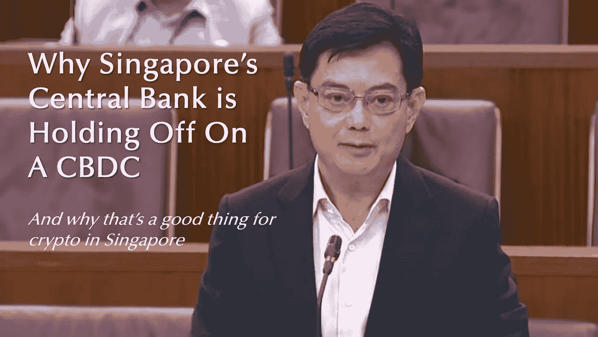

# 区块链在解决什么问题？

> 原文：<https://medium.com/coinmonks/what-problem-is-blockchain-solving-a725006fede9?source=collection_archive---------22----------------------->

*新加坡中央银行解释*

**“你在解决什么问题？”**

最好的企业能够清楚明白地表达他们存在的必要性。新加坡央行[对“温空投令牌化新币”的反应](https://www.mas.gov.sg/news/parliamentary-replies/2022/reply-to-cos-cut-on-digital-sing-dollar)就是这种以用户为中心的思维的一个极好的例子。

出乎许多人意料的是，新加坡金融管理局(MAS)最近澄清说，短期内不会部署零售 CBDC。为什么？因为目前，用户的需求还不足以满足国内支付的需求。

然而，创新的大门依然敞开。新加坡金融管理局继续投资 CBDC 能力，新加坡的分散金融(DeFi)初创公司也在积极尝试 [#stablecoin](https://www.linkedin.com/feed/hashtag/?keywords=stablecoin&highlightedUpdateUrns=urn%3Ali%3Aactivity%3A6905895780511555584) 用例。

*   来自新加坡 B2B 加密支付平台[**Request Finance**](https://www.request.finance/)的数据显示，支付的加密发票中有 42%是稳定发票。这是值得注意的，因为它被 1000 多家现实世界的企业用于工资、费用和 B2B 交易。(英尺。[克利斯朵夫·l .](https://www.linkedin.com/in/ACoAAAOzTTYBZcI9AKYog12vcfA7MrjW_L8qVWY)
*   2021 年，其 XSGD 在链上交易中的交易额达到 15 亿新加坡元，因为它被用于更快、更便宜的汇款，以及 Uniswap、Zilswap、DFX 金融和 1inch 等 DeFi 应用程序。(英尺。艾默瑞·基韦·乔纳斯·萨利
*   Bluejay Finance 正在为东盟等新兴经济体的多货币稳定货币制定一项资本高效协议。(英尺。[叶雷](https://www.linkedin.com/in/ACoAAA6qNnABHtbNJrrsRbVCi42bPFglTfVIY9U)
*   USDC 背后的巨头 [**Circle**](https://www.linkedin.com/company/circle-internet-financial/) 于 2021 年 11 月公布了在新加坡建立一个中心的计划，以测试新加坡公司的稳定联系。拉古兰病)

专注于解决用户问题。

那么，你在解决什么问题？下面评论。

[# defi](https://www.linkedin.com/feed/hashtag/?keywords=defi&highlightedUpdateUrns=urn%3Ali%3Aactivity%3A6905895780511555584)[# web 3](https://www.linkedin.com/feed/hashtag/?keywords=web3&highlightedUpdateUrns=urn%3Ali%3Aactivity%3A6905895780511555584)[# crypto](https://www.linkedin.com/feed/hashtag/?keywords=crypto&highlightedUpdateUrns=urn%3Ali%3Aactivity%3A6905895780511555584)[# fintech](https://www.linkedin.com/feed/hashtag/?keywords=fintech&highlightedUpdateUrns=urn%3Ali%3Aactivity%3A6905895780511555584)[# payments](https://www.linkedin.com/feed/hashtag/?keywords=payments&highlightedUpdateUrns=urn%3Ali%3Aactivity%3A6905895780511555584)

> 加入 Coinmonks [电报频道](https://t.me/coincodecap)和 [Youtube 频道](https://www.youtube.com/c/coinmonks/videos)了解加密交易和投资

# 另外，阅读

*   [CoinDCX 评论](/coinmonks/coindcx-review-8444db3621a2) | [加密保证金交易交易所](https://coincodecap.com/crypto-margin-trading-exchanges)
*   [红狗赌场评论](https://coincodecap.com/red-dog-casino-review) | [Swyftx 评论](https://coincodecap.com/swyftx-review) | [CoinGate 评论](https://coincodecap.com/coingate-review)
*   [Bookmap 评论](https://coincodecap.com/bookmap-review-2021-best-trading-software) | [美国 5 大最佳加密交易所](https://coincodecap.com/crypto-exchange-usa)
*   [如何在 FTX 交易所交易期货](https://coincodecap.com/ftx-futures-trading) | [OKEx vs 币安](https://coincodecap.com/okex-vs-binance)
*   [CoinLoan 评论](https://coincodecap.com/coinloan-review) | [YouHodler 评论](/coinmonks/youhodler-4-easy-ways-to-make-money-98969b9689f2) | [BlockFi 评论](https://coincodecap.com/blockfi-review)
*   [XT.COM 评论](https://coincodecap.com/profittradingapp-for-binance) | [币安评论](https://coincodecap.com/xt-com-review)