# izumi 为 Uniswap V3 解决了哪些问题

> 原文：<https://medium.com/coinmonks/what-problems-is-izumi-solving-for-uniswap-v3-e49b89273dab?source=collection_archive---------66----------------------->

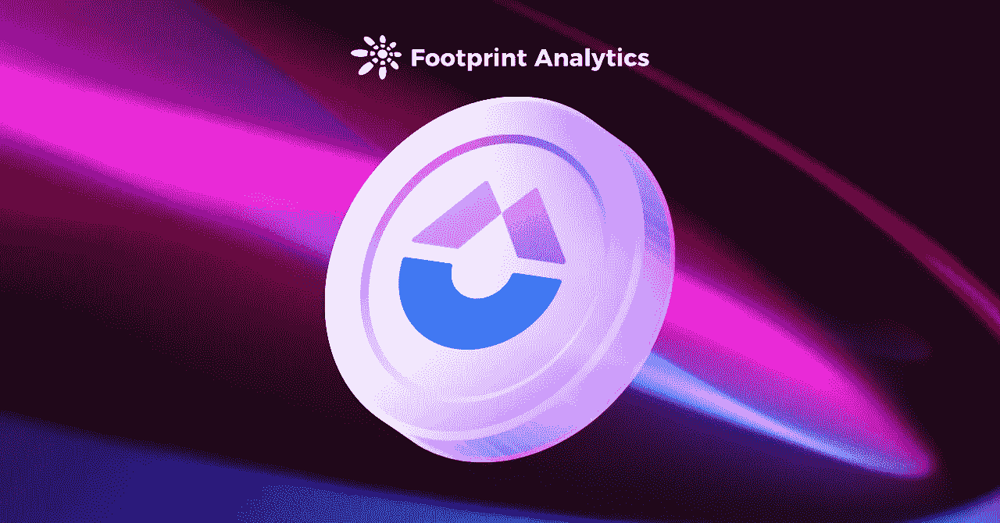

泉将如何改变 Uniswap 和 Curve 争夺 top DEX 的战斗？

2022 年 3 月

数据来源:Footprint Analytics [izumi 财务仪表板](https://www.footprint.network/guest/dashboard/izumi-finance-dashboard-fp-8d141bb0-0a31-421b-9cf5-a97b57623287?channel=ENG-209#secret=9548C940B1BCF540FAAC7FC4CE2966E7)&[Footprint DeFi 360](https://www.footprint.network/defi360?channel=ENG-209)

izumi Finance 于 12 月在 Bybit 上推出，是第一个可编程的流动性挖掘协议，它优化了流动性分配，并使该协议能够在特定价格范围内精确有效地提供回报。一月份在 Polygon 上发布后的一周内，其 USDT/USDC 池增长到为 Uniswap 提供 [70%的 TVL。](https://twitter.com/izumi_Finance/status/1486253697097428995?ref_src=twsrc%5Etfw%7Ctwcamp%5Etweetembed%7Ctwterm%5E1486253697097428995%7Ctwgr%5E%7Ctwcon%5Es1_&ref_url=https%3A%2F%2Fpublish.twitter.com%2F%3Fquery%3Dhttps3A2F2Ftwitter.com2Fizumi_Finance2Fstatus2F1486253697097428995widget%3DTweet)

在 Uniswap V3 流动性挖掘中，抵押协议令牌 iZi 可为用户赢得 veiZi，持有 veiZi 可获得高达 2.5 倍的奖励。此外，还可以通过发起投票或提案来参与[道](https://www.footprint.network/article/assange-dao-accusations-highlight-danger-of-mixing-activism-investing-fp-620f4120-a2873e00-1e46fd79?channel=ENG-209)的治理。

在本文中，我们将解释 izumi 独特的 [DeFi](https://www.footprint.network/article/de-fi-slowly-recovers-while-nft-fever-abates-february-monthly-report-fp-622aed7d-7abe1700-1eb79c14?channel=ENG-209) 模型，以及该协议是如何迅速发展的。

# izumi 如何解决 Uniswap V3 的棘手问题

Uniswap V3 被誉为 Uniswap 的巨大升级，因为 LP 令牌被 LP NFT 取代，用于流动性挖掘。LP 提供的流动性被限制在一定的价格范围内，从零到无穷大。

Uniswap V3 允许用户集中提供流动性，提高资金效率。

然而，加密货币市场波动性很大，大多数流动性提供商无法跟踪有限合伙人的价格区间进行调整。这导致了非永久性的损失。这也是 Uniswap V3 还没有超越 Curve 的原因之一。

下面是 izumi 如何解决这个问题:

*   **固定范围**解决了 [stablecoins](https://www.footprint.network/guest/dashboard/stablecoins-dashboard-fp-9d0d5bbb-dc74-412a-8449-a6435e2ec4e2?channel=ENG-209#secret=2C8D64B80CF878ACDED9A45541402388) 和 Uniswap V3 范围内锚定资产的流动性问题。
*   **动态范围**通过允许用户以动态价格范围提供流动性，解决了 Uniswap V3 中流动性提供者收益不佳的问题。
*   **一方**在 LP 令牌的一半(如 USDT)上开启流动性挖掘，将另一半(iZi)存放在 izumi LiquidBox 中进行赌注，减少非永久性损失。
*   [**C-AMM 桥**](https://izumi.finance/home) 是即将推出的跨链功能。它支持多链用户尝试 Uniswap V3 LP NFT 代币流动性挖掘，提高资金效率赚取更高收益。

# 泉的统计数据

在这一点上，基于来自 [Footprint DeFi 360](https://www.footprint.network/defi360?channel=ENG-209) (项目运营数据分析面板)的数据，我将分析 izumi 的 TVL 在不同公共链和 LP 令牌池中的分布，以及它的用户数据和竞争对手。

1.TVL 的分布

泉的 TVL 集中在两个公共链，以太坊和多边形。以太坊 TVL 约为 1300 万美元，或 66.7%，而多边形 TVL 约为 650 万美元，或 33.3%。

从具体模型来看，TVL 主要由固定区间和动态区间模型的流动性挖掘提供。耕作的 TVL 高于打桩(一边)。

**-耕作:固定范围&动态范围**

泉在推出不到 90 天的时间里，已在 TVL 筹集了 1950 万美元。iZUMi 的 USDT/USDC 养殖池在 Polygon 上的 TVL 已达到 600 万美元，是 Uniswap V3 Polygon 上 USDT/USDC TVL 总收入的 70%以上。

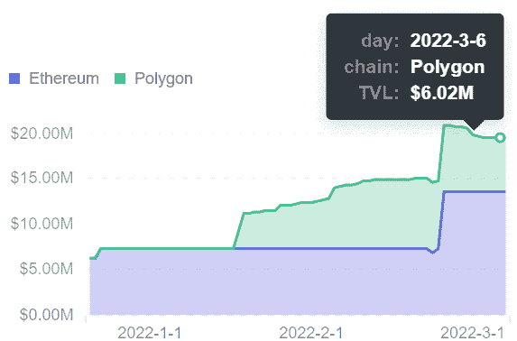

*Footprint DeFi 360 — Liquidity by Chain*

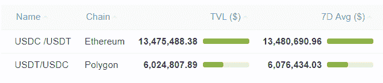

*Footprint DeFi 360 —* [*Top Pools by Liquidity*](https://www.footprint.network/guest/chart/tvl-pool-ranking-farming-template-fp-e12c10fe-5ff6-4514-89e0-945368c307ff)

**-铆接:一侧**

持有 iZi 可以质押，按照一方模式赚取奖励。

公链分销方面，iZi 主要质押在以太坊链上，与农耕相反。主要原因是 Polygon 的气费更低，更容易取出流动性开采的收益。

从认捐 iZi 的用户分布来看，主要集中在多边形上，以太坊上玩家相对较少。

从资金池的资金分布来看，USDC/USDT 资金池更受欢迎。以太坊的 USDC/USDT 资金池中有超过 87 万美元的 iZi 被质押。

8%的以太坊用户认捐了超过 93.65%的 iZi。可以推断，大多数以太鲸鱼持有大量的 iZi。向模型投入大量资金。

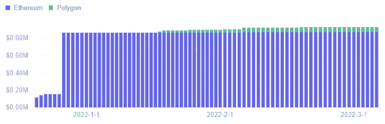

*Footprint DeFi 360 — Total Staked by Chain*

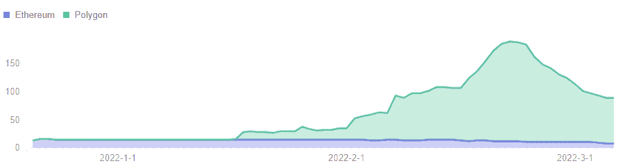

*Footprint DeFi 360 — Total Stakers by Chain*

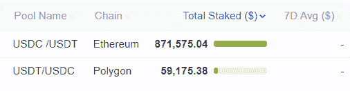

*Footprint DeFi 360 — Top Pools by Total Staked*

2.用户数据

2 月份，izumi 通过发布任务捕捉流量吸引了更多用户，但用户的留存显示出少量流失。

在链上分发方面，以太坊上的用户较少，主要是大鲸。多边形上的用户越多，玩家越普通。

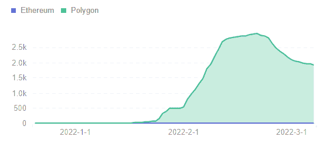

*Footprint DeFi 360 — Total Address by Chain*

**-新地址**

作为一个新兴项目，izumi 的整体用户增长趋势是上升的。2 月份 99.54%的增长来自 Polygon。

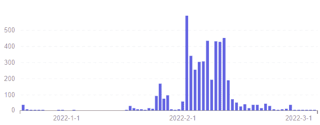

*Footprint DeFi 360 — Number of New Address*

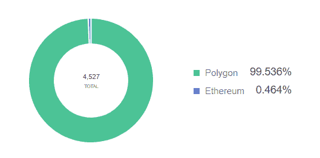

*Footprint DeFi 360 — Percentage of New Address by Chain*

**-活动地址**

从活跃地址来看，用户集中在 Polygon 上。主要是 Polygon 的用户在二月份相当活跃。这大致类似于用户的增加和农业的增长。

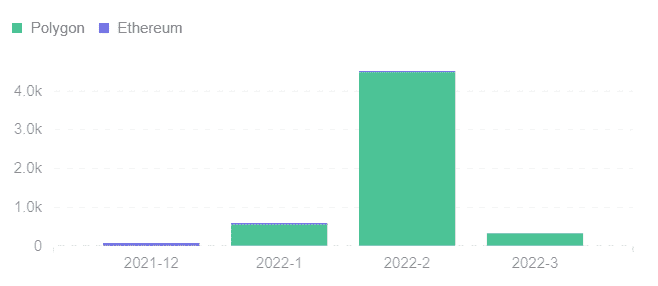

*Footprint DeFi 360 — Monthly Active Address by Chain*

**-每个活动地址的交易值**

每个活动地址的每月交易量呈下降趋势。主要的几卷是鲸鱼 12 月在以太坊活动的结果。自 1 月份以来，散户投资者一直很活跃，但交易量很小。

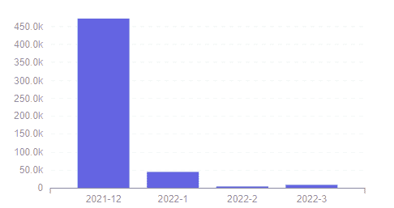

*Footprint DeFi 360 — Number of Monthly Txn Value Per Active Address*

3.竞争对手

Uniswap V3 流动性提供商遭受了巨大的非永久性损失，这是当今最突出的问题。根据 Topaz Blue 和 Bancor 的一项研究，到 2021 年，超过 49%的流动性提供者因非永久性损失而在投资上亏损。

出现了许多 Uniswap V3 流动性管理协议来解决非永久性损失，尤其是 izumi。其他例子包括 Alpha Vault(魅力金融)、Gamma(前 Visor 金融)和 G-UNI(意式冰淇淋网络)。

**-协议的主要特征如下**

*   [Alpha Vault(Charm Finance)](https://alpha.charm.fi/)，是首个 Uniswap V3 流动性管理协议。自动管理流动性再平衡。
*   [G-UNI(意式冰淇淋网络)](https://www.gelato.network/)将 Uniswap V3 LP 令牌 NFT 转换为可替换的 LP。在 Uniswap V2 通过采矿获得奖励。
*   [Gamma](https://www.gammastrategies.org/) ，前身为 Visor Finance，在 Uniswap V3 上实施了主动流动性管理，以减少 LP 令牌滑脱。
*   [izumi Finance](https://izumi.finance/home) ，第一个可编程的 Uniswap V3 移动性管理协议。

**- TVL 对比**

最高的 TVL 协议是 G-UNI(意式冰淇淋网络),为 5.8 亿美元，其次是 izumi，为 1950 万美元。Gamma 以 1117 万美元排在第三，领先于 Alpha Vault 的 841 万美元。

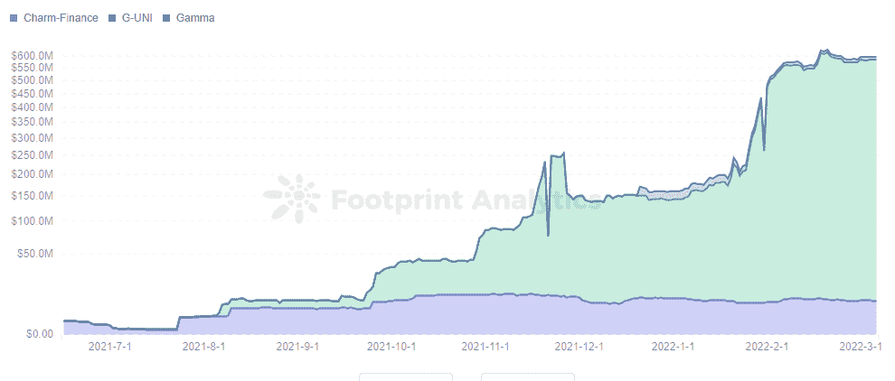

[*Footprint Analytics — TVL of Gamma, Alpha Vault & G-UNI*](https://www.footprint.network/guest/chart/tvl-of-gamma-alpha-vault-charm-finance-g-uni-gelato-network-fp-acfca751-18a5-4834-8397-99319cc7a859?channel=ENG-209#secret=09A907776F37B32E5C36B90EA489D831)

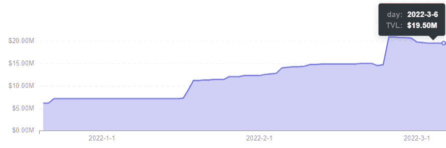

*Footprint DeFi 360 — TVL of izumi*

4.Token iZi

iZi 的价格正在走低，这与当前加密货币的整体下行趋势和即将到来的熊市有关。

代币价格在 0.05 美元左右波动，交易量保持在日均 16 万美元左右。

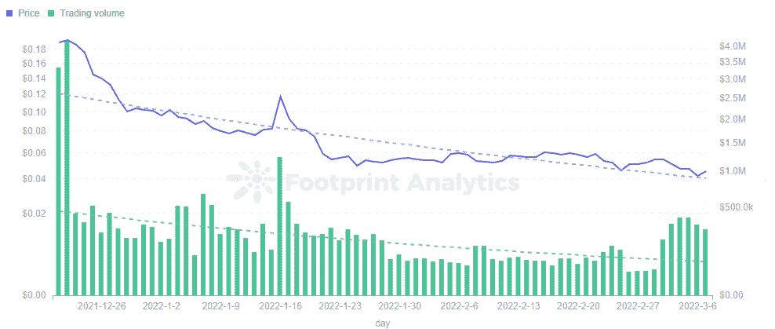

[*Footprint Analytics — Price & Trading Volume of iZi*](https://www.footprint.network/guest/chart/price-trading-volume-of-i-zi-fp-679fb318-5f36-4087-8a42-e5eac9b848f7?channel=ENG-209#secret=7509969783E109A250DA92DC78B01D7A)

一些想法

泉的用户增长集中在多边形而不是以太坊，种田仍然比跑马圈地更受欢迎。

izumi 可以考虑与 Solana 这样的公共连锁店整合，以获得比以太坊更低的燃气费。或许，C-AMM 大桥模型一旦投入使用，将会是一个有用的创新。

***此片由*** [***足迹分析***](https://www.footprint.network/?channel=ENG-209) ***社区供稿。***

*Footprint 社区是一个世界各地的数据和加密爱好者互相帮助了解和获得关于 Web3、元宇宙、DeFi、GameFi 或区块链新兴世界任何其他领域的见解的地方。在这里，你会发现活跃的、不同的声音相互支持，推动着社区向前发展。*

> 加入 Coinmonks [电报频道](https://t.me/coincodecap)和 [Youtube 频道](https://www.youtube.com/c/coinmonks/videos)了解加密交易和投资

# 另外，阅读

*   [麻雀交换评论](https://coincodecap.com/sparrow-exchange-review) | [纳什交换评论](https://coincodecap.com/nash-exchange-review)
*   最好的[加密税务软件](/coinmonks/best-crypto-tax-tool-for-my-money-72d4b430816b) | [硬币追踪评论](/coinmonks/cointracking-review-a-reliable-cryptocurrency-tax-software-5114e3eb5737)
*   [Stackedinvest 评论](https://coincodecap.com/stackedinvest-review) | [北海巨妖评论](/coinmonks/kraken-review-6165fc1056ac) | [bitFlyer 评论](https://coincodecap.com/bitflyer-review)
*   最佳[加密借贷平台](/coinmonks/top-5-crypto-lending-platforms-in-2020-that-you-need-to-know-a1b675cec3fa) | [杠杆令牌](/coinmonks/leveraged-token-3f5257808b22)
*   最佳[加密制图工具](/coinmonks/what-are-the-best-charting-platforms-for-cryptocurrency-trading-85aade584d80) | [最佳加密交易所](/coinmonks/crypto-exchange-dd2f9d6f3769)