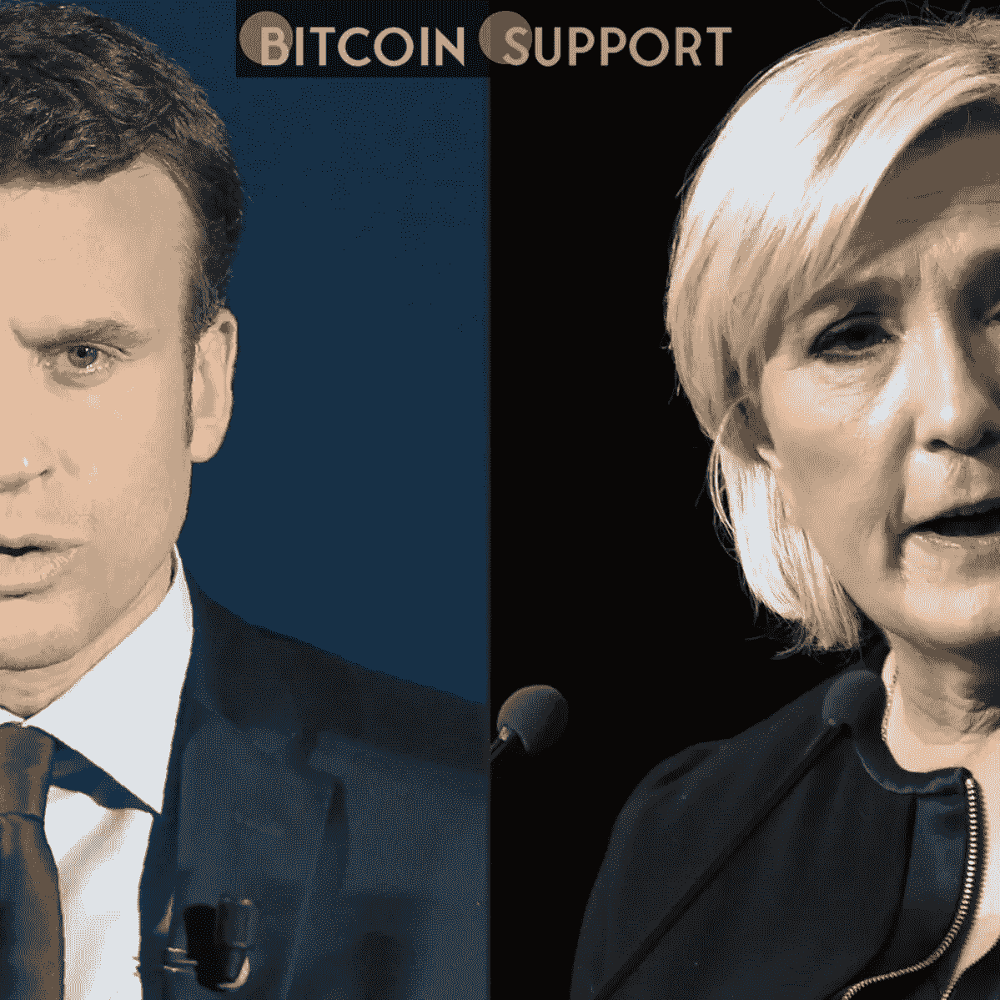
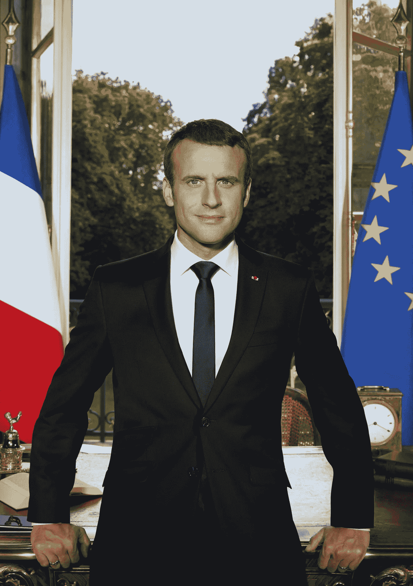

# 马克龙和勒庞哪个总统候选人对加密货币最有希望？

> 原文：<https://medium.com/coinmonks/what-promise-does-each-presidential-candidate-hold-for-cryptocurrency-macron-or-le-pen-253a0063fa9d?source=collection_archive---------37----------------------->

**Visit our website for full blog:-** [**https://bitcoinsupports.com/what-promise-does-each-presidential-candidate-hold-for-cryptocurrency-macron-or-le-pen/**](https://bitcoinsupports.com/what-promise-does-each-presidential-candidate-hold-for-cryptocurrency-macron-or-le-pen/)

France is unlikely to depart from the pan-European regulatory strategy, regardless of who wins the presidency.

Political commentators across the world are placing their predictions as France prepares for a runoff presidential election on April 24\. The decision is between incumbent Emmanuel Macron, a centrist, and right-wing populist Marine Le Pen, a right-wing populist. Much of the current political discourse revolves around economics, but one crucial aspect of it is largely lacking from the parties’ election platforms: digital assets. While both have made public pronouncements about cryptocurrency, neither Macron nor Le Pen appear to be poised to make any meaningful policy changes in the French digital economy.

**current state of the art**

Despite the present administration’s considerable attempts to welcome the IT industry, France remains a tech-unfriendly country in many aspects. For years, its authorities have been at the forefront of European legislative efforts to combat US IT behemoths’ tax “optimization” techniques, such as building European operations in more liberal jurisdictions like Ireland and Luxembourg.

The country does not have a specialised crypto regulatory regime, but the regulatory climate in general is quite tough. The 2019 Action Plan for Business Growth and Transformation of Enterprises, or PACTE, is the key piece of legislation that governs the industry. It requires any crypto companies in France (legally classified as digital asset service providers) to register with the Financial Markets Authority (AMF) and to follow the European Union’s Fifth Anti-Money Laundering Directive’s anti-money laundering and counter-terrorism financing (AML/CFT) criteria.

The stringent Know Your Customer (KYC) policy, which has no transaction value barrier for initiating reporting rules, is perhaps the crypto industry’s biggest concern. To put it another way, any cryptocurrency transaction of 1 euro or more requires a full KYC procedure, which includes the parties’ full names, addresses, and contact information.

On the plus side, well-behaved industry players may be able to receive a special licence from the AMF, allowing them to open bank accounts in France. French banks are hesitant to issue bank accounts for crypto firms, as Thibault Verbiest, a Paris-based partner at the law firm Metalaw, revealed. Meanwhile, France’s central bank is aggressively investigating the possibility of a central bank digital currency (CBDC).

**Regulatory activism in France**

Officials from France are involved in the international regulatory procedure. The European Securities and Markets Authority, chaired by Robert Ophèle, proposes consolidating all power and responsibility for crypto regulation in the hands of the European Securities and Markets Authority in February 2021\. He also stressed the importance of blockchain technology in the European economy’s future. The French government later reiterated the proposal.

In June 2021, four months later, Bank of France governor François Villeroy de Galhau reaffirmed his support for a pan-European crypto regulatory framework to be established as soon as possible. De Galhau’s perspective on the topic seemed significantly less friendly than Ophèle’s.

He projected that Europe has only one or two years to tackle the problem, citing the prospect of crypto undermining “monetary sovereignty.” The EU regulators responded with several important steps, including accelerating work on the Market in Crypto-Assets regulatory framework and revising the present Transfer of Funds Regulation to ensure that individual transactions are scrutinised more closely.

Nonetheless, the French government has attempted to assist the crypto business on a national level. “France has positioned itself at the vanguard of crypto innovation, at least in terms of legislative framework adoption, alliances with big industry players, and financial support for new projects,” Verbiest remarked. Binance CEO Changpeng “CZ” Zhao announced a partnership with the local financial technology association France FinTech in November 2021, standing alongside Cédric O, the French secretary of state for the digital economy, and pledging to spend $115 million on the development of the European crypto industry.

**Balanced caution vs. disinterested suspicion**

According to a recent poll, 4% of French respondents believe cryptocurrencies are a topic that will influence their presidential vote. This low figure is mirrored in the amount of time both candidates have spent talking about cryptocurrency. Macron, a former banker, has chosen a cautious approach, mostly echoing calls for increased regulation. He labelled Bitcoin (BTC) and digital currencies, along with shadow banking, “the most aggressive players on the financial markets who may produce financial crises and deregulate systems” during the 2018 Davos International Forum.

Macron was groomed to be a high-ranking official in France’s financial department, as Verbiest pointed out. As a result, it’s only logical that he prioritises the concerns of the European banking sector over the interests of the digital economy:

**“Crypto upsets banking, and France’s financial sector is extremely powerful.” Furthermore, the European Union and the euro compel France to reach a monetary and financial agreement with the other European member states.”**

Nonetheless, Macron’s first term saw at least two prominent figures publicly embrace the crypto business enter the halls of authority. In 2019, O committed to promote “all crypto-asset and blockchain actors” by creating “complete and credible growth conditions.” Several years later, though, O justified the strengthening of AML/CFT regulations and disregarded crypto entrepreneurs’ concerns, claiming that France was not “missing the train of blockchain technology.”

**Visit our website for full blog:-** [**https://bitcoinsupports.com/what-promise-does-each-presidential-candidate-hold-for-cryptocurrency-macron-or-le-pen/**](https://bitcoinsupports.com/what-promise-does-each-presidential-candidate-hold-for-cryptocurrency-macron-or-le-pen/)

33 岁的法国议会议员皮埃尔·皮耶森(Pierre Person)是青年运动 Les Jeunes avec Macron 的联合创始人，也是支持马克龙政策的“左翼自由派”智库拉可尔奇自由党(La France Libre)的联合创始人。他在 2019 年向法国议员提交了一份关于区块链的商业友好文件，随后倡导建立欧洲稳定货币。

另一方面，Person 刚刚卸任马克龙的 La rérepublicue En Marche 运动领导人，表达了对政府加密政策的不满。马克龙的对手、法国民族主义团体国民大会(National Rally)领导人马林·勒·庞长期以来一直喜欢讨论数字经济中的移民威胁。另一方面，她有在公开声明中彻底改变加密的记录。

**Visit our website for full blog:-** [**https://bitcoinsupports.com/what-promise-does-each-presidential-candidate-hold-for-cryptocurrency-macron-or-le-pen/**](https://bitcoinsupports.com/what-promise-does-each-presidential-candidate-hold-for-cryptocurrency-macron-or-le-pen/)

她呼吁在 2016 年禁止比特币，赶在上次选举之前，将比特币(以及一般的数字货币)描述为来自“强大的华尔街商业游说团”的想法。自那以后，勒庞缓和了反华尔街的言论，转而专注于支持严格的加密资产监管。与马克龙的随行人员不同，她和她的同事尚未对加密货币或区块链技术发表任何积极的看法。

**对自我监管说不，对泛欧战略说是**

不管周日的投票结果如何，法国几乎肯定会遵守其长期以来一直为之做出贡献的泛欧监管程序。加密货币交易所 Bittrex Global 的首席执行官斯蒂芬·斯顿伯格(Stephen Stonberg)告诉记者:

**“法国不太可能在欧盟即将到来的加密资产监管市场中遇到严重问题，因为法国监管机构将认识到，需要一个泛欧洲战略来适当管理市场。”事实上，法国监管机构更有可能在做出任何实质性决定或承诺之前等待 MiCA。"**

如果马克龙获胜，他的政府可能会继续走目前的道路，其中包括谨慎的加密友好言论(重点是区块链，而不是货币)，以及对数字资产的严格但不禁止的态度，所有这些都符合 FATF 和欧盟的标准。马克龙在大选第二轮投票前几天接受的采访，是对他与加密货币之间令人困惑的关系的精彩提炼。在回答有关数字资产和 Web3 的询问时，这位现任总统设法避免说一次“加密”这个词，同时重复他的国家成为数字经济领导者和促进创新的使命的旧词。以下也许是最关键的话:

**“我不相信一个自我监管的金融部门。这既不民主也不可持续。政府有责任在鼓励创新的同时，为该行业的健康发展创造正确的条件。"**

勒庞总是有可能采取强烈的反欧盟立场，但这对加密行业来说可不是什么好消息。这位政治家兼具左翼和右翼的民粹主义情绪，没有表现出对互联网经济特别感兴趣的任何迹象。

**访问我们的网站获取完整博客:-**[**https://bitcoinsupports . com/what-promise-does-each-president-candidate-hold-for-cryptocurrency-马克龙-or-le-pen/**](https://bitcoinsupports.com/what-promise-does-each-presidential-candidate-hold-for-cryptocurrency-macron-or-le-pen/)

**免责声明:以上为作者观点，不应视为投资建议。读者应该自己做研究。**

> 加入 Coinmonks [电报频道](https://t.me/coincodecap)和 [Youtube 频道](https://www.youtube.com/c/coinmonks/videos)了解加密交易和投资

# 另外，阅读

*   [无聊猿游艇俱乐部(BAYC)回顾](https://coincodecap.com/bored-ape-yacht-club-bayc-review) | [拜比特 vs 比特币基地](https://coincodecap.com/bybit-vs-coinbase)
*   [5 款最佳加密交易终端](https://coincodecap.com/crypto-trading-terminals) | [最佳 DeFi 应用](https://coincodecap.com/best-defi-apps)
*   [比特币基地 vs 瓦济克斯](https://coincodecap.com/coinbase-vs-wazirx) | [比特鲁点评](https://coincodecap.com/bitrue-review) | [波洛涅克斯 vs 比特鲁](https://coincodecap.com/poloniex-vs-bittrex)
*   [德国最佳加密交易所](https://coincodecap.com/crypto-exchanges-in-germany) | [Arbitrum:第二层解决方案](https://coincodecap.com/arbitrum)
*   [币安交易机器人](/coinmonks/binance-trading-bots-d0d57bb62c4c) | [OKEx 评论](/coinmonks/okex-review-6b369304110f) | [阿塔尼评论](https://coincodecap.com/atani-review)
*   [最佳加密交易信号电报](/coinmonks/best-crypto-signals-telegram-5785cdbc4b2b) | [MoonXBT 评论](/coinmonks/moonxbt-review-6e4ab26d037)