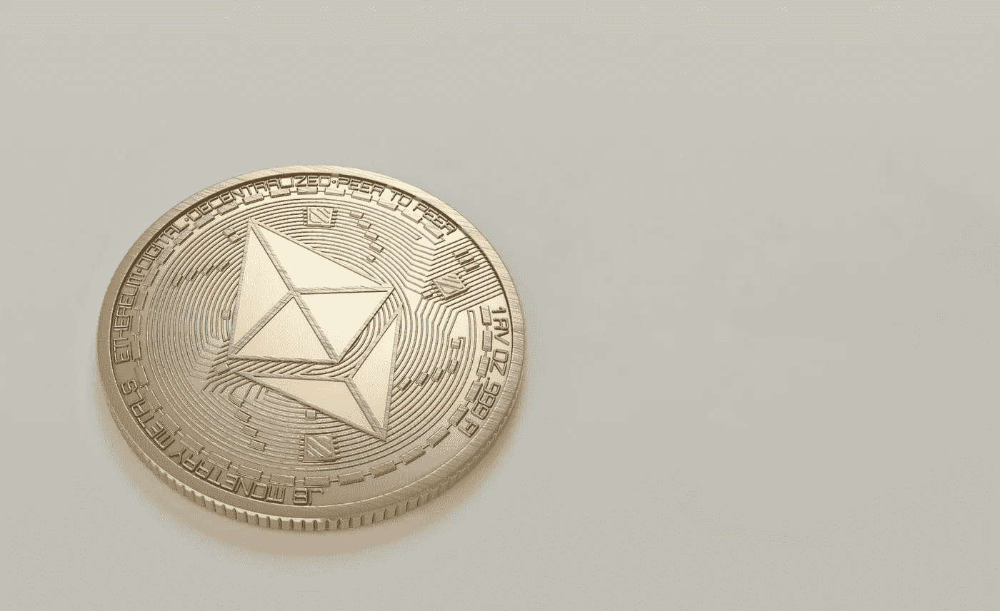
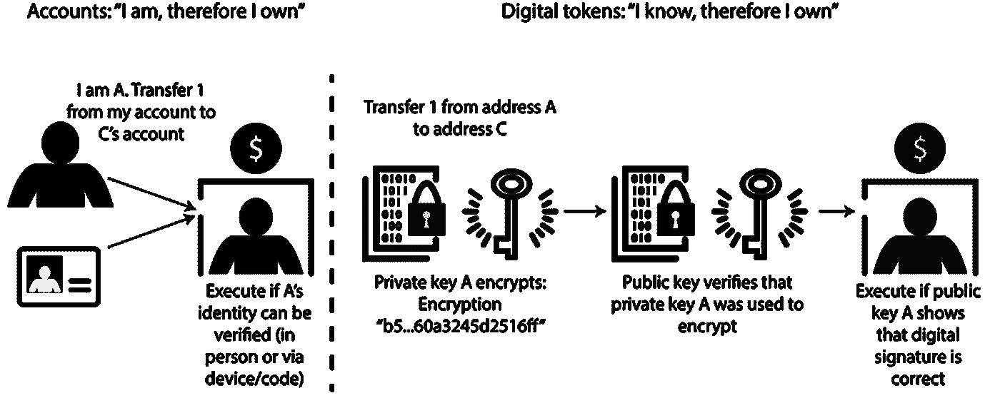
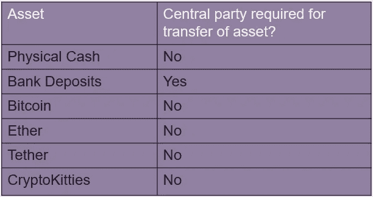

# 什么是真正的加密令牌？

> 原文：<https://medium.com/coinmonks/what-really-is-a-crypto-token-57b02c8bff3e?source=collection_archive---------25----------------------->

[Photo by Moose Photos](https://www.pexels.com/photo/round-gold-colored-ethereum-coin-1036637)

尽管 token 一词在计算机科学文献、技术博客和新闻中被广泛使用，但它的用法却很不一致，令人困惑。单词“token”可以用来描述不同的事物。它通常被等同于具有与实物现金相似属性的数字对象。这篇文章旨在解决这一困惑，并阐明“token”的真正含义和非含义。

下图显示了存储和转移价值的两种方式之间的区别。

Source: [The technology of retail central bank digital currency (BIS March 2020)](https://www.bis.org/publ/qtrpdf/r_qt2003j.htm)

在第一种情况下，价值根据身份在集中的分类帐中维护。这将存储像“爱丽丝拥有 100 美元，鲍勃拥有 50 美元”这样的信息。爱丽丝必须去银行出示一些身份证明。如果一个收银员能够验证她的 ID，那么他们将执行指令进行转账。然后，银行会借记爱丽丝的账户，贷记收款人的账户。

在第二种情况下，没有维护余额的中央分类账。声明只基于知识，如数字签名。使用非对称密钥对和数字签名来执行和验证传输。

这两种转移价值的方法之间有几个重要的区别。

1.  在第一个模型中，焦点在于确定交易的*方*的合法性，而在第二个模型中，焦点在于确定被转移的*物*的合法性。
2.  在第二种模式中，你不需要一个中央机构来核实转账。您可以使用您知道的东西(如私钥)来执行传输

这里的第一种方法称为“帐户模型”方法，第二种方法称为“令牌模型”。这有助于我们得出“令牌”可能是什么的可能定义。

> 代币是可以从一方转移到另一方的数字资产，无需集中的第三方参与

让我们看看这个定义如何与一些我们认为是“令牌”的常用资产和一些我们不认为是“令牌”的常用资产相比较。

在这里，只要我们确认收到的现金是真的，被认为是象征性的实物现金就可以简单地从一方转移到另一方。确实需要中央第三方验证和执行转账的银行存款是数字余额，不能被视为代币。比特币和以太分别是比特币和以太坊区块链的本地加密令牌，它们的转移不需要集中方，也不需要[系绳](https://tether.to/) ERC-20 令牌和 [CryptoKitty](https://www.cryptokitties.co/) NFTs。

到目前为止，我们的定义看起来相当可靠。但是，让我们更仔细地看看普通区块链平台中的“令牌”是如何工作的。

**比特币**钱包存储用于签署交易的密钥。用户的平衡是通过一个名为 [UTXO](https://river.com/learn/bitcoins-utxo-model/) 的系统来维护的，这个系统位于一个分布式的、复制的公共节点账本上。传输包括验证只有持有指定公钥的用户才能使用 UTXOs。

**以太坊**像比特币一样，钱包存储用于签署交易的密钥，余额在公共节点的分布式复制账本上维护。交易是来自账户的加密签名指令。账户将发起交易以更新以太网的状态(例如，借记 Bob 的账户，贷记 Alice 的账户),并且包含当发送者的私钥签署交易时生成的数字签名组件。这用于确认发送者已经授权该交易。

# 等一下…

比特币和以太坊中“代币”的工作方式，听起来非常类似于银行存款的转移。也就是说，您的余额由一台服务器维护(尽管这里是一组复制的余额)，您需要提供一个数字签名，以向权威机构证明确实是您在消费资金。通过仔细观察令牌在这些区块链平台中是如何实现的，可以得出两个重要的观察结果。

**分类账保存令牌**您的加密钱包仅保存对应的加密密钥，用于证明您的身份。区块链持有与您的公钥相对应的余额。因此，持有代币的不是钱包，而是账本(区块链)本身。如果所有的区块链节点都被清除(尽管这种可能性很小),那么与你的身份相对应的令牌余额也会被清除。

**没有账本就不能转移代币**在比特币和以太坊中，如果不能访问“账本”即区块链，就不能进行转移“代币”的交易。转移价值的请求必须到达区块链节点，并被足够数量的节点接受，这些节点需要对区块链的整体状态达成一致。

**加密令牌≠无记名令牌**

这些观察表明，这些代币不同于现金等实物代币。与现金不同，这些不是“不记名代币”。它们可以在没有“集中的第三方”参与的情况下从一方转移到另一方，但是需要分散的节点网络来保存余额和验证交易。

David Chaum 的 [ECash](https://www.usenix.org/legacy/publications/library/proceedings/ec95/full_papers/camp.txt) 系统实现了更接近数字转移价值的“无记名令牌”模型，该系统允许两个交易者之间的离线转移，但它要求收到电子令牌的商家迅速将该令牌提交给电子银行进行验证，否则将面临令牌一文不值的风险。

那么，为什么机构群体开始将这些基于区块链的资产余额称为“令牌”呢？

以下摘录自[联邦政府关于数字货币背景下代币和账户的说明](https://www.federalreserve.gov/econres/notes/feds-notes/tokens-and-accounts-in-the-context-of-digital-currencies-122320.htm)，揭示了我们如何将基于智能合约的资产余额称为代币。

> 以太坊的设计允许创建被称为智能合约的通用计算机程序，智能合约是存储在以太坊区块链上的可执行代码。
> 
> 智能合约的一个早期用例是区块链上资产(或其表示)的编程定义。以太坊社区将这些资产称为“代币”。总的想法是，智能合约可以定义自己的分类账，用于跟踪令牌的用户余额(本质上是以太坊的子分类账，特定于该特定智能合约)，并允许用户在该令牌所代表的资产中进行交易。

这在 ERC-20 令牌标准中也是显而易见的，该标准是最早的以太坊改进提案(EIP ),旨在标准化可替代资产在以太坊上的表示方式。它被描述为“令牌的标准接口”，“允许在智能合约中实现令牌的标准 API”。紧随以太坊的脚步，其他支持智能合约的平台也采用了类似的令牌标准，因此“令牌”一词开始流行，指的是在区块链上跟踪的资产。

# 结论

这篇文章首先区分了数字资产转移的模式，即账户模式和代币模式。然后，它针对通常称为令牌的资产测试了令牌的一般定义。它进一步探讨了令牌如何在比特币和以太坊上工作，以将其与“无记名令牌”进行比较。作为结论，它着眼于在以太坊中标准化资产表示的早期尝试，从而试图解决由于基于区块链的代币与账户模型的相似性而产生的混淆。

# 参考

1.  [联邦票据——数字货币背景下的代币和账户](https://www.federalreserve.gov/econres/notes/feds-notes/tokens-and-accounts-in-the-context-of-digital-currencies-122320.htm)
2.  查尔斯·M·卡恩——代币与账户:为什么区别仍然重要
3.  [Ezechiel Copic——是时候放弃“代币与账户”的讨论了](https://www.linkedin.com/pulse/its-time-abandon-token-vs-account-discussion-ezechiel-copic/)

> 加入 Coinmonks [电报频道](https://t.me/coincodecap)和 [Youtube 频道](https://www.youtube.com/c/coinmonks/videos)了解加密交易和投资

# 另外，阅读

*   [Bookmap 评论](https://coincodecap.com/bookmap-review-2021-best-trading-software) | [美国 5 大最佳加密交易所](https://coincodecap.com/crypto-exchange-usa)
*   最佳加密[硬件钱包](/coinmonks/hardware-wallets-dfa1211730c6) | [Bitbns 评论](/coinmonks/bitbns-review-38256a07e161)
*   [新加坡十大最佳加密交易所](https://coincodecap.com/crypto-exchange-in-singapore) | [购买 AXS](https://coincodecap.com/buy-axs-token)
*   [红狗赌场评论](https://coincodecap.com/red-dog-casino-review) | [Swyftx 评论](https://coincodecap.com/swyftx-review) | [CoinGate 评论](https://coincodecap.com/coingate-review)
*   [投资印度的最佳密码](https://coincodecap.com/best-crypto-to-invest-in-india-in-2021)|[WazirX P2P](https://coincodecap.com/wazirx-p2p)|[Hi Dollar Review](https://coincodecap.com/hi-dollar-review)
*   [加拿大最佳加密交易机器人](https://coincodecap.com/5-best-crypto-trading-bots-in-canada) | [库币评论](https://coincodecap.com/kucoin-review)