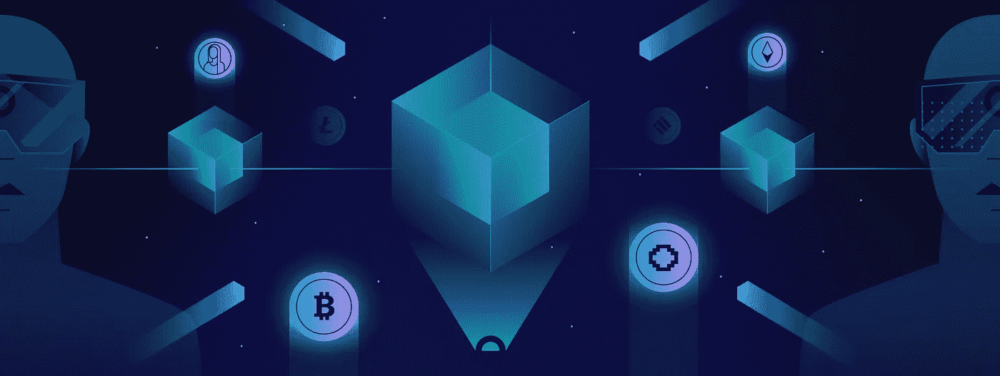

# 加密和 NFTs 在元宇宙中扮演什么角色？

> 原文：<https://medium.com/coinmonks/what-role-do-crypto-and-nfts-play-in-the-metaverse-cbbfe2667bf1?source=collection_archive---------25----------------------->

What Role do Crypto and NFTs Play in the Metaverse?

当脸书的母公司也拥有 Snapchat、Instagram 和 Whatsapp 时，元宇宙最近被推到了聚光灯下。也就是说，元宇宙并不是一个新概念。

甚至在脸书宣布之前，迪斯尼和微软这样的大公司就已经在探索元宇宙作为虚拟现实空间的潜力。

那么，元宇宙到底是什么，它是如何运作的？

# 什么是元宇宙？

Meta 首席执行官马克·扎克伯格(Mark Zuckerberg)将元宇宙视为一个将取代互联网的沉浸式平台；这将是一个用户不仅可以观看内容，还可以通过增强现实体验生活的地方。

也就是说，[元宇宙](https://www.cryptohopper.com/blog/4789-what-is-the-metaverse)并不是一个新概念。这个想法最初是由作家尼尔·斯蒂芬森在 1992 年的小说《冰雪奇缘》中提出的，斯蒂芬森在虚拟环境中创建了 3D 化身。像《《我的世界》》和《堡垒之夜》这样的游戏已经吸收了这一理念的元素，并将其用于游戏设计。

本质上，元宇宙是一个虚拟世界，在这里人们可以做几乎任何他们在现实世界中可以做的事情。元宇宙将提供一个虚拟空间和虚拟经济，人们可以在这里工作、赚钱、买卖房产、娱乐、玩游戏、创作艺术、支付款项，以及进行与现实生活类似的日常活动。元宇宙是增强现实和虚拟现实的结合，帮助人们和社区在社交平台上进行互动。他们创造 3D 化身，还允许人们执行现实中不可能的极端身体动作。

新冠肺炎疫情和随后的全球封锁是为什么元宇宙的概念在过去两年变得如此流行的重要原因。呆在家里的人们在寻找逃生的方法。在线游戏变得流行起来，不仅对年轻人如此，对成年人也是如此。在线游戏行业利用元宇宙的概念，推出了许多新产品来开拓市场。例如，微软正在开发基于虚拟和增强现实以及全息图的 XR(扩展现实)应用程序。

元宇宙的主要思想是帮助人们在虚拟环境中互动。人们可以在全息数字世界中举行会议。这个概念有重塑经济的巨大潜力。专家认为，它可以成长为一个万亿美元的产业，并为数百万人带来机会和就业。

# 加密在元宇宙中的作用

加密货币是全球用于数字交易支付的虚拟资产，为了运行元宇宙的虚拟经济，我们需要一种虚拟资产。在这种情况下，crypto 是最明显的选择。

加密货币已被全球接受，并作为一种安全、分散和透明的支付模式。许多元宇宙平台基于分散的区块链网络，并使用加密货币。

将加密技术应用到元宇宙中会带来许多好处。例如:

*   加密货币是分散的，不受任何中央权威机构的控制。
*   这是未经许可的。
*   加密实用程序利用高速交易。
*   它为用户提供完全匿名，保持用户的安全完整
*   它为用户提供了一个协作和开放的平台。
*   Crypto 向买家提供真实性和所有权的数字证明。
*   参与者可以参与元宇宙社区的决策过程。
*   像 Polkadot 和 Avalanche 这样的加密货币可以创造互动的区块链。这使得不同的元宇宙生态系统可以相互交流。

# 非正规金融机构在元宇宙的作用

NFT(不可替代代币)在元宇宙的未来扮演着至关重要的角色。这是因为 NFT 基于区块链技术工作，并使用加密令牌来提供虚拟艺术品、数字物品、运动卡、虚拟房地产、音乐、视频和游戏物品的所有权。

非功能性交易通过智能合约运作。因此，想要在元宇宙购买虚拟财产的用户可以通过 NFT 智能合同来完成。这就把所有权转移给了买方。在这种情况下，加密货币成为唯一被接受进行所有这些虚拟交易的代币。人们还可以使用虚拟角色参与虚拟游戏，并通过加密货币获得奖励。在游戏中，买家和卖家可以使用虚拟角色，创建一个虚拟身份，在元宇宙平台上购买 NFT 的房产、艺术品或音乐视频。

NFT 的项目包括 MetaCity，这是一个类似于《我的世界》的元宇宙游戏平台。该平台允许用户买卖 NFT 的土地和发展业务。它还提供了跨游戏功能，玩家可以在游戏之间交换游戏物品。元城市还提供免费的 NFT 滴，用户可以赚取奖励。该平台的另一个独特之处是，用户可以通过 NFT 人物创造他们选择的经济或生活。

建立在以太坊区块链网络上的 Sorare 是一款面向足球迷的 NFT 游戏。目前，有 180 家持牌足球俱乐部。玩家可以使用游戏卡建立虚拟团队，并根据团队的表现获得奖励。

# 元宇宙密码项目值得你关注

# 分散土地

元宇宙项目[分散地](https://decentraland.org)使用法力，这是平台的原生加密货币。它向用户提供治理协议，货币可以用于实际交易。该平台的用户可以创建定制的虚拟化身，玩游戏或去虚拟赌场并获得奖励。参与者还可以在拍卖中买卖土地，并使用马纳货币购买 NFT 产品。分散土地的总市场评估是 50 亿美元。

# 沙箱

[沙盒](https://www.sandbox.game/en/)与分散地颇为相似，沙子充当平台的虚拟货币。沙盒是一个虚拟社区平台，用户可以在这个平台上相互交流，也可以买卖房产和不动产并获得收入。沙盒也得到了音乐界大腕的代言，包括 Snoop Dogg 和 Deadmau5。目前，沙盒的总市值为 23 亿美元，略落后于分散化土地。

# 杰德斯塔

[JEDSTAR](https://jedstar.app) 是一个去中心化金融(DeFi)和游戏化金融(GameFi)项目。该公司推出了一种名为 KRED 的新令牌，可用于其新的 CCG(可收集的纸牌游戏)、MMORPG(元宇宙多人在线角色扮演游戏)和 NFT 市场。他们还将推出 STARDOME，这是一项允许用户通过他们通常的支付方式买卖 KRED 的计划。

元宇宙仍处于起步阶段，预测其未来还为时过早。然而，虚拟或增强现实已经走过了漫长的道路，专家认为元宇宙的潜力才刚刚开始。

*原载于*[*https://www.cryptohopper.com*](https://www.cryptohopper.com/blog/5023-what-role-do-crypto-and-nfts-play-in-the-metaverse)*。*

> 加入 Coinmonks [电报频道](https://t.me/coincodecap)和 [Youtube 频道](https://www.youtube.com/c/coinmonks/videos)了解加密交易和投资

## 另外，阅读

*   [3 商业评论](/coinmonks/3commas-review-an-excellent-crypto-trading-bot-2020-1313a58bec92) | [Pionex 评论](https://coincodecap.com/pionex-review-exchange-with-crypto-trading-bot) | [Coinrule 评论](/coinmonks/coinrule-review-2021-a-beginner-friendly-crypto-trading-bot-daf0504848ba)
*   [莱杰 vs Ngrave](/coinmonks/ledger-vs-ngrave-zero-7e40f0c1d694) | [莱杰 nano s vs x](/coinmonks/ledger-nano-s-vs-x-battery-hardware-price-storage-59a6663fe3b0) | [币安评论](/coinmonks/binance-review-ee10d3bf3b6e)
*   [加拿大最佳加密交易机器人](https://coincodecap.com/5-best-crypto-trading-bots-in-canada) | [Bybit vs 币安](https://coincodecap.com/bybit-binance-moonxbt)
*   [阿联酋 5 大最佳加密交易所](https://coincodecap.com/best-crypto-exchanges-in-uae) | [SimpleSwap 评论](https://coincodecap.com/simpleswap-review)
*   购买 Dogecoin 的 7 种最佳方式
*   [最佳期货交易信号](https://coincodecap.com/futures-trading-signals) | [流动性交易所评论](https://coincodecap.com/liquid-exchange-review)
*   [用于 Huobi 的加密交易信号](https://coincodecap.com/huobi-crypto-trading-signals) | [Swapzone 审查](/coinmonks/swapzone-review-crypto-exchange-data-aggregator-e0ad78e55ed7)
*   [火币交易机器人](https://coincodecap.com/huobi-trading-bot) | [如何购买 ADA](https://coincodecap.com/buy-ada-cardano) | [Geco？一次审查](https://coincodecap.com/geco-one-review)
*   [币安 vs 比特邮票](https://coincodecap.com/binance-vs-bitstamp) | [比特熊猫 vs 比特币基地 vs Coinsbit](https://coincodecap.com/bitpanda-coinbase-coinsbit)
*   [如何购买 Ripple (XRP)](https://coincodecap.com/buy-ripple-india) | [非洲最好的加密交易所](https://coincodecap.com/crypto-exchange-africa)