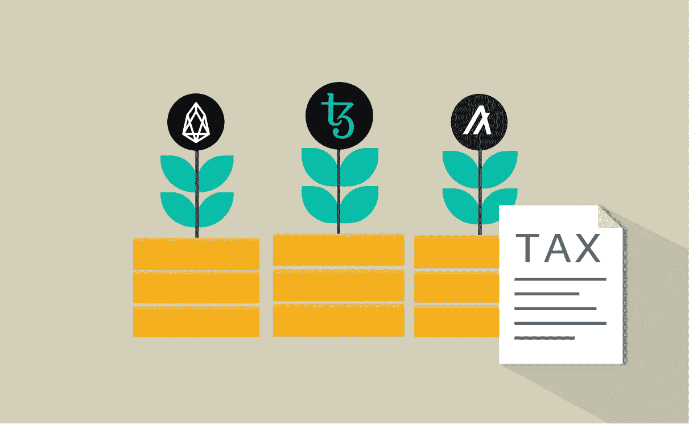

# 我应该知道什么关于加密 Staking 税？

> 原文：<https://medium.com/coinmonks/what-should-i-know-about-crypto-staking-taxes-2caf031e13ec?source=collection_archive---------38----------------------->

# 浅谈加密赌注税

一些幸运的投资者将从不断上涨的密码价格中获得巨大收益。但是如何在密码上获得收益呢？

随着赌注证明的出现，许多用户开始对赢得赌注奖励感兴趣。对于那些不愿意让他们的密码闲置在钱包里或不得不出售给菲亚特(这导致招致资本收益税)的人来说，这可能是一个有吸引力的选择。

当然，从赌注加密中获得回报的用户也必须为此纳税。虽然这往往会导致比菲亚特销售更少的纳税义务，但报告这一收入的要求给用户带来了更多的问题。

围绕加密赌注税的法律可能会令人困惑。关于加密交易、采矿、空投等的税法可能已经很复杂了，但赌注代表了加密用户在纳税时必须导航的另一个前沿领域。

在这里，我们将涵盖什么是要记住的基本知识，当谈到加密赌注税。

# 什么是加密赌注？

*Crypto staking* 是通过 Crypto 赚取被动收入的一种方式。越来越多的协议利用*利益证明(PoS)* 共识机制，该机制允许用户将令牌锁定一段时间。那些“下注”最多代币的人赢得下一次街区奖励的机会最大。

虽然工作证明(PoW)机制需要昂贵的挖掘设备来参与实现网络共识的过程，但是 PoS 仅需要网络的本地令牌。

用户可以下注他们的代币，以帮助网络验证交易，同时也有机会赢得一些下一个块奖励。成为 PoS 网络中的节点或“验证器”所需的最小令牌数通常很高，这给普通人造成了进入障碍。

但是一些交易所已经成为验证者，允许他们使用用户的存款作为额外的赌注。然后，交易所可以根据用户的贡献按比例奖励用户，减去一定的费用。通过这种方式，用户可以从支持赌注的交换钱包中持有的 PoS 硬币中获得回报。每次派息都像是持有股票的股息。

# 加密赌注是应税事件吗？

是的。加密赌注奖励类似于从支付股息的股票中获得股息，因此它们被视为一种应税收入。

关于国税局是否认为通过赌博获得的加密收入是应纳税收入，最近有相当大的混乱。最近一桩涉及纳什维尔一对名为贾勒特夫妇的案件只是增加了困惑。2022 年 2 月初，人们知道贾勒特夫妇对美国国税局提起了诉讼，最终获得了 3793 美元的退税。这笔钱来自他们最初因出售未售出的 XTZ 代币而欠下的税款。

社交媒体上的许多人从这一行动中推断，美国国税局不再将通过赌注获得的未出售加密视为应税收入。然而，还没有正式作出这样的裁决。虽然美国国税局(IRS)向 Jarretts 夫妇发放退款(T1)确实表明，通过赌博获得的收入在出售前可能不需要纳税，但仍没有正式的指导方针。因此，用户认为他们不欠任何加密赌注税是错误的。

事实上，在[为 Coindesk](https://www.coindesk.com/layer2/2022/02/08/your-staking-rewards-are-still-taxable/) 撰写的一篇文章中，加州大学欧文分校法学院研究生税务项目的法学教授兼学术主任 Omri Marian 将该案件的结果描述为“在法律上毫无意义”他指出，贾勒特夫妇事实上拒绝退款，并继续对国税局提起诉讼。根据 Marian 的说法，如果国税局决定在未来对加密赌注奖励积极征税，该案件可能会有助于国税局。

# 支付加密赌注的税款

支付加密赌注税的第一步是跟踪你的所有交易。大多数赌注奖励大约每三天支付一次。这意味着在一年的时间里，相当多的交易开始累积，特别是对于下注多个不同硬币的用户来说。

幸运的是，当通过交易所下注时，用户通常会得到一个包含每笔交易的电子表格。但是用这些信息能做什么呢？

把所有的收入加起来并算出所欠的税款可能是一个相当大的负担。当然，一个专攻密码的会计师会有很大的帮助。但还有另一种选择:由懂加密的认证税务专家制作的加密税务软件。

# Cointelli 和加密赌注税

最简单的支付加密赌注税的方法是使用最先进的加密税务软件，如 [Cointelli](https://cointelli.com/) 。

由真正的注册会计师谁有经验的加密，Cointelli 成功的地方，其他加密税务软件可能会失败。

Cointelli 用户可以放心，他们将:

> *不用支付额外的税款
> 从不错过任何会产生税务责任的交易
> 将所有的加密交易集中在一个地方
> 可以通过真人获得 24/7 的实时客户支持
> 获得可以直接与会计共享的数据*

Cointelli 使支付加密赌注税(以及其他类型的加密税)变得快速而简单。[现在就来看看](https://cointelli.com/)！

*免责声明:本帖仅供参考，不应被解释为或依赖为财务、法律或税务专业人士建议的替代品。此外，本内容仅涉及美国公民和居民的美国联邦所得税后果，不涉及可能与受特殊规则约束的特定人员(如经销商或贸易商)相关的税务后果。您应该咨询您自己的财务、法律或税务专业人士，以报告和提交您的加密税或根据您的特定情况做出决定。法律、法规或现有法律的解释可能会发生变化，这可能会对未来或追溯产生不利影响。这篇文章的内容可能会有变化。*