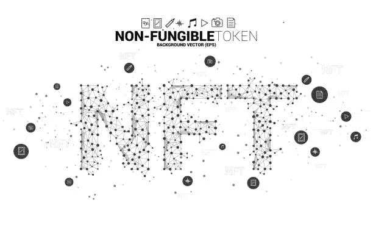

# 你应该了解 NFT 的地板价格吗？

> 原文：<https://medium.com/coinmonks/what-should-you-know-about-nft-floor-price-44beeb6d246a?source=collection_archive---------23----------------------->

被称为不可替换令牌(NFT)的加密令牌是一种无法复制的令牌。2021 年，人们对 NFT 市场的兴趣显著增加，预计这一趋势将持续到 2022 年。像 Bored Apes Yacht Club 和 CryptoPunks 这样的 NFT 项目引发了加密社区对数字艺术和游戏的新一轮兴趣。

NFT 底价是指获得 NFT 所有权或成为项目持有人必须投入的最低金额。NFT 的发起人设定最初的底价，一旦 NFT 到达二级市场，市场设定最终价格。

请继续阅读，了解更多关于 NFT 底价的信息，以及它们可能如何惠及您的企业。

# 底价是多少？

地板价的目的是什么？另一方面，这个名字本身就说明了一切。例如，NFT 收藏的“底价”是 NFT 的最低价。术语“进入价格”，在技术上与“底价”是一样的，经常被使用。

考虑一下 NFT 系列是由同一家公司生产的一组帽衫，因为这将有助于你更好地理解它。当你去那个特定品牌的商店时，有许多选择等着你。然而，该品牌的一些帽衫确实更受欢迎，价格也更高。尽管所有的帽衫都有相同的用途，但它们的价格并不相同。这同样适用于来自同一集合的 NFT。

同样，底价指的是你特别喜欢的特定品牌或系列中最便宜的帽衫。

以下是你在 NFT 市场上会遇到的多种底价形式，以及对你作为买家的一些启示:

# 实际价值

在市场上，价格是实时更新的。这意味着在任何给定的时间，价格都会根据实际市场价值而波动。NFT 的销售价格被称为底价。

大多数买家和卖家都是根据当前的实时价值做出决定的。当然，实时底价会以各种方式波动，并有许多不同的原因。

# 降低底价

当 NFT 的底价下降时，并不总是一件可怕的事情；事实上，这种情况经常发生。NFT 的价值由多种因素决定，所有这些因素都是动态的、不断变化的。项目中的新进展、新所有权和新服务都可能是需要考虑的因素。

没有理由担心 NFT 项目中的楼板会塌下来。研究一下为什么这个项目的价值在缩水，并且慢慢来。如果发生了可怕的事件，投资者不愿意保留他们的投资，你可能要考虑在 NFT 失去所有价值之前卖掉它。

对 NFT 项目缺乏兴趣的最可能的原因是人们缺乏耐心，并且因为对项目缺乏兴趣而撤回资金投资于其他项目，即所谓的“纸面手”。

# 提高最低比率

出于多种原因，这是一件好事，但情况并非总是如此。这可能是因为项目进展顺利，也可能是一种营销策略，通过人为提高底价来增加对项目的兴趣。

如果你观察到 NFT 的价格在上涨，不要急于投资。花点时间弄清楚它为什么在跳动。假设你不打算立即出售 NFT 来获利，那么要确保任何推高价格的因素都是可持续的。

此外，以更高的价格购买 NFT 并不总是一个好主意，因为你会花更多的钱。当一个项目的价格下跌时，通常是投资的好时机，前提是价格下跌不是一些负面事件的结果。

# NFT 底价是如何确定的？

你可能想知道为什么 NFT 市场如此不稳定，考虑到所有的涨跌，到底是什么决定了 NFT 的底价。

底价的计算受到多种因素的影响，包括:

# 对 NFT 的需求

当设定 NFT 的底价时，对 NFT 的需求是一个需要考虑的明显方面。NFT 的底价是由对它的需求决定的。如果需求很少，市场可能会降价。

Gary Vee 是一位连续创业者，也是 Web3 的先驱，他经常谈论 NFT 市场的供需问题。当涉及到买卖双方时，首先关注需求。

# NFT 的价值

由于缺乏向投资者提供的真正价值，许多早期市场 NFT 的底价已经下跌。与没有提供价值的非功能性交易相比，那些成功利用非功能性交易开发成功品牌并向其持有者提供真正价值和效用的人会经历更高的底价。

这就是为什么在买 NFT 之前问自己“为什么”是至关重要的。它在现实世界中对你有用吗？你为什么要买它？

这里没有正确或错误的答案；这一切都归结于你想用你的 NFT、你以前的经验以及你基于这些目标快速果断行动的能力来完成什么。

# 品牌或创造者的声誉

当一个知名人士在市场上发布 NFT 时，地板价格可能会更高。因此，与从陌生人那里购买相比，人们更有可能从认识并信任的人那里购买。

然而，这并不排除知名公司和发明者以较高底价提供非专利技术的可能性，如果他们愿意的话。

# 结论

在这篇文章中，我们讨论了 NFT 底价的意义以及如何修改 NFT 项目的底价。

我们的目标是为您提供全面掌握 NFT 地板价格概念所需的所有信息。

在评估一个 NFT 项目时，要考虑其他标准，如市场资本总额。一个项目的独特性可以被编程，一个项目的出处、社区和历史都可以被主观地解释。

> *加入 Coinmonks* [*电报频道*](https://t.me/coincodecap) *和* [*Youtube 频道*](https://www.youtube.com/c/coinmonks/videos) *了解加密交易和投资*

# 另外，阅读

*   [有哪些交易信号？](https://coincodecap.com/trading-signal) | [Bitstamp vs 比特币基地](https://coincodecap.com/bitstamp-coinbase) | [买索拉纳](https://coincodecap.com/buy-solana)
*   [如何给 MetaMask 钱包添加 Arbitrum？](https://coincodecap.com/how-to-add-arbitrum-to-metamask-wallet)
*   [KuCoin vs 北海巨妖 vs BitYard](https://coincodecap.com/kucoin-vs-kraken-vs-bityard)
*   [加密交易的最佳 VPN](https://coincodecap.com/best-vpns-for-crypto-trading)
*   [ProfitFarmers 回顾](https://coincodecap.com/profitfarmers-review) | [如何使用 Cornix Trading Bot](https://coincodecap.com/cornix-trading-bot)
*   [西班牙 5 大最佳文案交易平台](https://coincodecap.com/copy-trading-spain)