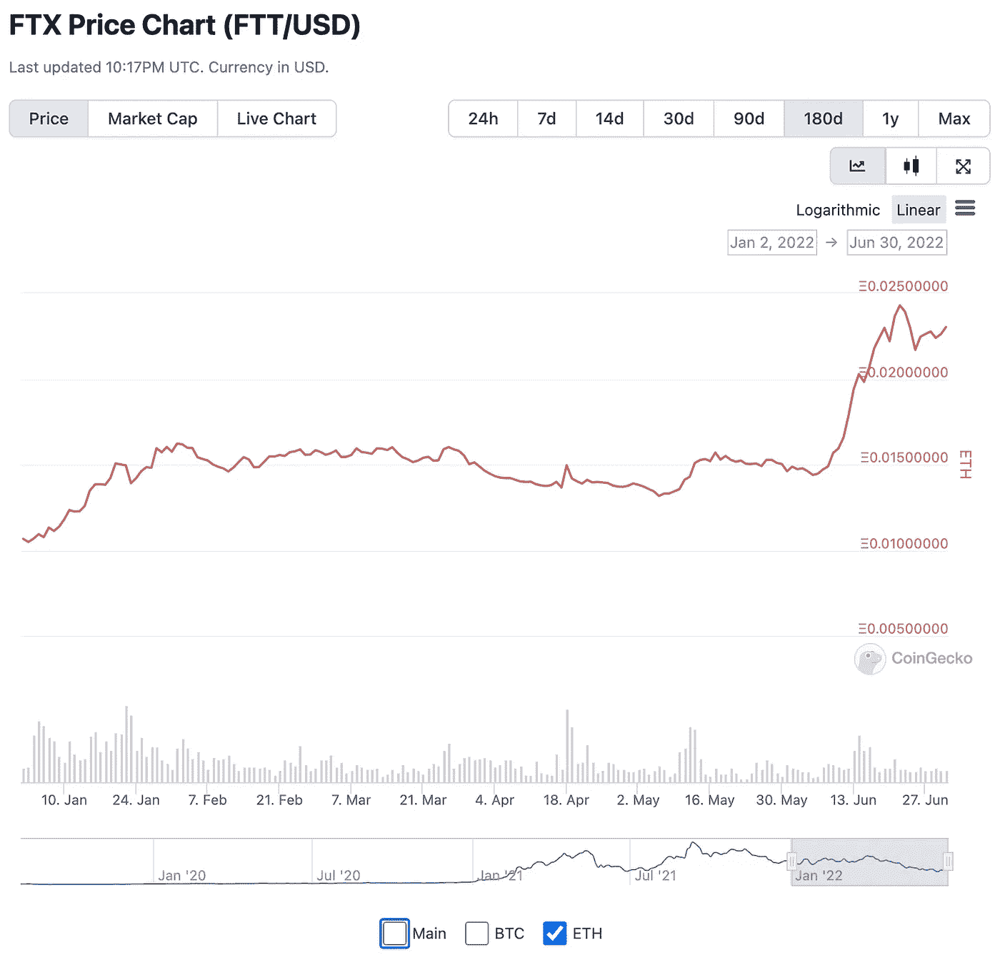

# 什么他妈的(？TX)

> 原文：<https://medium.com/coinmonks/what-the-f-tx-2d54d2a058db?source=collection_archive---------63----------------------->

大家好，让我们从一张图开始，不是相对于美元，而是相对于 ETH(一种绘制 Pinotio.com 代币的时髦方式),来绘制 FTT(FTX 代币)的图表。):

Price of FTT token in ETH

在过去的 180 天里，除了比特币和以太坊经典(ETC)之外，没有多少代币的价格相对以太上涨，但 FTT 是其中之一！

# 什么是 FTT？

[FTT](http://ftx.com/ftt) 是由 FTX(Sam Bankman-Fried 创立的加密交易所公司)创造的一种代币，它在 FTX 交易所赚取 33%的交易费。我说“赚”是因为交易所的费用被用来每周在公开市场上回购 FTT 代币，然后烧掉它们——这被称为回购和烧掉。

FTT 代币对 FTX 公司没有控制权，但它们为持有者提供了一些其他好处，比如降低交易费用，以及在包括以太坊在内的区块链上免费取款。

# FTX 在私人市场上值多少钱？

首先，有几个 ftx。针对美国市场，似乎有 FTX 国际公司(非美国)和 FTX 美国公司。(有 FTX 欧盟，但我认为就最终母公司而言，这是国际的一部分，我不确定)。

FTX 非美国公司似乎在 2022 年以 320 亿美元的估值筹集了资金，而 FTX 美国公司似乎在 2022 年初达到了 80 亿美元的估值。天真地将这两者加在一起，FTX 的总估值将达到 400 亿美元。

相比之下，比特币基地今天收盘时的市值约为 110 亿美元。诚然，FTX 的 400 亿美元是在 1 月份，所以今天可能会有所不同(因为市场低迷而有所降低，或者因为 FTX 试图成为伯克希尔·哈撒韦公司(Berkshire Hathway)拯救行业而没有太大不同……我不确定)。我知道 FTX 在 2022 年第二季度仍在筹集资金——我假设估值类似或更高——所以我猜测 FTX 私募市场的估值不会离 400 亿美元太远，至少目前是这样。

> 交易新手？尝试[加密交易机器人](/coinmonks/crypto-trading-bot-c2ffce8acb2a)或[复制交易](/coinmonks/top-10-crypto-copy-trading-platforms-for-beginners-d0c37c7d698c)

值得注意的是，FTX 不是一个小玩家。按照某些标准(如 2022 年 5 月的 BTC-USDT 成交量)，FTX 比比特币基地更大。然而，比 FTX 和比特币基地大得多的是币安！

Conor Ryder 在他的博客中对 FTX 做了一个很好的概述，也比较了比特币基地和币安。值得注意的是，比特币基地收取的交易费用比 FTX 高得多:0.5%，而 FTX 是 0.1%或更低。从某种意义上说，这是 FTX 的优势，因为他们可以抢占市场份额。另一方面，比特币基地在每单位交易量上赚的钱更多。

# FTX 的估值对 FTT 的价值意味着什么？

非常*乐观地*，鉴于 FTT 赚取了 FTX 33%的交易费，我们可以估计所有 FTT 代币的价值大约是 FTX 的一半。假设 FTX 美国公司为 FTT 的回购和焚烧贡献了交易费(我不清楚)，那么 FTX 的价值将为 400 亿美元(根据上面引用的新闻报道)，这可能意味着 FTT 的市值应为 200 亿美元。

在撰写本文时，FTT 股票的实际市值刚刚超过 40 亿美元——根据 https://ftx.com/ftt.[的消息，这低于 200 亿美元的乐观估计，从方向上看是合理的。](https://ftx.com/ftt.)

# FTT 代币的燃烧率告诉了我们什么关于 FTX 的交易费收入和估价？

FTX 交易所的费用(以及其他一些费用)用于每周回购 FTT 代币，并烧掉这些代币。在过去的几个月里，每周大约有价值 400 万美元的 FTT 代币被烧毁(非常粗略)。这意味着每年约 6 亿美元的交易费收入(每周 400 万美元 x 每年 52 周/ 33%的费用流向 FTT)。考虑到 FTX 的交易费如此之低，这可是一笔不小的费用。

如果 FTX 的估值为 400 亿美元(同样，我不知道 FTX 在美国的费用是否也部分流向了 FTT token burns)，那么根据最近几个月的年化表现，FTX 的收入倍数约为 66 倍。(实际上，这个倍数更高，因为应该减去一部分流入 FTT 的收益/收入)。

现在，鉴于交易所费用没有太多的固定成本(FTX 成本主要是运营服务器、满足监管要求和员工成本的固定成本——相对于比特币基地或其他交易所，员工数量很少)，这一收入倍数可能与 EBITDA(或潜在 EBITDA)倍数相差不远。

相比之下，比特币基地在 2021 年的收入约为 70 亿美元。FTX 的收入并不公开，但我猜测——部分基于上述数字——它较低，但增长更快(正如 Conor Ryder 在文章中提到的，比特币基地有更多的员工和成本)。

# FTX/SBF 作为伯克希尔哈撒韦公司，不是吧！

在某种程度上，FTX 一直在拯救部分加密行业，就像伯克希尔哈撒韦在金融危机期间帮助拯救高盛一样。也许 FTX 认为自己足够大，可以从防止 crypto 流动性危机的外部性中受益(Byrne Hobart 写了很多关于“大型技术像国家一样思考”的假设)。下面是山姆·班克曼·弗里德在《福布斯》杂志上的一段经典语录(赖德的博客也引用了这段话):

*“你知道，我们愿意在这里做一笔有点糟糕的交易，如果这是稳定局势和保护客户的代价的话”*

问题是，FTX 并不真的像伯克希尔·哈撒韦公司，因为 FTX 不是用它的收入/利润来拯救公司，而是用它通过股权出售筹集的资金(除非我错了，在这种情况下，请在下面评论)。这与沃伦巴菲特的资产负债表上积累了大量来自利润的现金截然不同。

# 红色 F(lags)TX？

我没有看到任何关于 FTX 的大红旗。萨姆·班克曼-弗里德曾经是(现在也是)一名交易员，他可能非常了解(肯定比包括我在内的大多数人都了解)市场传染和恐慌是如何运作的。

然而，有几件事让我困惑:

1.  为什么他们把我们列为 FTX 的 Terra 失败的 stablecoin？对 SBF 和 FTX 来说，Terra 的设计是脆弱的，会失败，这应该是显而易见的？仅仅为了交易费用而将 Terra 上市似乎是短视的。(也许有功利主义的理由？SBF 是功利主义的忠实拥护者。)
2.  当索拉纳不断崩溃时，为什么 FTX 要在索拉纳上推广(并建设它的许多项目)？这似乎是缺乏对安全的重视。也许我错了。也许这里的制胜策略只是快速行动？对我来说，这似乎是短期/交易者的风格，并且忽略了加密的要点，即审查阻力+可靠性。

# 我在 FTX vs 比特币基地的经历

我已经停止使用比特币基地，现在只使用 FTX(虽然我不会在平台上留下资金):

*   比特币基地，在超过 6 个月之后仍然没有批准我提交的商业申请。
*   在 6 月份的崩盘期间，比特币基地引入了在没有任何通知的情况下强制退出的白名单——有效地将退出能力延迟了 48 小时。
*   如上所述，比特币基地的学费比 FTX 高得多。
*   FTX 使添加资金和提取资金变得简单快捷。对比特币基地来说，这是一个复杂而缓慢的过程，经常会有延误。

总之，我仍然做多比特币基地股票和 FTT 股票，但目前我不会增加任何头寸。也许 FTX 会击败比特币基地，但我认为他们可能在用户群和地理上有一些持续的差异。我不确定这是一个赢家通吃的局面。我在考虑购买更多的 FTT 股票，但是——首先——这不是真正的 FTX 股票，其次——关于特拉和索拉纳的东西让我困惑。

*免责声明*:很明显，FTT 代币和——更多的——比特币基地股票最近变得一文不值，所以我不会在没有预料到可能会损失所有投资资金的情况下进行投资。

> 加入 Coinmonks [电报频道](https://t.me/coincodecap)和 [Youtube 频道](https://www.youtube.com/c/coinmonks/videos)了解加密交易和投资

# 另外，阅读

*   [TraderWagon 回顾](https://coincodecap.com/traderwagon-review) | [北海巨妖 vs 双子星 vs BitYard](https://coincodecap.com/kraken-vs-gemini-vs-bityard)
*   [如何在 FTX 交易所交易期货](https://coincodecap.com/ftx-futures-trading)
*   [OKEx vs KuCoin](https://coincodecap.com/okex-kucoin) | [摄氏替代品](https://coincodecap.com/celsius-alternatives) | [如何购买 VeChain](https://coincodecap.com/buy-vechain)
*   [ProfitFarmers 点评](https://coincodecap.com/profitfarmers-review) | [如何使用 Cornix 交易机器人](https://coincodecap.com/cornix-trading-bot)
*   [如何匿名购买比特币](https://coincodecap.com/buy-bitcoin-anonymously) | [比特币现金钱包](https://coincodecap.com/bitcoin-cash-wallets)