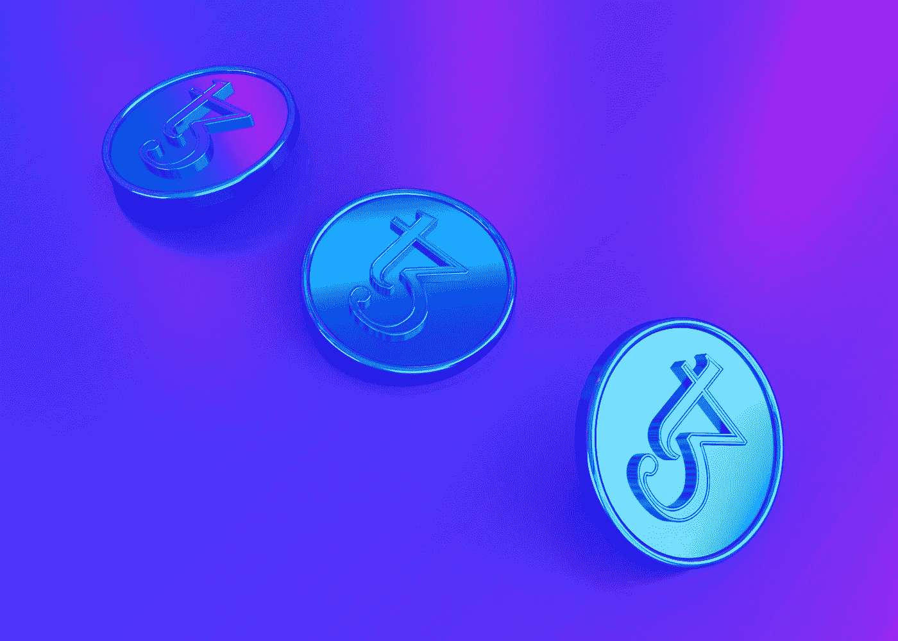

# 关于赌注和贷款，他们没告诉你的是

> 原文：<https://medium.com/coinmonks/what-they-dont-tell-you-about-staking-and-lending-b6b9a79efc1d?source=collection_archive---------23----------------------->

## 您需要了解的内容及其对您的影响

Photo by [Allison Saeng](https://unsplash.com/@allisonsaeng?utm_source=medium&utm_medium=referral) on [Unsplash](https://unsplash.com?utm_source=medium&utm_medium=referral)

在众多的协议、术语和交流中导航可能会非常混乱。我很早就意识到，有许多细微差别可能看起来没什么大不了的，但当你深入了解并变得超级看好加密/区块链/web 3 空间时，价值就很重要了。

赌注是指用户同意向网络抵押资金，以帮助网络验证交易。借贷是指用户同意借出他们的加密货币，以换取利息支付。这两个概念都允许用户赚取代币，但风险和回报是不同的。

# 放款

当我们把钱存入银行时，银行就承担了寻找贷款对象的责任和风险。即使有人不还钱，只要我们能把钱拿回来也没关系。

那么这在 crypto 中是如何进行的呢？

# 通过托管人贷款

想想看，Nexo，Celsius，Blokfi-这些都是“加密货币银行”,你可以在那里存放你的密码，他们会照顾贷款，你会收到不错的利息。这些被归类为集中财务，要创建一个账户，你需要通过 KYC，这样他们就可以验证我们。

# 通过 DeFi 贷款

通过 DeFi 来出借真的更符合这个世界的精神，在这个世界中，你通过一个分散的协议来出借你的密码，以在这些密码上获得一定的 APY。主要区别在于，你不是通过传统的金融生态系统，而是通过智能合约。

# 立桩标界

Staking 是 crypto 独有的，基本上允许我们在保护网络方面发挥作用。在一个分散的网络上，那些有利害关系的人正在验证交易。因此，举例来说，如果我下注总供应量的 10%，我可能有 10%的机会创作下一个区块。作为交换，我可以赚取交易费或新铸造的代币。这当然取决于协议。

显然，我在这个领域还是个新手，还没有太多的曝光率，所以一篇更好的文章应该是这篇由 CoinMarket Cap 撰写的文章。

# 所以赌注 VS 贷款…有什么大不了的？

就我个人而言，我更喜欢赌注，因为没有什么比拥有自己的钥匙更好的了。这就是集中交易发挥作用的地方，也是用户如何被误导，以为他们是在下注，而实际上是在放贷。众所周知，crypto.com 和币安都使用误导性的术语。

例如，在 Crypto.com 的 DeFi wallet 上“下注”TUSD 赚了 19.26%。TUSD 是一个稳定的投资者，赚近 20%似乎有点不可思议。考虑到目前没有固定挂钩的稳定债券可以在本地进行投资，贷款是获得这种 APY 的唯一途径。根据这里的 FAQ 页面[，](https://help.crypto.com/en/articles/4675818-all-about-defi-earn-on-crypto-com-defi-wallet)有一个关于什么被抵押和借出的明细，但是除非你怀疑并挖掘出来，否则你不会知道。

# 你为什么要在乎？

老实说，加密是很辛苦的工作。有很多好处，但最简单的事情，如跟踪胜利，学习获利，寻找模仿的项目，也许从地毯上恢复——所有这些事情都需要大量的时间，努力和经验。有些人在 NFT 翻转中运气不错，但很多人最后都被烧伤了。如果你像我一样，研究不是你的强项，你可能会试试你的运气，看看会发生什么——这没什么错，但你可能不会成功。虽然我们还为时过早，但重要的是要意识到并知道你正在进入什么。

## 所有权控制

crypto、web 3 和区块链背后的价值之一是所有权。利用押记和借出，对专用于该过程的加密的所有权的控制。

为了借出你的密码，你可以把它交给实体持有，或者放在交易平台上，比如 Blockfi、Crypto.com、Nexo、Celsius 等等。问题是，你必须通过 KYC，你必须请求允许提取你的资金。此外，你可能会受到最低取款额、费用等等的影响。这里的主要问题是责任和义务不再是你的了。如果他们被黑，被起诉，破产，等等。你的密码也随之消失。这里使用的术语是软赌注——大多数交易所提供的通常是某种形式的贷款。

您可以通过多种方式下注，如通过该网络的本地钱包或各种 DeFi 钱包下注。目前，我正在为 Cosmos 赌上 [Keplr 钱包。通过智能合同，也可以进行集中/分散贷款。](/coinmonks/guide-to-cosmos-ecosystem-7e45a9e18241)

# 我在哪里押什么

煎饼互换(Pancake swap)——我在这里下注蛋糕，老实说，这不是最好的象征经济学，但我看不出继续下注蛋糕有什么坏处。

我把 ATOM，OSMO 押在这里

**Terra Station 钱包-** 我把露娜押在 Terra Station 钱包上

Anchor 是一种借贷协议，提供稳定的 UST 收益率。他们的动力来自区块链多重股权证明的回报。

## **交易所**

FTX-我把索尔和 FTT 押在这里。赌注 FTT 节省您的交易费用！

**北海巨妖**——我的赌注点在这里。Crypto.com**——我在 crypto.com 的应用上押了价值 500 美元的 CRO，我参与了 CRO/奥斯莫的流动性池。押注 crypto.com 让我在 CRO 获得了 2%的丰厚返现。**

# **隐性被动收入**

**加密的被动收入更容易复合，加密支出更经常支付，费用更少。复利管理起来更轻松，而且可以通过完全分散的方式实现。**

**然而，仍然有一些事情需要注意，**

1.  **用代币支付。你会受到价格波动的影响。当我下注蛋糕时，是 11-18 美元，ATH 是 43.96 美元。现在是 7.47 美元。需要考虑的事情。**
2.  **锁定期或监视时间。锁定期是指你在取款前必须锁定硬币的时间，而监视期是指你需要多长时间才能解除锁定。**
3.  **开始下注和申领下注奖励的最低要求。在购买你可能想要的东西时，请记住这些。**

**在一天结束的时候，只要知道有时候，赌注和贷款可以互换使用，以做对你最有利的事情。如果你优先考虑 KYC、所有权和去中心化，那就使用智能合约的非托管钱包。**

**你如何赚取被动加密收入？让我知道！**

> **加入 Coinmonks [电报频道](https://t.me/coincodecap)和 [Youtube 频道](https://www.youtube.com/c/coinmonks/videos)了解加密交易和投资**

# **另外，阅读**

*   **[BigONE 交易所评论](/coinmonks/bigone-exchange-review-64705d85a1d4) | [电网交易机器人](https://coincodecap.com/grid-trading)**
*   **[氹欞侊贸易评论](https://coincodecap.com/anny-trade-review) | [CoinSpot 评论](https://coincodecap.com/coinspot-review)**
*   **[新加坡十大最佳加密交易所](https://coincodecap.com/crypto-exchange-in-singapore) | [购买 AXS](https://coincodecap.com/buy-axs-token)**
*   **[投资印度的最佳加密软件](https://coincodecap.com/best-crypto-to-invest-in-india-in-2021) | [WazirX P2P](https://coincodecap.com/wazirx-p2p)**
*   **[7 个最佳零费用加密交易平台](https://coincodecap.com/zero-fee-crypto-exchanges)**
*   **[最佳网上赌场](https://coincodecap.com/best-online-casinos) | [期货交易机器人](/coinmonks/futures-trading-bots-5a282ccee3f5)**