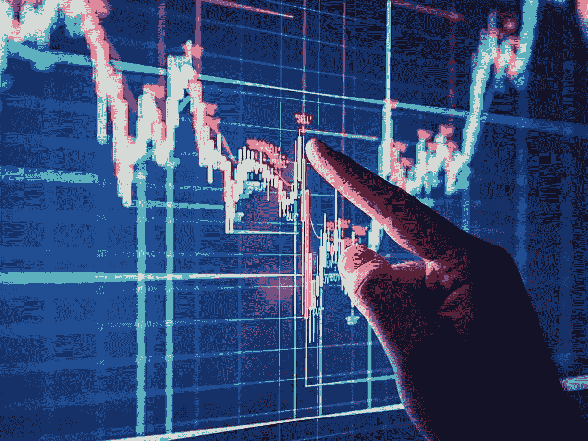

# 哪些建议对所有类型的日内交易者都有帮助？

> 原文：<https://medium.com/coinmonks/what-tips-could-be-helpful-to-day-traders-of-all-types-acc843a70228?source=collection_archive---------20----------------------->

## 这可以帮助你成为一个成功的交易者。！

交易者是独特的人。和企业家一样，交易者痴迷于掌握自己的技能。我们会熬夜，早起，第二天重复这个过程——所有这些都是为了过上大多数人只能梦想的非凡生活。

Photo Source on Google

这些建议对所有类型的日内交易者都有帮助，不管是有经验的还是新手。

# **执行个人审计**

如果你想从事日内交易，你需要了解挑战。你会有赔钱的日子。理解你在做什么需要很长时间。即使你理解了不同的策略和所有的术语，你仍然可能找不到成功。日内交易很难，没有人能保证你会赚钱。

许多人认为成为日内交易者是一种简单的赚钱方式，你不需要太多的经验——只要点击几个按钮，嘿，很快，你就发财了！但事实并非如此。日内交易是一个非常困难的行为准则，就像成为一名职业足球运动员或者演奏一种乐器达到大师的水平。你首先需要有天生的天赋，其次是多年的练习。

有了十多年的衍生品交易经验，我可以明确地告诉你，日内交易是一项艰巨的任务。这需要有分析的头脑，而且她见过的许多成功人士都有需要多年教育和实践的行业背景。如果你想成为日内交易者，一夜暴富，你最终会损失大量的钱。成为有效的日内交易者需要时间和练习。

也就是说，有日内交易成功的故事。如果你了解市场并制定有效的交易策略，你就有可能成为成功的日内交易者。

我培训过很多客户，他们从拥有 10，000 到 37，000 美元小交易账户的小隔间到成功的全职日内交易者，在短短几年内赚了数百万，我已经证实了人们可以从职业生涯跳到全职交易。

# **研究市场、战略和潜在平台**

无论你是要使用外汇市场，加密市场，还是任何其他市场，在成为日内交易者之前，你需要了解这个市场是如何运作的。有一种观点认为，做日内交易者可以让你快速致富，让你大部分时间都放松，但这与事实相去甚远。成功的日内交易者需要大量的研究和努力。

研究市场并最终制定策略也需要向成功的日内交易者学习。

成为日内交易者的最好方法是向现有的盈利日内交易者学习，互联网上有大量关于如何日内交易的理论材料，但没有什么比向目前成功的人学习更好的了。

你的研究还应该包括寻找市场内交易策略和日内交易规则的更多细节。

# **起步小**

一旦你完成了充分的研究，按照 Rothfeld 的建议从小处着手是很重要的。学习如何日内交易需要时间，而且一开始就投入大量资金是一个很大的风险。与日内交易相关的风险也意味着你应该使用你愿意损失的钱。

日内交易者通常会在交易的第一个月遭受严重的财务损失，许多人永远不会毕业到盈利状态，鉴于这些结果，很明显:日内交易者应该只拿他们能承受损失的钱冒险。他们不应该用他们需要的钱来支付日常生活费用或者退休，办理二次抵押贷款，或者用他们的学生贷款来进行日间交易。

因为亏损是许多日内交易者学习过程的一部分，所以慢慢开始，边学边做是个好主意。坚持你正在实施的交易策略也很重要。日内交易者犯的最大错误之一是制定了一个深思熟虑的策略，却在匆忙的交易中完全违背了它。

通常，日内交易者会进行交易，因为他们整天都坐在屏幕前，强迫交易通常是亏损的交易。永远遵守你的规则。

# **了解风险**

日内交易并不容易，对于新的日内交易者来说，有几个复杂的领域需要研究。如果你决定成为日内交易者，重要的是要明白日内交易不是一个快速致富的计划。一路上你会亏钱，不是你所有的交易策略都会如你预期的那样有回报。

要成为一个成功的日内交易者，你需要愿意付出数月甚至数年的努力来理解市场，制定策略，并持续执行你的计划。

**提示:**日内交易不容易，也不能保证赚钱。研究市场、策略和耐心都是重要的因素。

# **日内交易策略**

我们发现了一些经验丰富的日内交易者通常推荐或使用的交易策略:

*   **突破:**突破策略是指在一个长时间相对静止的秘密价格上出现相当大的波动或突破。例如，如果一枚加密硬币三周以来一直在 30 美元到 31 美元之间，突然你发现它要么下跌要么大幅上涨，这可能是交易的好时机。这种波动性应该对日内交易者有吸引力。
*   头皮交易:头皮交易是指在交易有利可图后，你立即卖掉你的密码。就何时出售而言，这并不太复杂；这是一个很容易让你涉足日内交易的方法。刷单也被称为利用“差价”，因为交易者从卖家要价和买家出价之间的差价中获利。
*   **动量:**动量交易是基于趋势新闻和信息。无论是新的收益报告还是不同的突发新闻，日内交易者利用新闻事件来预测上涨和下跌的密码。这需要做好一些研究，但对于初学者来说这仍然是一个不错的选择。
*   **衰落:**衰落是与市场上明显的流行趋势相反的行为。这是一种与传统智慧背道而驰的高风险策略。是不是每个人都在投资一枚你认为会破产的加密硬币？为什么不在高峰期做空呢？当然，风险在于传统智慧可能成为加密货币市场的一个有力因素。

> 加入 Coinmonks [电报频道](https://t.me/coincodecap)和 [Youtube 频道](https://www.youtube.com/c/coinmonks/videos)了解加密交易和投资

# 另外，阅读

*   [分散交易所](https://coincodecap.com/what-are-decentralized-exchanges) | [比特 FIP](https://coincodecap.com/bitbns-fip) | [宾邦评论](https://coincodecap.com/bingbon-review)
*   [用信用卡购买密码的 10 个最佳地点](https://coincodecap.com/buy-crypto-with-credit-card)
*   [加拿大最佳加密交易机器人](https://coincodecap.com/5-best-crypto-trading-bots-in-canada) | [比特 vs 币安](https://coincodecap.com/bybit-binance-moonxbt)
*   [阿联酋 5 大最佳加密交易所](https://coincodecap.com/best-crypto-exchanges-in-uae) | [SimpleSwap 评论](https://coincodecap.com/simpleswap-review)
*   购买 Dogecoin 的 7 种最佳方式
*   [最佳期货交易信号](https://coincodecap.com/futures-trading-signals) | [期交所评论](https://coincodecap.com/liquid-exchange-review)
*   [用于 Huobi 的加密交易信号](https://coincodecap.com/huobi-crypto-trading-signals) | [Swapzone 审查](/coinmonks/swapzone-review-crypto-exchange-data-aggregator-e0ad78e55ed7)