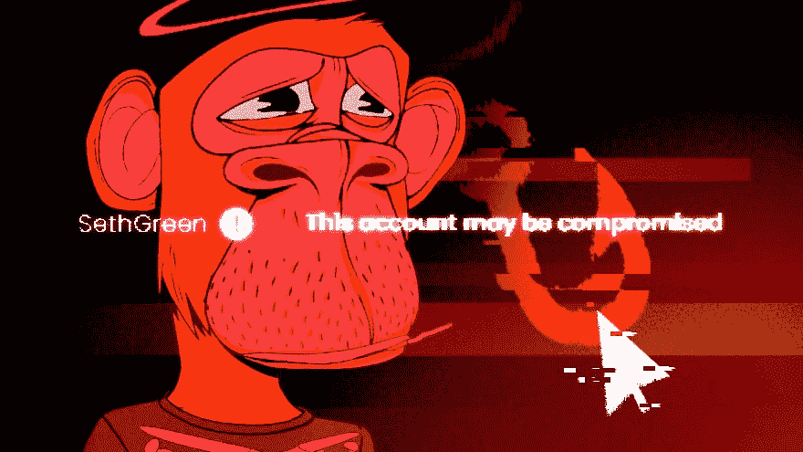

# 你电影的明星被绑架了怎么办？

> 原文：<https://medium.com/coinmonks/what-to-do-when-the-star-of-your-movie-is-kidnapped-4ff9579d5730?source=collection_archive---------42----------------------->

想象一下，你即将推出一部电影的全球首映式，而这么多的工作、投资、鲜血、汗水和泪水都投入到了这部电影的制作中。

然后，在首映前几天，你电影中的明星被绑架了。

噗。

就这样走了。

你是做什么的？

今天，我们在 NFTs 的背景下探索 IP 的迷人概念。

NFT 世界最伟大的举措之一就是使用知识产权和版权。

当有史以来最受欢迎和最有价值的 NFT 收藏品“无聊猿游艇俱乐部”允许其所有者利用知识产权并从中赚钱时，它改变了游戏规则。

随着时间的推移，我们开始看到一些惊人的 NFTs 用例。

首先是在洛杉矶的无聊和饥饿的实体汉堡和薯条店。

然后有一些游戏是模仿贝克猿建造的。

后来，猿猴主人开始出售印有 NFT 的帽子、t 恤和商品。

现在，有人甚至正在制作一部动画电视节目。

那个人就是赛斯·格林。

你可能不认识他，但他是《一家人》电视剧中的明星，这部电视剧很受欢迎。

凭借他在《一家人》中的传统和明星身份，这部无聊的猿类 NFT 电视剧肯定会大受欢迎。

这个节目叫做“白马酒馆”，甚至加里·维纳查克也在里面！

它的主角是赛斯命名为弗雷德的 BAYC #8398。

弗雷德应该是酒吧的酒保。

猿猴在哭泣，头上戴着天使光环，穿着骷髅 t 恤。

听起来一切都很顺利。

直到猿猴被偷。

Will Seth ever get his ape back?

是的，很明显，Seth 被钓鱼了，他所有的 NFT 都被偷了。

弗雷德，两只变异猿和一只涂鸦。

很容易就偷了 25 万美元。

残忍。

这是一个严酷的提醒，告诉我们 Cryptoland 的西部荒野是多么可怕。

骗子、攻击者、黑客和篡夺者无处不在，他们每次都变得越来越老练。

如果你刚刚进入 NFTs 甚至是一个经验丰富的专业人士，不要低估安全性。

网络钓鱼者很快在公开市场上将其转手，一个名为“ [DarkWing84](https://opensea.io/DarkWing84) ”的用户以 20 万美元的价格买下了 Fred。

是的，现在是一个糟糕的熊市，人们仍然愿意花 20 万美元买 jpegs。

这就是事情变得非常复杂的地方。

“ [DarkWing84](https://opensea.io/DarkWing84) 做了什么违法的事情吗？

即使他不知道弗雷德是赃物，他买它有错吗？

像 NFTs 这样保护数字资产的法律有哪些？

OpenSea 对此能做些什么吗？

随着电视节目的筹备和成本下降，Seth 还应该继续推出吗？

他现在可以合法地这样做而不拥有弗雷德吗？

可怜的赛斯现在该怎么办？

Security is paramount, especially in web3!

这确实提出了一个关于非专利技术知识产权的有趣话题。

如果" [DarkWing84](https://opensea.io/DarkWing84) "和 Seth 是同一个人，而这一切都是为了提高发布会的知名度，会怎么样？

天哪这么多问题。

我现在会坚持喝拿铁和泡沫茶。

-

你会看由 NFT 角色制作的节目吗？

-

# startups # business # startupx # growth # success # social media # culture # entrepreneur # strategy # eth #比特币#加密货币# bayc # NFT # apes # branding # Fred # Seth green # web 3

> 加入 Coinmonks [电报集团](https://t.me/joinchat/Trz8jaxd6xEsBI4p)，了解加密交易和投资