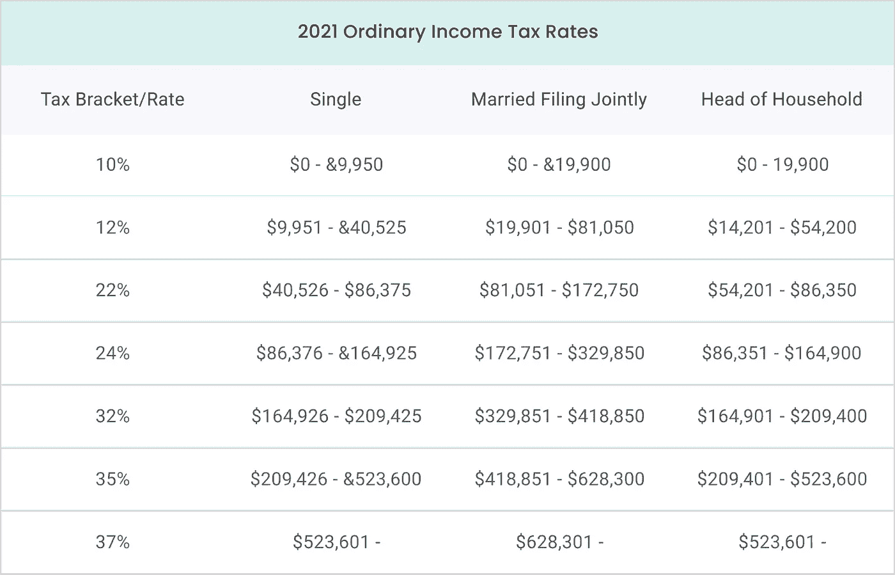
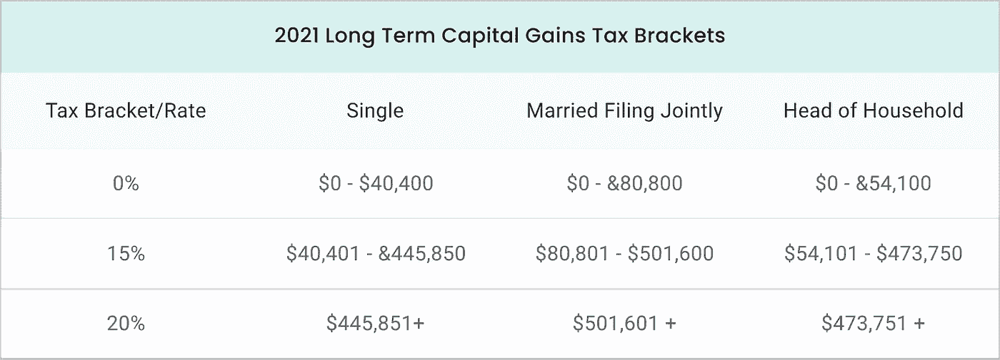

# 什么知道加密收益税

> 原文：<https://medium.com/coinmonks/what-to-know-about-crypto-gains-taxes-a915c180b516?source=collection_archive---------66----------------------->

如果你过去购买了某些加密货币，你可能会获得一些丰厚的收益。如果你选择兑现你的密码，并将其转换为菲亚特，你将不得不支付这些加密收益税。

但是，除了直接转换为菲亚特，还有哪些行为可能被视为应税事件？投资者可能欠多少税？当涉及到加密交易时，人们如何将他们的纳税义务最小化？

在试图回答如何对加密收益征税的问题时，要记住以下几点。

# 什么时候可以收取资本利得税？

用户可以采取许多与加密相关的行动，导致不得不为加密收益纳税。事实上，任何导致已实现收益或损失的行为都被视为应税事件，包括:

*   为菲亚特出售密码
*   使用密码支付商品或服务
*   将密码存入加密支持的预付费借记卡
*   将一种加密货币换成另一种

还有一些与加密相关的事件可以归类为所得税事件，例如:

*   通过硬分叉或空投接收加密
*   从赌注、流动性池或 DeFi 利息中赚取加密
*   从采矿活动中获取密码
*   用密码支付商品或服务

跟踪属于上述类别之一的任何交易可能是一个好主意。当然，如果你有好的加密税务软件，那些细节会为你处理好。

# 你在加密收益上欠了多少？

加密收益税通常与其他投资一样，如房地产、股票或债券。这些收益被称为[资本收益](https://www.irs.gov/taxtopics/tc409)，并受特定税率的影响，这些税率因变量而异，例如:

*   投资者当前的税级
*   资产在出售前持有多长时间

如果投资者在出售前持有资产的时间不超过 365 天，该出售将按照[短期资本利得税率](https://cointelli.com/blog/crypto-tax-rate-2022)进行。持有*超过*一年的投资可以归类为长期投资，适用不同的税率。长期利率通常低于短期利率。

短期资本利得率属于 10%至 37%之间的七个税级之一。

长期资本利得率依次落入三个税级之一——0%、15%或 20%。

投资者有时可能根本不需要为他们的加密收益缴税。如果他们属于可能的最低税级，并持有资产超过一年，他们的资本利得率可能是 0%。在几乎所有其他情况下，个人至少会欠一些加密收益税。

不过，还是有办法减少相关的纳税义务的。

# 最小化加密税

降低加密收益税的一种方法是采用一种被称为*税收损失收获的策略。*这包括亏本出售一些投资，以抵消获利出售的投资所产生的资本收益。请注意，销售必须在收益实现的同一纳税年度完成。

这是可行的，因为投资者的资本利得或损失是根据他们在某一年出售资产的总回报来计算的。

假设你卖出一枚硬币赚了 1，000 美元，但你还持有另一枚 500 美元买入的硬币，现在下跌了 50%，交易价为 250 美元。如果你卖出下跌的硬币，你将会损失 250 美元。这一损失可以从之前的 1000 美元资本收益中减去。结果将是，投资者只需为 750 美元的收益(1000 至 250 美元)缴税，而不是 1000 美元。

另一种可能降低加密收益税的方法是持有资产超过 365 天。如前一节所述，这样做将使相关销售收入受制于[长期资本利得税率](https://cointelli.com/blog/crypto-tax-rate-2022)，该税率几乎总是较低。

# 如何避免秘密资本收益税

你可能想知道在这一点上如何避免加密资本收益税。在大多数情况下，你不能。然而，仍有一些特殊情况，你可能最终没有任何纳税义务。

一种选择是永远不卖。这将包括不购买任何加密产品，这也是一个应税事件。投资者还必须小心，不要将一种加密货币兑换成另一种加密货币，不要将任何加密货币发送给另一个人，也不要采取前面提到的任何其他行动。

当然，如果你从来不卖，就没有办法利用潜在收益。还是有？

如果想获得流动性，走这条路需要有人用他们的密码贷款。这样做并不适合所有人，但可能适合某些用户。

对于那些想用密码贷款的人来说，值得考虑的一些事情包括:

*   贷款价值(LTV)比率
*   利率
*   贷款的偿还条件
*   基础资产的波动性

因为加密货币非常不稳定，所以用加密货币抵押贷款会有风险。如果价格下跌得足够厉害，借款人可能会收到追加保证金的通知，要求他们存入更多密码，或者比预期更早偿还贷款。因此，LTV 比率越低越好。

# 加密税收软件可以帮助加密收益税

最终，加密收益往往无法避免纳税。接下来的问题是，你将如何确保准确计算你所欠的税款。

一种方法是使用最先进的加密税务软件，如 Cointelli。

[Cointelli](https://cointelli.com/) 跟踪、记录和计算加密税务准备所需的所有信息。Cointelli 可以快速计算出什么是应纳税的，什么税是到期的，税率是多少。资本收益以无与伦比的准确度计算，为用户节省了时间和金钱。

在其他有用的功能中，Cointelli 为用户提供:

*   用户友好的界面
*   准确、可靠的报告
*   一个简单的循序渐进的过程
*   沿途提供帮助的向导
*   来自真正税务专业人士的客户服务
*   易于阅读的报告，可以直接发送给会计师或税务服务

如果你在[计算你的加密税](https://cointelli.com/features)时遇到困难，仔细看看 Cointelli 今天提供了什么。

*免责声明:本帖仅供参考，不应被解释为或依赖于替代财务、法律或税务专业人士的建议。此外，本内容仅涉及美国公民和居民的美国联邦所得税后果，不涉及可能与受特殊规则约束的特定人员(如经销商或贸易商)相关的税务后果。您应该咨询您自己的财务、法律或税务专业人士，以报告和提交您的加密税或根据您的特定情况做出决定。法律、法规或现有法律的解释可能会发生变化，这可能会对未来或追溯产生不利影响。这篇文章的内容可能会有变化。*