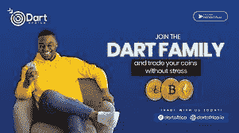

# 在你交易你的密码之前要注意什么

> 原文：<https://medium.com/coinmonks/what-to-look-out-for-before-you-trade-your-crypto-bab4a65ea17d?source=collection_archive---------71----------------------->

对于加密货币，投资者面临的最大挑战是不要被炒作所困，以及担心在下一个重大事件中被遗漏(FOMO——害怕错过)。在许多个人和机构投资者的金融投资组合中，数字货币的数量大幅增加。与此同时，批评者继续告知投资者加密货币价格的波动性和不可预测性。

Trade your Crypto

如果你决定投资加密货币，就像对待其他投资机会一样，做好尽职调查至关重要。最佳交易策略往往来自对加密货币市场的多年投资。在这篇文章中，我们将给出一些关于如何成为一个成功的加密投资者的提示，以及如何为 Naira 和 Cedis 出售你的加密货币。

## **考虑你为什么投资加密货币**

要成为一个好的加密货币投资者，这是你在进行任何加密货币投资之前应该问自己的最基本的问题。你还可以投资其他领域，其中许多领域比加密货币具有更高的稳定性和更低的风险。

你应该知道你在市场上是为了什么，并以此来塑造你的交易策略。你是市场炒作的原因吗？或者你有更有说服力的理由投资某个特定的代币吗？(也许代币是试图用聚集的资金解决特定的气候问题，而你对减少气候变化感兴趣。)当然，不同的投资者有不同的入市理由。

**感受一下这个行业**

对于投资者来说，尤其是那些对加密货币相对陌生的投资者来说，在投资之前了解数字货币世界的运作方式非常重要。花点时间了解不同类型的加密货币，这应该排除比特币、以太、Ripple、道奇和 co 等大牌，你应该已经熟悉这些货币，你应该更多地关注排名较低的替代货币。

此外，探索区块链技术以了解加密货币世界的这一方面是如何工作的，它目前是如何使用的以及它未来可能的用途也很重要。

没有适当的计算机科学或编码背景，区块链技术的某些方面可能很难学习，但是，让你自己熟悉区块链，因为它的某些方面是为外行人编写的。

一旦你确定了用于投资的加密货币(或多种加密货币)，就要研究这些代币如何利用区块链技术，以及它们是否提供了任何创新，使它们有别于其他代币，如用于 NFT 和智能合约的以太坊。当你更好地掌握加密货币和区块链技术时，你将更有能力判断一个潜在的投资机会是否会有成果。

## **加入加密货币爱好者在线社区**

加密货币空间非常广阔，很难单独掌握所有方面。在加密世界中，趋势瞬息万变，及时的信息是获得成功加密体验的关键，成为加密社区的一部分可以帮助您保持并成为最新趋势的一部分。原因是数字货币投资者和爱好者的活跃社区正在昼夜不停地交流并分享重要的加密新闻和技巧。

加入在线加密货币社区，了解加密世界的最新消息和要点。Reddit 和 Twitter(尤其是 NFTs 相关新闻)已经成为数字货币爱好者的中心枢纽。

**阅读加密货币白皮书**

比口碑和社交媒体炒作更重要的是决定好的加密货币的因素。当你在考虑一个特定的加密投资时，花点时间找到并阅读该项目的白皮书。一个好的加密货币项目应该有一个这样的项目，而且如果你拿不到白皮书，它应该很容易被访问。

白皮书应该告诉你你需要知道的关于项目的一切，负责的开发商，他们如何计划筹集资本和资金，项目的目的是什么，项目的时间框架和投资者可能需要的项目的其他细节。如果白皮书没有包含关于项目的信息和具体细节，这通常被视为负面的。白皮书是一个开发团队展示他们的项目是谁、什么、什么时候和为什么的机会。

## **如何将你的加密货币兑换成现金**

如果你在尼日利亚或加纳，你正在寻找一个平台来销售你的加密货币， [Dart Africa](http://dartafrica.io) 是非洲领先的交易平台。

Dart Africa 为其客户提供高汇率来交易他们的加密货币，Dart Africa 以其丰厚的利率而闻名。当客户与 Dart Africa 进行交易时，他们总能获得最高的硬币回报。您可以随时使用 [Dart Africa rate calculator](https://dartafrica.io/coincalculator) 查看您的比特币和其他替代币将获得什么。

请注意，要通过 Dart Africa 出售比特币或其他替代币，您必须[创建一个账户](https://dartafrica.io/register)或者[登录](https://dartafrica.io/login)如果您已经有一个账户。

**在 Dart Africa 交易的加密货币**

*   比特币
*   以太坊
*   道奇硬币
*   莱特币
*   美元硬币
*   USDT 系绳
*   BNB

> 加入 Coinmonks [电报频道](https://t.me/coincodecap)和 [Youtube 频道](https://www.youtube.com/c/coinmonks/videos)了解加密交易和投资

# 另外，阅读

*   [用于 Huobi 的加密交易信号](https://coincodecap.com/huobi-crypto-trading-signals) | [Swapzone 审查](/coinmonks/swapzone-review-crypto-exchange-data-aggregator-e0ad78e55ed7)
*   最佳[密码交易机器人](https://coincodecap.com/best-crypto-trading-bots) | [购买索拉纳](https://coincodecap.com/buy-solana) | [矩阵导出评论](https://coincodecap.com/matrixport-review)
*   [Coldcard 评论](https://coincodecap.com/coldcard-review) | [BOXtradEX 评论](https://coincodecap.com/boxtradex-review)|[uni swap 指南](https://coincodecap.com/uniswap)
*   [比特币基地评论](/coinmonks/coinbase-review-6ef4e0f56064) | [德里比特评论](/coinmonks/deribit-review-options-fees-apis-and-testnet-2ca16c4bbdb2) | [FTX 评论](/coinmonks/ftx-crypto-exchange-review-53664ac1198f)
*   [联合国硬币评论](https://coincodecap.com/unocoin-review) | [最佳加密赌注硬币](https://coincodecap.com/best-crypto-staking-coins)
*   如何使用 MetaMask Wallet 获得 KCC 地址？