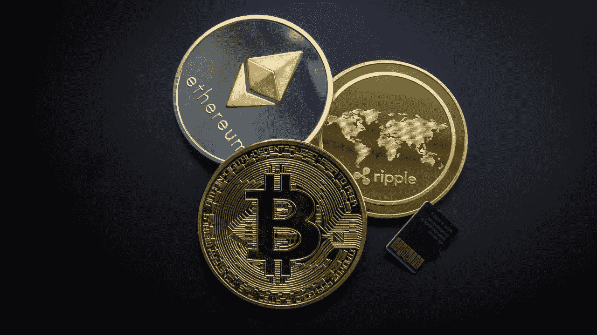

# 关于硬币和代币要了解什么？

> 原文：<https://medium.com/coinmonks/what-to-understand-about-coins-and-tokens-ac424f32e933?source=collection_archive---------39----------------------->

如果你正在阅读这些文章，并且对加密货币市场有点兴趣，你一定听说过比特币。

比特币呢？还是以太坊的以太？Altcoins？硬币和代币概念？加密货币市场更多，比如上面的产品和概念。

有硬币和代币以及许多其他概念。本文将重点介绍什么是硬币和代币，以及它们之间的区别。

# 硬币和其他

硬币(也称为替代硬币或替代加密货币硬币)是使用加密技术创建的数字硬币，并随着时间的推移存储价值。在这种情况下，它意味着货币的数字等价物。最广为人知的硬币例子是比特币。比特币也是一种加密货币，因为它使用加密技术来保护它。没有实物比特币。只有所有人都可以访问的公共分类账中的余额。所有比特币交易都是通过一个被称为“挖掘”的过程，利用海量计算能力进行验证的。另一方面，比特币不是由任何银行或政府发行或支持的。单个比特币作为商品是没有价值的。比特币在交易时通常被缩写为 BTC。基于比特币原始协议的 Litecoin 和 Namecoin 已经上市，在区块链上运行的 coins Ripple 和 Monero 也是专门为它们设计的。

硬币的另一个例子是以太坊的以太 ETH。ETH 是智能合约平台的原生硬币，用于构建在分散式区块链上运行的通用计算机程序。以太坊不关注金融数据。相反，它专注于随机的程序数据，这些数据可以涵盖从游戏到社交媒体的所有内容。以太网用于发送/接收资产、管理资产、支付燃气费以及与网络中的分散式应用程序(dApps)进行交互。

硬币和货币有着相同的特征:可交换、可分割、可接受、可携带、耐用、限量供应。

这些硬币的主要特点是:

*   它们连接到公共区块链，任何人都可以加入和参与网络
*   它们可以被发送、接收或挖掘

硬币除了像货币一样发挥作用之外，并不打算发挥任何功能。

# 什么是 Altcoin？

从那时起，数以千计的新替代硬币或替代货币被创造出来，并加入到加密生态系统中。“Altcoin”是指除比特币以外的任何加密货币。以太坊是最受欢迎的另类硬币，人们在谈论更广泛的区块链网络时使用它的全名(以太坊)，但在讨论货币本身时使用以太(ETH)。

根据价格监测网站 CoinMarketCap 的数据，截至 2022 年 2 月，加密货币的种类超过 17，000 种。比特币占整个加密市场的近一半，以太坊占近四分之一。Altcoins 占据了剩余的市场份额(大约 40%)。

这意味着在元数据存储区中有数千个其他硬币被交换。让我们仔细看看什么是替代币，为什么专家说大多数投资者应该转向比特币和以太坊以外的任何东西。

“altcoin”一词是“另类硬币”的简称，简单来说就是比特币以外的加密货币。继比特币之后，最受欢迎的九种加密货币如下:

*   以太坊
*   XRP
*   极限
*   卡尔达诺
*   波尔卡多特
*   主要的
*   美元硬币
*   Dogecoin
*   链环
*   Uniswap

专家指出，比特币的投机性很强，altcoins 的投机性更强。以太币(Ethereum)是最常听到的替代硬币，自 2015 年推出以来，由于其智能合约功能和被称为不可变令牌(NFT)的数字艺术的流行，它取得了显著增长。

# Token 是不同类型的硬币吗？

令牌是围绕一个特定的项目形成的。代币在项目生态系统中被用作支付方式。然而，它们是数字资产，执行与硬币类似的功能。但主要区别在于，它还赋予了所有者加入网络的权利。令牌可以代表公司的一部分，提供对项目功能的访问等等——随着新项目的启动，令牌的未知方面被发现。

数字令牌彼此相似。只有特定的项目有特定的用例。

令牌代表一种资产或工具。这就是为什么安全令牌和实用令牌是有区别的。安全令牌旨在成为公司的一部分。代币占据了加密货币市场的一个独特角落，它们在应用的生态系统中充当“有用”的代币，以激励某些行为或支付费用。例如，Fitlich 应用程序通过燃烧卡路里为您赢得代币。

生成令牌比生成令牌更容易，因为您不必创建新代码或修改现有代码。只需使用以太坊等区块链平台的标准模板，任何人都可以创建代币。就几步。使用模板生成令牌可以确保无缝的互操作性。因此，用户可以在一个钱包中存储不同类型的令牌。以太坊是第一个简化令牌生成过程的平台。

# 结论

代币只是一种支付方式。股份在公司或公司项目的白皮书中进行投影。通过令牌兑换，用户可以访问产品或服务，并执行许多其他功能(如 STEPN 和 Fitlich app)。硬币是可以用来买卖东西的货币。你可以用硬币购买代币，但反之则不行。虽然硬币由于其工作原理而独立工作，但令牌在项目生态系统中有特定的用途。

参考资料:

 [## 硬币和代币的区别|分类账

### 我们用 crypto 这个词来涵盖多种货币，但事实上硬币和代币是有区别的…

bit.ly](https://bit.ly/39fnxud)  [## 加密类:加密硬币和代币的区别

### 新德里:如今，加密资产或加密货币对大众来说并不陌生。然而，一个常见的错误是…

bit.ly](https://bit.ly/3vFPWRI)  [## 有成千上万种不同的代用币。这就是为什么加密投资者应该放弃其中的大部分

### 插图由 NextAdvisor 编辑独立在加密货币的众所周知的“狂野西部”,比特币建立了…

bit.ly](https://bit.ly/3k5i7UR)  [## 硬币和代币有什么区别？

### 单词“硬币”和“代币”经常被用作同义词，并且被许多人认为是可以互换的。但是他们指的是…

medium.com](/@bonpay/what-is-the-difference-between-coins-and-tokens-6cedff311c31) 

> 加入 Coinmonks [电报频道](https://t.me/coincodecap)和 [Youtube 频道](https://www.youtube.com/c/coinmonks/videos)了解加密交易和投资

# 另外，阅读

*   [创造并出售你的第一个 NFT](https://coincodecap.com/create-nft) | [密码交易机器人](https://coincodecap.com/best-crypto-trading-bots)
*   [如何在 CoinDCX 上购买柴犬(SHIB)币？](https://coincodecap.com/buy-shiba-coindcx)
*   [CBET 评论](https://coincodecap.com/cbet-casino-review) | [库科恩 vs 比特币基地](https://coincodecap.com/kucoin-vs-coinbase) | [拜比特 vs 比特币基地](https://coincodecap.com/bybit-vs-coinbase)
*   [折叠 App 回顾](https://coincodecap.com/fold-app-review) | [LocalBitcoins 回顾](/coinmonks/localbitcoins-review-6cc001c6ed56) | [Bybit vs 币安](https://coincodecap.com/bybit-binance-moonxbt)
*   [加密保证金交易交易所](/coinmonks/crypto-margin-trading-exchanges-428b1f7ad108) | [赚取比特币](/coinmonks/earn-bitcoin-6e8bd3c592d9) | [Mudrex 投资](https://coincodecap.com/mudrex-invest-review-the-best-way-to-invest-in-crypto)
*   [WazirX vs CoinDCX vs bit bns](/coinmonks/wazirx-vs-coindcx-vs-bitbns-149f4f19a2f1)|[block fi vs coin loan vs Nexo](/coinmonks/blockfi-vs-coinloan-vs-nexo-cb624635230d)
*   [比斯勒评论](https://coincodecap.com/bitsler-review)|[WazirX vs coin switch vs coin dcx](https://coincodecap.com/wazirx-vs-coinswitch-vs-coindcx)