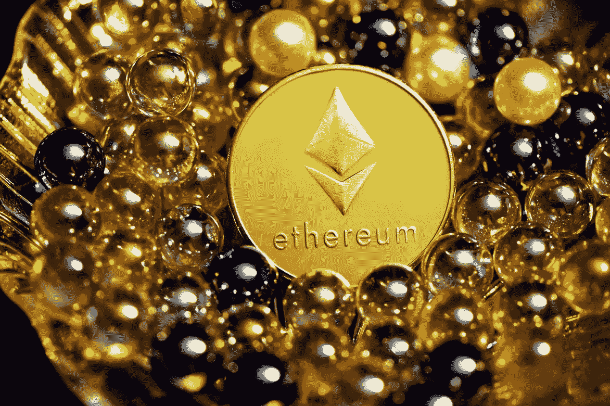

# 在最近的加密崩溃期间，以太坊鲸购买了哪些令牌？

> 原文：<https://medium.com/coinmonks/what-tokens-are-ethereum-whales-buying-during-the-recent-crypto-crash-553c16172b5f?source=collection_archive---------1----------------------->

Image via [Unsplash.com- Kanchanara](https://images.unsplash.com/photo-1623053590518-32beebe56321?ixlib=rb-1.2.1&ixid=MnwxMjA3fDB8MHxwaG90by1wYWdlfHx8fGVufDB8fHx8&auto=format&fit=crop&w=1172&q=80)

## 一些投资者仍在通过价格波动买入

过去一周，随着大多数代币的价格大幅下跌，加密投资者一直在咬牙切齿。虽然底部还不知道，但看看大投资者在做什么还是很有意思的。考虑购买…