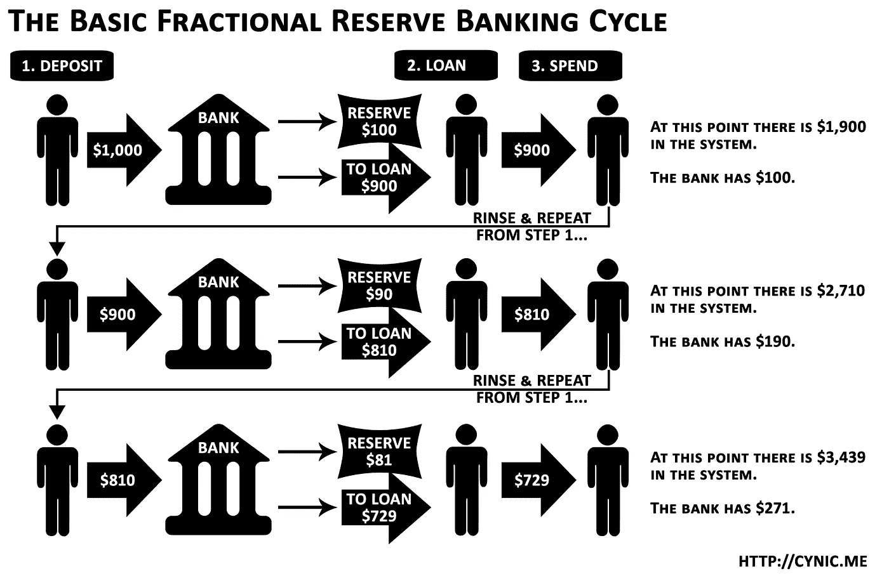

# 战争对密码意味着什么

> 原文：<https://medium.com/coinmonks/what-war-means-for-crypto-dd32f710fa5e?source=collection_archive---------26----------------------->

## 我试图理解一个多变的世界

2 月 24 日，当俄罗斯和乌克兰之间的战争首次爆发时，世界陷入了震惊之中。

没有人期望战争，然而，我们在这里。想起来很痛苦，我无法想象所有受影响的人是如何应对这场危机的。

当战争爆发时，保护资源成为一种本能，金融市场感受到了很多不稳定因素。鉴于全球不稳定，一场可能的衰退即将到来。

作为一个新手，我对金融市场的了解非常有限，更不用说它们是如何运作的了。我参加了经济学的高级课程，但是记忆和概念应用是两回事，所以通货膨胀的概念在我的脑海里有点模糊。因此，我想弄清楚正在发生的事情，以及这场危机如何反映在股票和密码市场上。

## 以下是我所学到的

## 比特币作为一种资产类别

Photo by [Quantitatives](https://unsplash.com/@quantitatives?utm_source=medium&utm_medium=referral) on [Unsplash](https://unsplash.com?utm_source=medium&utm_medium=referral)

*   战争造成了巨大的不稳定，地缘政治冲击导致加密市场下跌了 12%，导致许多人质疑比特币是否是一种“安全港”资产类别。
*   市场不确定性=低风险资产。我们从许多科技股的下跌中看到了这一点，crypto 的跌幅超过了股票的 4%
*   比特币的很多交易都是算法交易。这意味着买卖是根据关键数据趋势发生的。
*   战争=不确定性
    不确定性=股价下跌
    股价下跌=加密下跌
    出售比特币
*   贝塔。贝塔一般是指特定资产对大盘的敏感度。比特币的贝塔系数高于大多数其他资产类别，当其他资产变动时，加密的变动幅度会大得多。

## 为什么 BTC 坦克？

*   当俄罗斯入侵乌克兰时，算法发现了这一点，并在预期中出售了密码
*   手握重权的投资者卖出股票，因为他们害怕进一步下跌
*   杠杆清算的影响→加剧加密市场的波动

## 加密作为价值储存>银行

当危机发生时，许多乌克兰人涌向银行提取现金。然而，乌克兰中央银行暂停了货币市场并限制提款，(每天只有 100，000 乌克兰格里夫纳-3339.13 美元)，汇率处于历史最低点。

这表明了部分准备金银行的风险。

[altexploit](https://altexploit.wordpress.com/2017/06/16/fractional-reserve-banking-an-attempt-at-demystifying/)

由于银行不持有所有存款，资产保值的选择很少。

许多人转向加密货币。

## 危机期间的加密(用例)

**逃离乌克兰**

有些人通过使用比特币作为价值储存手段成功逃脱了战争。你可以在这里阅读弗朗西斯科·麦当娜的故事。实际上，他在菲亚特有大约 600 美元，带着一个 usb 和一张纸逃离了乌克兰。然后他在波兰将 BTC 兑换成现金。

**捐款**

乌克兰政府也接受了加密货币捐款，收到了近 1 亿美元的捐款。

**俄罗斯和制裁**

作为对俄罗斯入侵的回应，世界各地都实施了大规模制裁。甚至瑞士也打破了长期以来的中立。没过多久，俄罗斯就意识到他们的储备(60%)存在外国央行手中。这意味着储备会被没收。

*   西方禁运接踵而至，俄罗斯银行被踢出 SWIFT。
*   Visa 和 Mastercard 都暂停了在俄罗斯的业务
*   俄罗斯公民奔向他们的银行，俄罗斯提高利率并引入资本管制。
*   制裁迫使更多人加密
*   加密的无许可性质导致了对俄罗斯是否能利用加密来规避制裁的猜测

## 俄罗斯能用密码逃避制裁吗？

Crypto 完全透明，每笔交易都被跟踪，美国可以制裁钱包→几乎不可能逃避制裁。

以下是区块链协会执行副总裁兼政策主管杰克·切尔文斯基对此的看法。

[Jake Chervinsky](https://medium.com/u/9c78f5b0ecaf?source=post_page-----dd32f710fa5e--------------------------------)

## 要考虑的其他因素

美联储涨价 0.25%→通货膨胀

*   如果通胀高于预期→利率上升→风险资产抛售
*   油价暴涨→高油价→高能源价格→更高的生产成本→商品和服务价格上涨。
*   脆弱的供应链+战争+纷争+制裁=对全球货物流动的严重影响。

## 结束语

在困难时期，Crypto 似乎能够保护那些直接受到影响的人的购买力。今天的事件也让我们了解到全球金融体系是多么的集中和相互依赖。

至于比特币，霍德勒夫妇似乎很欣赏它的潜在价值，在战争、不确定性和审查时期，它似乎是一种很好的避险工具。

无论如何，人民在战争中受害最深，我希望为了和平，战争能尽快结束。

这里有一些帮助乌克兰的资源。

特别感谢这些 youtube 频道解释了正在发生的事情，我强烈建议观看所有的视频，以便更好地理解。像往常一样，请总是 DYOR(做自己的研究)，因为这是 NFA(而不是财务建议)。

*   [硬币局](https://www.youtube.com/watch?v=_AedZhTra1c)
*   [小鸡天才](https://www.youtube.com/watch?v=77cVL9g1ZWs)
*   [凯尔文学习投资](https://www.youtube.com/watch?v=a2cE1yx0ohY)