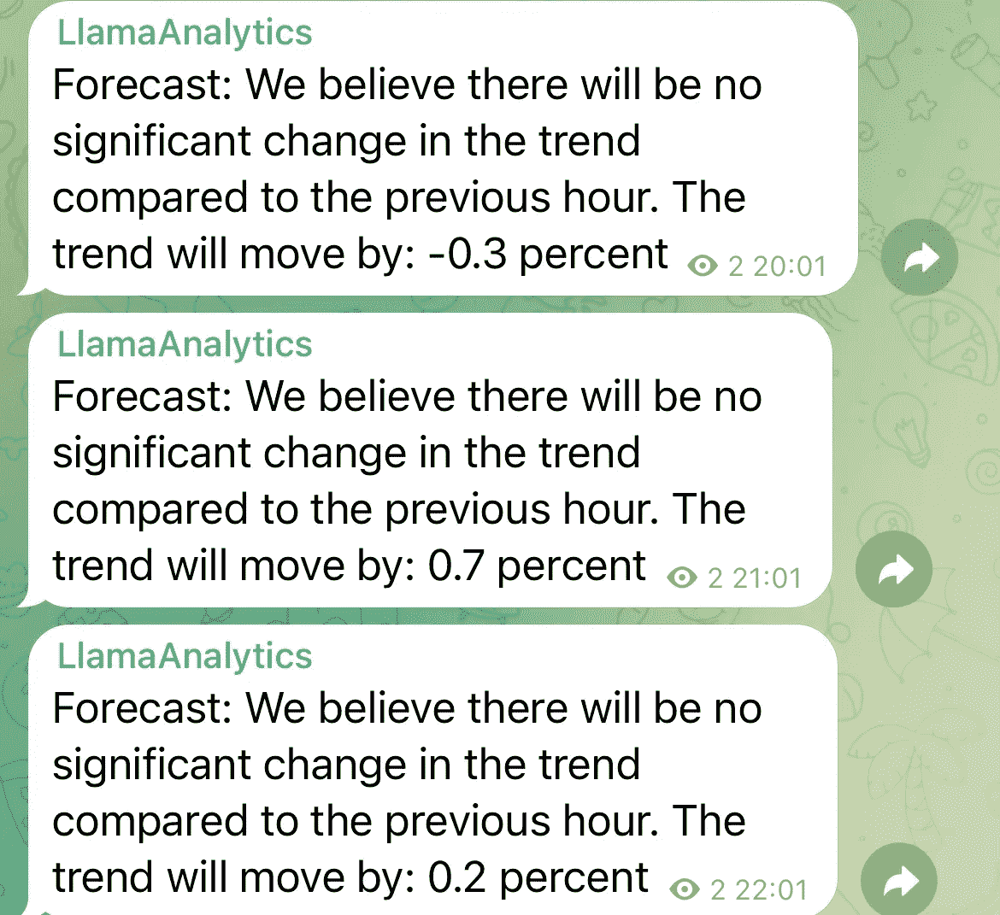

# 预测趋势时我们看到了什么

> 原文：<https://medium.com/coinmonks/what-we-saw-while-forecasting-the-trend-bff321911d43?source=collection_archive---------40----------------------->

因此，在过去的几天里，我们有一个有趣的市场，我们预测的趋势一直在上升和下降。

过去几天，我们看到了一个主要是消极的趋势，也有一些积极的动向

昨晚我们看到了一个主要是负面的趋势，但今天趋势已经回升，我们已经看到了 3.1%的相当大的正面运动和较小的负面趋势运动。

如果你对我们的每日预测感兴趣，你现在可以加入一个免费的电报组，在那里你可以看到每小时的趋势预测。

该小组的链接附后

 [## llamaa 分析

### 使用机器学习和人工智能加密交易信号

t.me](https://t.me/LlamaAI) 

> 加入 Coinmonks [电报频道](https://t.me/coincodecap)和 [Youtube 频道](https://www.youtube.com/c/coinmonks/videos)了解加密交易和投资

# 另外，阅读

*   [Exness 点评](https://coincodecap.com/exness-review)|[moon xbt Vs bit get Vs Bingbon](https://coincodecap.com/bingbon-vs-bitget-vs-moonxbt)
*   [如何开始通过加密贷款赚取被动收入](https://coincodecap.com/passive-income-crypto-lending)
*   [BigONE 交易所评论](/coinmonks/bigone-exchange-review-64705d85a1d4) | [电网交易机器人](https://coincodecap.com/grid-trading)
*   [氹欞侊贸易评论](https://coincodecap.com/anny-trade-review) | [CoinSpot 评论](https://coincodecap.com/coinspot-review)
*   [新加坡十大最佳加密交易所](https://coincodecap.com/crypto-exchange-in-singapore) | [购买 AXS](https://coincodecap.com/buy-axs-token)
*   [投资印度的最佳加密软件](https://coincodecap.com/best-crypto-to-invest-in-india-in-2021) | [WazirX P2P](https://coincodecap.com/wazirx-p2p)