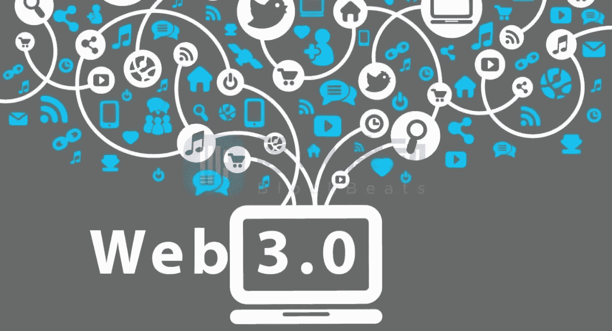

# Web 3.0 对您的投资意味着什么

> 原文：<https://medium.com/coinmonks/what-web-3-0-means-for-your-investments-bb67868309b9?source=collection_archive---------40----------------------->

Source photo [web3.0 for investment — Bing images](https://www.bing.com/images/search?view=detailV2&ccid=suaMfw7E&id=F83E2FD1D304EC304A4EE1F42889CD385DCE69B9&thid=OIP.suaMfw7EdyEUx8ddBxuHngHaEB&mediaurl=https%3a%2f%2fth.bing.com%2fth%2fid%2fR.b2e68c7f0ec4772114c7c75d071b879e%3frik%3duWnOXTjNiSj04Q%26riu%3dhttp%253a%252f%252fipfs-file.oss-cn-shenzhen.aliyuncs.com%252f0%252f2020-02%252f27173942862-e08d9e36-009c-40c6-976f-7914fe2f9c1a.jpg%26ehk%3dJWJbRELK18DEVuh%252fX%252brLpkfiuPstLjPKm%252fxpJga%252b51I%253d%26risl%3d%26pid%3dImgRaw%26r%3d0%26sres%3d1%26sresct%3d1%26srh%3d705%26srw%3d1300&exph=411&expw=758&q=web3.0+for+investment&simid=608024102117080444&FORM=IRPRST&ck=302BFE4F42FAE59C2E013CDFFE8E5F7B&selectedIndex=1&ajaxhist=0&ajaxserp=0)

web 3——或 web 3.0——近年来越来越引人注目。这已经成为几次关于技术未来的讨论中的一句口头禅。自从以太坊的联合创始人加文·伍德(Gavin Wood)在 2014 年创造了这个词以来，你可能听说过它。

然而，web3 是什么？这毕竟是我们在这里讨论的问题。