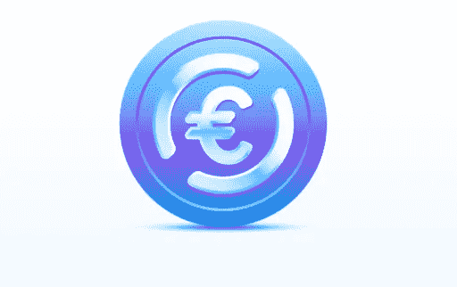

# 欧元硬币(EUROC)会是什么？

> 原文：<https://medium.com/coinmonks/what-will-be-euro-coin-euroc-e697c11f9db6?source=collection_archive---------25----------------------->

Source photo [Euro Coin (EUROC) I A Euro-Backed Stablecoin (circle.com)](https://www.circle.com/en/euro-coin)

USDC 稳定硬币背后的公司 Circle 已经宣布创造一种新的由菲亚特支持的数字资产，称为欧元硬币(EUROC)。尽管最近市场不稳定，但从此举可以看出，对加密服务的需求仍然强劲。

作为 ERC-20 的代币，新的稳定欧元硬币将于 6 月 30 日推出，并将于今年晚些时候在许多区块链网络上接受。