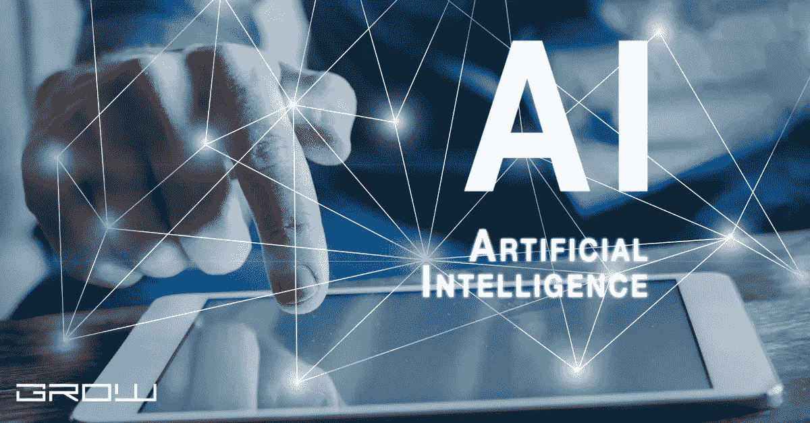

# 人工智能在未来会是什么样子

> 原文：<https://medium.com/coinmonks/what-will-be-the-of-ai-in-coming-future-a952ec5d750b?source=collection_archive---------50----------------------->

Artificial intelligence

人工智能已经走过了漫长的道路。从聊天机器人到自动驾驶汽车，我们看到了机器独立思考能力的快速进步。但是 AI 的未来会是怎样的呢？

在这篇文章中，我们将探索人工智能何时超越人类智能，以及它将如何改变我们的社会。有时令人担忧，有时令人乐观，我们希望这篇文章有助于评估你对机器智能和我们的世界之间的关系的看法。

我们从讨论机器智能何时可能超越人类能力开始。正如我们将要展示的，这是一个复杂的话题，因为许多因素影响着机器智能的进化。然后，我们继续讨论人工智能在未来可能扮演的角色，以及它可能带来的潜在好处和危险。

人工智能是计算机科学的一个分支，旨在通过设计模拟学习、决策或解决问题等认知过程的算法，使机器比人更聪明。许多人认为，机器最终将能够在各个方面超过我们:从数学和工程到艺术、音乐、经济和体育。

人工智能的发展被广泛定义为研究和改进计算方法，以在计算机中实现人类水平的智能。人工智能(AI)一词是由约翰·麦卡锡在 20 世纪 50 年代创造的，但人工智能的历史可以追溯到古希腊神话和塔罗斯的传说。

在世界经济论坛发布的 2016 年全球风险报告中，AI 被描述为在全球范围内产生高度影响的大趋势之一。有人预测，人工智能将在未来几十年产生巨大的社会影响，类似于手机和社交网络如何改变了今天的社会。该报告概述了人工智能的可能用例:从改善医疗保健和恢复视力到开发自动驾驶汽车和风力涡轮机。

虽然人工智能正在各个行业和部门传播，但检查人工智能对人类社会可能产生的积极和消极影响至关重要。生物医学科学是人工智能在未来可能产生重大影响的一个领域。这一领域的研究已经带来了医学突破，如癌症疫苗和心脏病的创新疗法。随着这一领域的不断进步，我们将能够帮助更多的人解决他们的健康问题，并对阿尔茨海默氏症等疾病进行潜在的治疗。

在 AI 研究中，建造机器的目标被称为“人类级别”的智能。能够像人一样思考和决策的设备可以被称为“人类级”机器，而接近人类智能的设备则被称为“强人工智能”。人们普遍认为，第一批机器将在 2047 年达到人类水平的智能。

这场竞赛似乎是在当前技术能力和我们发明的技术能力之间进行的。从长远来看，很难预测哪种特定方法在实现人类水平的智能方面更有效。

强人工智能的一个潜在问题是，如果没有道德的联邦监管，它可能会变得具有侵略性。许多人工智能研究人员担心这项技术被不受控制地使用，特别是如果我们不教机器善待或同情人类。有人担心超级智能机器最终可能会滥用它们的智能来伤害人类。

人类知识和信息的共享可能会有进一步的问题。人工智能将增强我们的数字足迹，这可能会导致隐私和数据安全问题。AI 的未来非常不确定，但它正在到来，我们需要为此做好准备。

未来人工智能的作用会是什么？

人工智能已经走过了漫长的道路。从聊天机器人到自动驾驶汽车，我们看到了机器独立思考能力的快速进步。但是 AI 的未来会是怎样的呢？在本帖中，我们将探索人工智能何时超越人类智能，以及它将如何改变我们的社会。有时令人担忧，有时令人乐观，我们希望这篇文章有助于评估你对机器智能和我们的世界之间的关系的看法。
我们的出发点是简要回顾一些关于机器智能进化的关键事实。在那之后，我们将研究人工智能在未来将扮演什么角色，以及它的潜在危险。
人们认为，机器最初可以在几个特定领域超越人类，但不能超越一般智力。到本世纪末，机器可能有能力在许多领域超越人类。然而，只有在 2040 年，机器可能会变得比人类更聪明。

The development of AI has been broadly defined as the study and advancement of computational methods to achieve human-level intelligence in computers. The term Artificial Intelligence was coined by John McCarthy in 1955 but the history of AI can be traced back to Greek mythology and the legend of Talos.
In 1965, Joseph Licklider initiated Project MAC at MIT with a grant from the Advanced Research Projects Agency (ARPA). It was the first project to study artificial intelligence at MIT. One of its research areas was symbolic reasoning and logic, which has a long history in artificial intelligence engineering. The project provided an excellent platform for the development of new technologies and algorithms. In 1967, Licklider shared his intentions regarding how AI would change society in the future: “Man will not willingly allow himself to be deserted by his god.”
In 1972, Robert Brachman and Joseph Weizenbaum wrote a paper named “Can Machines Think?” about some ethical issues related to AI. It argued that machines are capable of acquiring knowledge, including beliefs and desires, in a way that surpasses their human creators. As a result, the probability of machines turning against their creators might be very high.
In the 1980s and 1990s, AI research started to move from symbolic reasoning toward neural networks. Neural networks are computer models of the human brain that can learn complex tasks on their own by using feedback from historical data. They are similar to other types of machine intelligence like heuristic search, inductive logic programming, and evolutionary computation. In 1997, Rodney Brooks created iRobot, which was an early example of a robot that could act on its own after having been taught by humans. It helped to advance robotics research into the practical implementation of artificial intelligence.
In 1997, Marvin Minsky and Seymour Papert co-founded the MIT Artificial Intelligence Laboratory (MILA). MILA is famous for its connection with AI research and world-leading work in AI by many famous researchers like Rodney Brooks, Allen Newell, Allen Henricks, and John McCarthy. The laboratory is also known for creating the first robot to be accepted into a household in history: Autonome.
In 2005, Siri was introduced at Apple’s iPhone 4 launch event by Steve Jobs. Siri is a machine learning system that comes with natural language processing capabilities. It responds to voice commands and can perform many tasks including weather forecasts, local searches, making reminders, and booking tickets. Its algorithms are based on neural networks which have been taught by humans.
In 2007, IBM’s Deep Blue beat the world chess champion, Garry Kasparov, in a six-game series hosted in New York. The “Deep Blue” strategy board was developed by Michael Littman and Michael Iversen at IBM’s Deep Blue Research Center.
In 2009, Google’s self-driving car project was started after Larry Page saw Stanford University professor Sebastian Thrun on TV giving a lecture about autonomous vehicles 2007\. In 2012, Google began to develop its autonomous car technology after acquiring several companies in the field.
In 2011, IBM created Watson using software called DeepQA which uses language processing techniques and machine learning algorithms. Watson is famous for winning the game show “Jeopardy!” with impressive accuracy. In 2015, IBM announced that it would sell Watson to a healthcare company named Blue Cross Blue Shield. The company claimed that it could help doctors improve treatment for cancer patients.
In 2014, AlphaGo is an AI system developed by Google’s DeepMind division and built from four neural networks trained by playing many games against itself. Its objective was to defeat the world champion in Go, Lee Sedol. In March of 2016, AlphaGo beat Lee Sedol 4–1 in a five-game series.
In 2015, Tesla released Autopilot which is now a part of Enhanced Autopilot and Full Self-Driving Capability. It was first included in Tesla Model S vehicles built after October 2014 and became standard in all new production vehicles like the Model X and Model 3\. Later versions of Autopilot came with hardware that enabled self-driving capability by introducing cameras and additional sensors onto the vehicles.
Autopilot can automatically steer within a lane, change lanes, transition from one freeway to another, and exit the freeway when your destination is near. It can also automatically park itself in a garage, automatically open and close the car door, and park your car parallel to a curb.
In 2016, Facebook released DeepFace, an AI system that could recognize faces in real-time. It was trained with face images from more than 5.6 million Facebook users uploaded by their friends to generate a database of 1.2 million faces. DeepFace has been used by Facebook to identify people in photos and videos uploaded on Messenger and the dating service Instagram.
In 2017, Apple introduced its own AI chip called “Neural Engine” with its new iPhone X. The “Neural Engine” is manufactured using a 10-nanometer process and it has been built from a single core unit with multiple sub-processors. It can perform 5 trillion operations per second which is more than the power of IBM’s Watson, Google’s TensorFlow, or Amazon’s Alexa today.
In 2017, Elon Musk launched Neuralink which aims to connect the human brain with a machine interface by creating micron-sized devices to be implanted in the human brain. It will initially be used to help people with severe brain injuries by feeding signals from the brain to an AI system.
In 2017, DeepMind (an AI system acquired by Google in 2014) developed AlphaZero which is a generalized artificial intelligence system that can master chess, shogi (a Japanese version of chess), and Go on its own within 72 hours with no human input. It is the first artificial system that can learn the games from scratch without any human knowledge.
Statistics about AI:
- 70% of organizations are planning to implement AI systems in their organization this year.
- 56% of companies are already using or experimenting with some form of AI today.
- 49% of executives believe that AI will drive competitive advantage in their industry within the next three years.
- 50% of executives believe that AI will bring more jobs to the country.
- Only 8% of people believe that AI can make their life worse with little to no benefits for them.
- Only 3% of organizations have lost a business opportunity because of their AI initiatives.
- 97% of respondents from organizations who have implemented AI are satisfied with their current progress and development.
- 91% of organizations who are using AI in their organization are satisfied with their current progress and development.
- 61% of executives believe that AI will replace them within one year.
- Only 3% of people believe that AI can make their life better with little to no benefits for them.