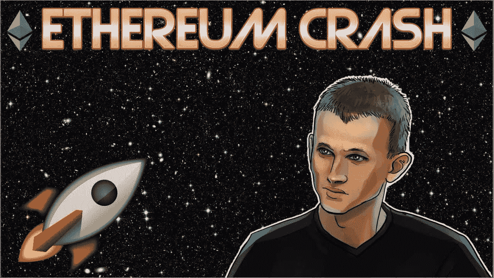

# 以太坊的价格会有什么变化？

> 原文：<https://medium.com/coinmonks/what-will-happen-with-the-price-for-ethereum-62c50e42472d?source=collection_archive---------19----------------------->

Source photo [ethereum crash — Bing images](https://www.bing.com/images/search?view=detailV2&ccid=Rmsq5QZa&id=930B4D0CA43BA5CA9F0023E0B900742D1B673E93&thid=OIP.Rmsq5QZaU_WMTGrgUpbEAAHaEK&mediaurl=https%3a%2f%2fi.ytimg.com%2fvi%2fQTBUjWUUtJE%2fmaxresdefault.jpg&cdnurl=https%3a%2f%2fth.bing.com%2fth%2fid%2fR.466b2ae5065a53f58c4c6ae05296c400%3frik%3dkz5nGy10ALngIw%26pid%3dImgRaw%26r%3d0&exph=720&expw=1280&q=ethereum+crash&simid=608034341442364800&FORM=IRPRST&ck=3BC0EA3CA7483EA1D244F54BC1C3DA39&selectedIndex=2&ajaxhist=0&ajaxserp=0)

在过去的几周里，以太坊的价格在一个狭窄的支撑位和阻力位区间内交易。最近几天，以太币/美元的交易区间有所收窄，支撑位在 1，700 美元附近，下跌趋势线在前期波动高点之上。

在本周中期，看涨势头减弱为涓涓细流，只有几个短暂、剧烈的…