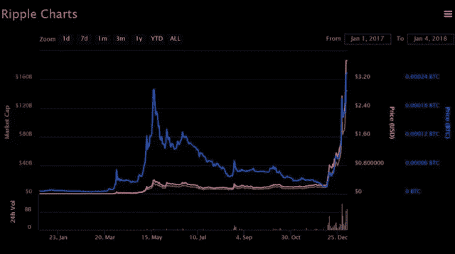

# 如果一根类似比特币的魔杖到了你手里，你会怎么办？

> 原文：<https://medium.com/coinmonks/what-would-you-do-if-a-magic-wand-like-a-bitcoin-got-into-your-hand-d8d08e5dd9d1?source=collection_archive---------60----------------------->

[首页](https://www.theeducationism.com/) [比特币是什么](https://www.theeducationism.com/search/label/what-is-bitcoin)如果一根类似比特币的魔杖落到你手里，你会怎么做？

也有许多人想以某种方式帮助购买他们的比特币，因为买卖比特币不亚于科学

这不像你去你的银行，拿着一些纸币出纳，带着一个比特币回家。人们对此非常感兴趣，因为大多数人都听说过许多从比特币中致富的故事，在这些故事中，购买比特币的人购买了几个鳄鱼比特币，如今变得富有。那谁的心里不希望他比有钱人更有钱呢

比特币获得了像魔杖一样的声誉，可以让一枚丢失的硬币变成金子。如果你手里有一根护身符棍，能让每一枚丢失的硬币都变成金子，你会怎么做？

当然，你不会用这根棍子打破核桃。他们会堆积黄金，但如果你告诉人们你有这样一根魔杖，人们可能会认为你疯了。如今，比特币的世界是一种加密货币，显然类似的事情正在发生

根据股票市场时钟，被认为是股票主要市场的伦敦证券交易所已经投资了 3.9 万亿

根据硬币市值，加密货币市场目前投资 7 750 亿美元，并迅速达到 1 万亿美元。这表明投资者现在正在强调加密货币

那些最初用丢失的硬币购买了大量比特币的人今天正在与天空交谈，他们面前有成堆的黄金。许多人称比特币买家疯狂，但今天我感叹道，我希望我们也能表现出一些疯狂

比特币现在对许多人来说非常昂贵，许多新的加密货币已经出现。其中最显著的是垂降和动脉粥样硬化

2017 年 1 月，一个 rapple 花费 00 0.006。它的价值增加了 40 62 400 英镑，目前价值为 3 英镑。3.75，仅次于资本

当我在计算增加比例时，我很惊讶地看到了答案。显然这不亚于一个护身符棒

一方面，创办 Ripple 的公司发行了货币，另一方面，它试图在世界范围内引入一种新的高速货币交易系统。根据 Ripple 的说法，这个新系统被称为当前银行使用的系统，它将会更快

加密货币市场是当时引入去中心化全球系统的第三大市场，据他所说，这将搅动技术世界

以太币将是这个系统中交易的重要组成部分。2017 年初 8 美元，目前已超过 1000 1000

去年年初，比特币的价格大约是 1000 1，000 英镑。在它的价格一年增加几次的地方，它的价格突然再次上升，在 12 月份增加到 20，000 英镑，然后突然下降到接近 10，000 英镑

无论是比特币还是其他加密货币，它们的价值在上涨的地方也会大幅下跌，但目前谁看到了其中的危险？

目前，许多人痴迷于投资比特币和其他加密货币。加密货币的价格也在上涨。对它们的需求非常大，价格也在急剧上涨。人们目前购买加密货币是基于对其未来价值的猜测

可以理解，比特币是一种货币。像这样的货币还有很多。它们只存在于网络世界，不是由一个国家的国家银行发行的，而是由与技术世界相关的机构发行的。发行的是什么？

这些人的目的是提供这些国家的国家银行发行的货币的替代品，而没有人能够控制这些货币。为了获得这些纸币，你必须在加密货币交易所开立账户

你可以把加密货币交给你国家的货币兑换处。问题是收到后会去哪里。要么你必须保留你的加密货币兑换账户，要么给他们一个数字金库或钱包，你必须把它放在里面

数字金库有一个类似电子邮件账户的地址，人们可以通过它向你汇款。这些保管库也可以以手机应用程序的形式提供，也可以在电脑上使用

货币的主要用途之一是买卖或支付。问题是你能不能带着加密货币去商店买东西。目前不太可能，因为它只在非常有限的地方使用。也许将来我会买卖它们，但现在还不是时候

*最初发表于*[*【https://www.theeducationism.com】*](https://www.theeducationism.com/2022/03/what-is-bitcoin-what-is-btc.html)*。*

> 加入 Coinmonks [电报频道](https://t.me/coincodecap)和 [Youtube 频道](https://www.youtube.com/c/coinmonks/videos)了解加密交易和投资

# 另外，阅读

*   [币安 vs FTX](https://coincodecap.com/binance-vs-ftx) | [最佳(SOL)索拉纳钱包](https://coincodecap.com/solana-wallets)
*   [比诺莫评论](https://coincodecap.com/binomo-review) | [斯多葛派 vs 3Commas vs TradeSanta](https://coincodecap.com/stoic-vs-3commas-vs-tradesanta)
*   [Capital.com 审查](https://coincodecap.com/capital-com-review) | [港加密借贷平台](https://coincodecap.com/crypto-lending-hong-kong)
*   [如何在 Uniswap 上交换加密？](https://coincodecap.com/swap-crypto-on-uniswap) | [A-Ads 审核](https://coincodecap.com/a-ads-review)
*   [WazirX vs coin dcx vs bit bns](/coinmonks/wazirx-vs-coindcx-vs-bitbns-149f4f19a2f1)|[block fi vs coin loan vs Nexo](/coinmonks/blockfi-vs-coinloan-vs-nexo-cb624635230d)
*   [本地比特币审核](/coinmonks/localbitcoins-review-6cc001c6ed56) | [加密货币储蓄账户](https://coincodecap.com/cryptocurrency-savings-accounts)