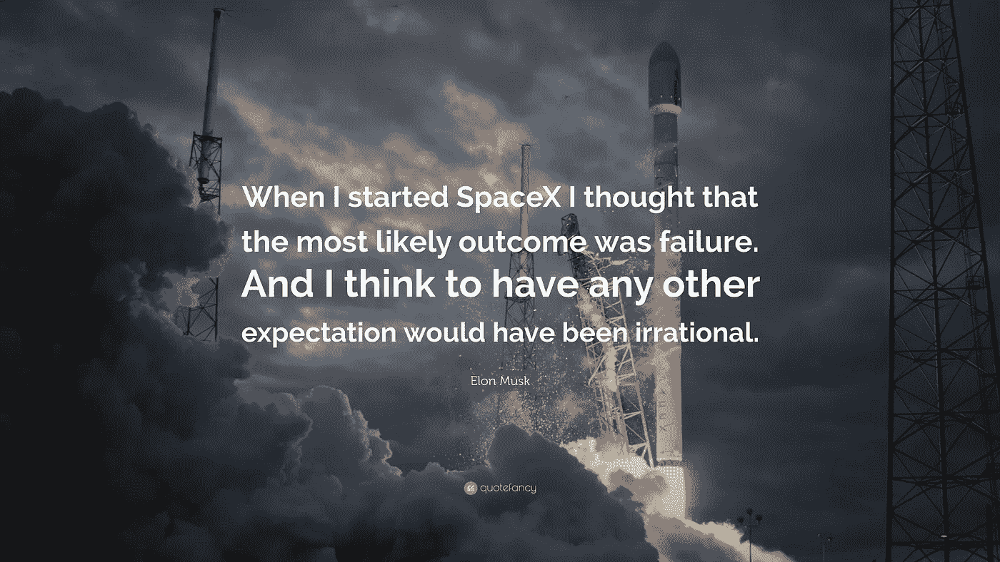

# 你能从世界上最富有的人之一埃隆·马斯克身上学到什么

> 原文：<https://medium.com/coinmonks/what-you-can-learn-from-elon-musk-one-of-the-richest-people-in-the-world-9359a964b647?source=collection_archive---------36----------------------->

Source photo [elon musk quotes — Bing images](https://www.bing.com/images/search?view=detailV2&ccid=IECkffcP&id=C930FD8E082CEEB40D2CC7B948A0504CBA2EF8D5&thid=OIP.IECkffcPjqRoXTynAmtSEgHaEK&mediaurl=https%3a%2f%2fquotefancy.com%2fmedia%2fwallpaper%2f3840x2160%2f2001417-Elon-Musk-Quote-When-I-started-SpaceX-I-thought-that-the-most.jpg&cdnurl=https%3a%2f%2fth.bing.com%2fth%2fid%2fR.2040a47df70f8ea4685d3ca7026b5212%3frik%3d1fguukxQoEi5xw%26pid%3dImgRaw%26r%3d0&exph=2160&expw=3840&q=elon+musk+quotes&simid=607991739587372700&FORM=IRPRST&ck=4854A4B71A307BE85233414243A9D605&selectedIndex=28&ajaxhist=0&ajaxserp=0)

SpaceX 和特斯拉的首席执行官埃隆·马斯克也是世界上最富有的人，在这场持续的疫情灾难中，他的财富增加了 924%。他的想法和成功的动机是灵感的巨大来源，也是学生和努力奋斗的年轻人的神奇资源。