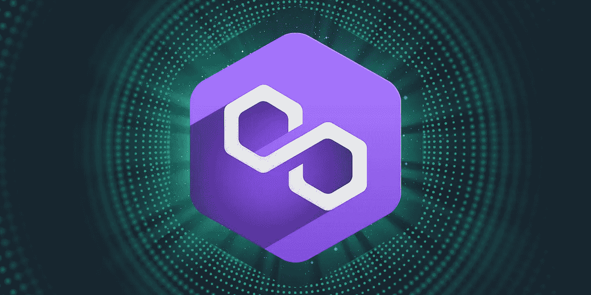

# 关于多边形你需要知道什么

> 原文：<https://medium.com/coinmonks/what-you-need-to-know-about-matic-polygon-83007cde40c3?source=collection_archive---------40----------------------->

MATIC 是 Polygon Network 的本地 ERC-20 令牌，可用于各种目的，包括交易费、托管费和治理费。计算能力:MATIC 主要用在多边形区块链上，作为一个股份令牌，使用股份证明(PoS)方法来验证交易。

MATIC 用于 Polygon 内部的支付服务，并作为在 Polygon 生态系统中工作的用户之间的结算货币。多边形侧链上的交易费也用自动代币支付。Matic 是 Polygons 生态系统中的本地货币，用于下注和支付交易费用。

Polygon MATIC 还使用侧链，智能地重定向来自以太坊的用户流量和交易，释放计算能力。MATIC 是 Polygon 的本地区块链令牌。Polygon 有效地将以太坊变成了一个真正的多链系统(也称为区块链互联网)。成为导致了所谓的“第二层”网络的创建，例如 Polygon，其目的是从以太坊接管负载。

Polygon MATIC 通过实施一种创新的独一无二的第 2 层解决方案来解决这些问题，该解决方案允许 Polygon 利用以太坊支持以最低的成本验证交易。创新的多边形不需要它自己的主区块链来工作；而是运行在以太坊网络上。Polygon MATIC 称自己为“以太坊区块链互联网”,因为它的主要使命之一是支持一个由以太坊驱动的多链生态系统。就交易量而言，Polygon 一直是 CoinSwitch 上表现最好的加密资产之一。Polygon 前身是 Matic Network，由 Jainty Kanani、Sandeep Nailwal 和 Anurag Arjun 于 2017 年 10 月在印度创立。在 Sandeep Nailwal Polygons 白皮书中，Janty Kanani 第一个提出了与以太坊相关的关键问题:高额燃油税和网络瓶颈。Polygon(原 Matic Network)是第一个结构良好且易于使用的以太坊扩展和基础设施开发平台。Polygon(以前的 Matic Network)是由币安和比特币基地公司推出的第 2 层扩展解决方案。

Matic Network 将自己描述为第 2 层扩展解决方案，该解决方案使用侧链进行链外计算，同时通过等离子体基础设施和分散的利益证明(PoS)验证器网络来保护资源。“Matic 网络的架构[旨在]在以太坊区块链和 Matic Le side chain Matic side chains 之间提供安全高效的通信。

` ` PoS(赌注证明)令牌桥现在在 Matic mainnet 上有效，允许资金在以太坊和 Matic 之间存取，反之亦然。DApps 现在可以使用安全验证器令牌桥将 ERC20、ERC721 和 ERC1155 令牌从以太坊传输到 Matic，以及从 Matic 传输到以太坊。互动功能意味着你可以从以太坊存入 Matic，与代币互动，还可能在以太坊平台再次提现。

我们的以太坊双向桥是基于以太坊的，因为多边形 PoS 提交链的所有验证/标桩逻辑都作为智能契约存在于以太坊上。Polygon PoS 提交链有自己的一组无授权验证器，并使用以太坊来标记/划分验证器检查点。这个螺丝钉意味着如果以太网瘫痪了，Polygon PoS 提交链也会瘫痪。

到目前为止，Polygon 已经吸引了 50 多个 DApps 加入它的 PoS-secure Ethereum 侧链。至于 Polygon，Polygon 表示，即使在以太坊 2.0 推出后，对区块链缩放服务的需求仍将保持强劲。开发人员和投资者发现 Polygon 非常有吸引力，因为 Polygon 支持使用顶级以太坊安全协议创建分散式应用程序和智能合同，但具有更高的可扩展性和更低的 gas 率。Polygon 已经有像阿迪达斯和普拉达这样的公司在他们的网络上试验 NFTs。

CryptoPredictions Polygon 显示，价格可能会在 2 月份降至 1809 美元，如果是这样，价格可能会降至 1230 美元。MATIC price 从 5 月 23 日的低点出现了惊人的 230%的回撤，形成了一个反向底部，可能会在未来几天和几周内将 MATIC 推向新高。尽管从峰值下跌了 70%，MATIC 仍然是最近几周最好的成绩之一。

一旦反转形态完成，MATIC 再次准备突破并测试其高点 2.7 美元。Polygon 作为一个拥有集成项目缩放解决方案的区块链网络，其日益增长的声誉以及马克·库班最近的投资，从长期来看，将提高 MATIC 的估值。在币安交易比特币、以太坊、BNB 期货等。如果强劲的牛市冲击市场，多边形将走向 1.618%的斐波纳契水平，相当于 3.9205 美元。

红杉资本硅谷已经向多边形区块链网络投资了 4.5 亿美元。在 2019 年转移到他们的网络之前，Polygon 团队为以太坊生态系统做出了巨大的贡献。Polygon 作为加密货币以太坊背后的平台以太坊的底层，帮助以太坊处理大规模交易。Polygon 是一种以太坊令牌，提供以太坊扩展解决方案，并在第 2 层侧链(运行在以太坊主链上的区块链)上提供更便宜、更快速的交易。

虽然以太坊使用高能耗的加密货币挖掘来验证交易，但 Polygons 网络的成员只需要证明他们拥有一些令牌——换句话说，“股份”——就可以成为验证者。虽然 Polygon 目前仅支持以太坊基链，但该网络打算根据社区提议和共识扩展对其他基链的支持。

[来源](https://bigbraincrypto.blogspot.com/2022/02/what-you-need-to-know-about-matic.html)

> 加入 Coinmonks [电报频道](https://t.me/coincodecap)和 [Youtube 频道](https://www.youtube.com/c/coinmonks/videos)了解加密交易和投资

# 另外，阅读

*   [CoinLoan 评论](https://coincodecap.com/coinloan-review) | [YouHodler 评论](/coinmonks/youhodler-4-easy-ways-to-make-money-98969b9689f2) | [BlockFi 评论](https://coincodecap.com/blockfi-review)
*   [XT.COM 评论](https://coincodecap.com/profittradingapp-for-binance)币安评论 |
*   [SmithBot 评论](https://coincodecap.com/smithbot-review) | [4 款最佳免费开源交易机器人](https://coincodecap.com/free-open-source-trading-bots)
*   [比特币基地僵尸程序](/coinmonks/coinbase-bots-ac6359e897f3) | [AscendEX 审查](/coinmonks/ascendex-review-53e829cf75fa) | [OKEx 交易僵尸程序](/coinmonks/okex-trading-bots-234920f61e60)
*   [如何在印度购买比特币？](/coinmonks/buy-bitcoin-in-india-feb50ddfef94) | [瓦济克斯审查](/coinmonks/wazirx-review-5c811b074f5b)
*   [隐料斗替代品](/coinmonks/cryptohopper-alternatives-d67287b16d27) | [HitBTC 审查](/coinmonks/hitbtc-review-c5143c5d53c2)
*   [CBET 评论](https://coincodecap.com/cbet-casino-review) | [库科恩 vs 比特币基地](https://coincodecap.com/kucoin-vs-coinbase)
*   [折叠 App 审核](https://coincodecap.com/fold-app-review) | [Kucoin 交易机器人](/coinmonks/kucoin-trading-bot-automate-your-trades-8cf0ca2138e0) | [Probit 审核](https://coincodecap.com/probit-review)
*   [如何匿名购买比特币](https://coincodecap.com/buy-bitcoin-anonymously) | [比特币现金钱包](https://coincodecap.com/bitcoin-cash-wallets)
*   [币安 vs FTX](https://coincodecap.com/binance-vs-ftx) | [最佳(SOL)索拉纳钱包](https://coincodecap.com/solana-wallets)