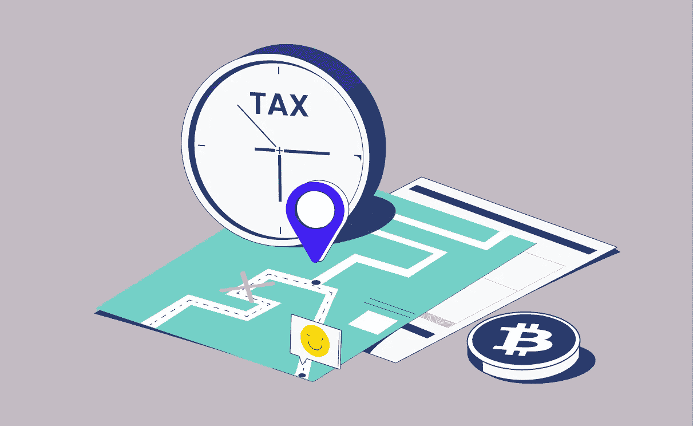

# 作为本季的秘密税务顾问，你需要知道什么

> 原文：<https://medium.com/coinmonks/what-you-need-to-know-as-a-crypto-tax-advisor-this-season-601163061a44?source=collection_archive---------44----------------------->

每个人都喜欢寻找更有效地完成工作的方法，尤其是当这涉及到为客户计算税款的漫长过程时。考虑到加密货币近年来经历的爆炸性流行，会计师可以预计，许多通常自给自足的客户将寻找最佳解决方案，以简化他们的加密税。

我们总是建议 [Cointelli](https://cointelli.com/) 确保您的客户准备好您需要的所有加密税文件，并确保他们的加密货币税快速准确地完成。 [Cointelli 的流程](https://cointelli.com/blog/crypto-tax-made-easy)简单、高效、直截了当，让繁忙的纳税季尽可能平稳地进行。Cointelli 与非常广泛的钱包、交易所和区块链连接，以导入数据并使用它来生成报告，您可以将该报告合并到您的平台或流程中。通过这样做，Cointelli 可以轻松地与您的系统集成，并确保您的客户不会错过任何交易。

虽然鼓励你的客户使用 Cointelli 平台确实是最好的方式，当然还有其他秘密税务交易的技巧来帮助你和你的客户在申报之前。

# 不要缩短你的报告

去年 1099 表格上的错误导致许多人声称不知道他们到底需要向国税局报告什么。由于这个原因以及其他原因，华盛顿今年非常重视加密纳税申报。

他们甚至将他们的努力命名为“隐藏的宝藏行动”，并宣布他们将对那些少报或未能正确报告其秘密收入的人提起刑事诉讼。为了支持这一点，美国国税局现在有能力跟踪交易，以验证它们的存在。

长话短说，确保你的客户报告所有的钱包，收入流和收益，以避免成为下一集*法律与秩序的故事情节:(加密)犯罪意图。*

# 把收获作为礼物

如果你的客户考虑过将密码赠送给朋友或家庭成员，那么最好是在收益得到认可的时候。虽然礼物赠送者不会被征收*所得税*，因为收益是赠送的(尽管交易可能要缴纳*赠与税*)，但接受礼物的个人不会被征税，除非他们决定使用、出售或交易礼物以获取利润。这个特别的提示也可以帮助你的客户在纳税季节之外。

拥有一切的人能得到什么？给他们加密，给你的客户减税！

# 慈善捐款

如果您的客户向免税的 501(c)慈善机构捐赠了加密资产，他们通常可以通过使用慈善捐款扣除来降低他们的税单。

许多奇妙而有价值的慈善机构现在都在接受加密货币捐赠，包括红十字会、联合国儿童基金会、救助儿童会、雨林基金会和其他机构。事实上，在 crypto 中进行捐赠实际上可能会节省慈善资金，因为这些团体经常需要为用信用卡支付的捐赠支付处理费。

对您客户的钱包和信誉又是一个双赢！

# 坚持住

虽然许多投资者可能会被诱惑不断参与加密领域(“买入下跌”的口号经常可以听到)，但客户如果持有资产超过一年，就可以避免被征收更高的税率。

这对新手投资者来说尤其是一个好建议，因为他们可以实际看到数字如何随着时间的推移而变化，并了解更多关于投资加密货币的寿命。

在过去两年里，国际社会学到了许多新的经验教训。在投资领域，我们发现加密货币将会长期存在。随着这一分散金融的新领域越来越受欢迎，加密税收问题将开始变得司空见惯。

在 [Cointelli](https://cointelli.com/crypto-tax-professionals) ，我们可以帮助您轻松解决客户的加密税务问题，让您有时间专注于生活中的重要事情。

*免责声明:本帖仅供参考，不应被解释为或依赖于替代财务、法律或税务专业人士的建议。此外，本内容仅涉及美国公民和居民的美国联邦所得税后果，不涉及可能与受特殊规则约束的特定人员(如经销商或贸易商)相关的税务后果。您应该咨询您自己的财务、法律或税务专业人士，以报告和提交您的加密税或根据您的特定情况做出决定。法律、法规或现有法律的解释可能会发生变化，这可能会对未来或追溯产生不利影响。这篇文章的内容可能会有变化。*

> 加入 Coinmonks [电报频道](https://t.me/coincodecap)和 [Youtube 频道](https://www.youtube.com/c/coinmonks/videos)了解加密交易和投资

# 另外，阅读

*   [OKEx vs KuCoin](https://coincodecap.com/okex-kucoin) | [摄氏替代度](https://coincodecap.com/celsius-alternatives) | [如何购买 VeChain](https://coincodecap.com/buy-vechain)
*   [币安期货交易](https://coincodecap.com/binance-futures-trading)|[3 commas vs Mudrex vs eToro](https://coincodecap.com/mudrex-3commas-etoro)
*   [如何购买 Monero](https://coincodecap.com/buy-monero) | [IDEX 评论](https://coincodecap.com/idex-review) | [BitKan 交易机器人](https://coincodecap.com/bitkan-trading-bot)
*   [CoinDCX 评论](/coinmonks/coindcx-review-8444db3621a2) | [加密保证金交易交易所](https://coincodecap.com/crypto-margin-trading-exchanges)
*   [红狗赌场评论](https://coincodecap.com/red-dog-casino-review) | [Swyftx 评论](https://coincodecap.com/swyftx-review) | [CoinGate 评论](https://coincodecap.com/coingate-review)