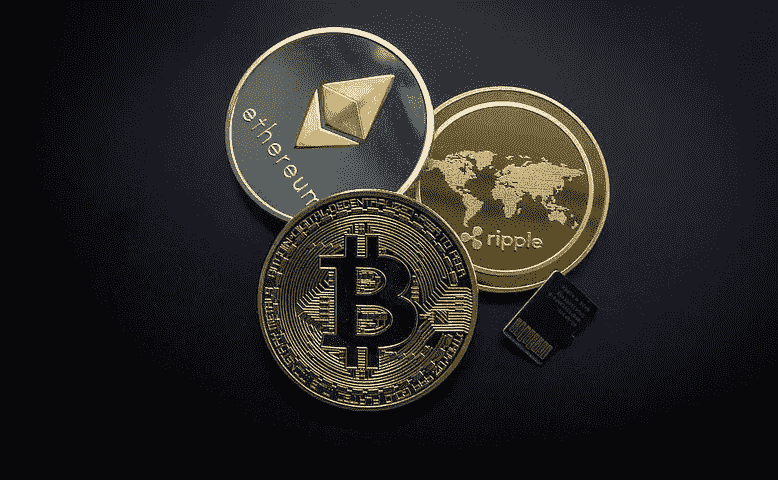

# 作为高风险投资者，在购买 Crypto 之前你需要知道什么

> 原文：<https://medium.com/coinmonks/what-you-need-to-know-before-buying-crypto-as-a-high-risk-investor-3a7c47def7bd?source=collection_archive---------51----------------------->

如果你有很高的风险承受能力，那么你可以建立一个 100%由加密货币组成的投资组合。如果你的目标是尽快实现大的投资回报，那么你可以去寻找明天的以太或溶胶。

为此，你需要做大量的研究。事实上，投资最有前景的加密货币的最佳方式是先于所有人发现这个项目。为此，Twitter 是最相关的媒体，也是了解该行业最新消息的重要工具。

**在 Twitter 上研究有前景的加密货币**

为了充分利用 Twitter，你需要关注加密货币的影响者。为了选择这些有影响力的人，你也必须做自己的研究。你可以问自己以下问题:

这个人提某某项目有什么兴趣？
他或她为此付钱了吗？这个人曾经谈论过过去成功的项目吗？
根据您的标准选择了最相关的影响者后，您必须彻底探索他们帐户上共享的项目。

**尽职调查了解投资哪种加密货币**

为了确保项目的可行性，你必须进行尽职调查。尽职调查是一种调查形式，每个理性的人都应该在做出投资决定之前进行调查。即使你的风险承受能力很高，也要记住加密货币的世界充满了各种各样的骗局。如果你没有必要的技术背景来发现这些骗局，你就更容易受到它的伤害。

要进行尽职调查，你必须从访问项目网站开始。首先要做的是分析白皮书。白皮书(white paper)是由一个加密项目发布的文档，目的是提供有关概念、路线图、项目背后的团队以及令牌组学的信息。

最著名的白皮书是中本聪在 2008 年 10 月 31 日分享的。中本聪是创造比特币背后的神秘人物。他的白皮书是一份 9 页的文件，基本上解释了比特币是什么以及它是如何工作的。

**阅读白皮书**

为了确定你是否应该投资一个加密项目，你应该仔细阅读这份文件。这也适用于提供的所有文件。你应该从团队开发的技术开始。这项技术能解决某个特定的问题吗？正在解决的问题的规模有多大？这首先让你对项目发展的市场规模有一个概念。

其次，你应该对代码感兴趣。那么，团队开发的代码是否具有确保竞争优势的特定特征？然后，你必须学习令牌的用法。提出的加密货币有用例或现实生活中的应用吗？如果有，它们是什么？

一旦你回答了这些不同的问题，看看路线图。对你来说，为实现团队设定的目标而宣布的不同步骤是否可行？您认为这些步骤在规定的时间框架内可以实现吗？

最后，这可能是研究白皮书最重要的部分，看看项目背后的团队。为此，你可以去成员的 LinkedIn 个人资料，查看他们过去的职业生活。他们曾经是技术项目的一部分吗？如果有，结果如何？

注意，你也可以通过社交网络直接与创始人互动。从白皮书中，很容易找到该项目的电报频道，Twitter 或 Discord。因此，您可以与团队或社区进行交流。如果你找不到社交媒体，就开始质疑这个项目的严肃性。

进行尽职调查时，潜在的合作伙伴也是另一个需要考虑的标准。该项目是否得到其他公司的支持？如果是为什么？这些公司能在资金或技术上支持这个项目吗？

**记号组学的研究**

如果在进行了所有这些检查后，项目对你来说似乎是可信的，那么你可能已经遇到了一个有前途的加密货币项目。为了确定这一点，你现在必须研究它的表征组学。

Tokenomics 是一个包括 token(代币)和经济学的组合词，字面意思是——代币经济。令牌组学是一种数据，可让您了解令牌将如何发行和分发。代币的最大数量和这些代币的分布从项目开始就通过算法来定义。

例如，我们知道比特币的数量不会超过 2100 万，而且每四年比特币的发行量就会减半。所以大家都知道这个资产的稀有程度。

为了研究一个项目的记号组学，有必要询问今天可用的记号的数量以及总共可用的记号的数量。您还必须询问创建这些令牌的模型。

三种最常见的模型是反通货膨胀模型、通货膨胀模型和通货紧缩模型。反通胀模型认为代币数量有限。例如，这是比特币模型。相反，通货膨胀模型认为代币的数量以平衡的方式增长。令牌的数量通常会随着区块链的使用而增加。例如，这是以太坊模型。

随着时间的推移，通缩模型会减少加密货币的供应。目标是防止市场上充斥着有问题的资产，同时增加其价值。代币的供给越有限，其需求就越增加，其价值就越增加。

通缩项目使用两种主要方式来达到目的。首先，“回购和烧毁”是指项目回购自己的加密货币，并将其发送到一个无法检索令牌的地址。这减少了流通中的代币数量。例如，Cake 或 BNB 等加密货币就是这种情况。

“交易时燃烧”是指智能合约规定，在有问题的加密货币交易期间收取的费用将被自动燃烧。这种方法的成功依赖于代币的交易量。

因此，代币的数量及其发行模式是评估加密货币未来价值的良好指南。

尽职调查是一项漫长而乏味的活动，尤其是如果你是一名初学者，它需要良好的英语知识，因为几乎所有的白皮书都只有这种语言的版本。

然后，需要有一些基本的计算机知识来评估一个项目的技术可行性。最后，需要一些金融知识来研究代币背后的经济。

你当然可以通过仔细的学习获得他所有的知识。此外，请注意，投资看起来很有前途的加密货币可能会涉及很大的风险。

你必须自己确保这个项目不是一个骗局，开发商不会带着钱消失。过去就是这种情况，一些欺诈计划甚至成功地愚弄了最有经验的投资者。

总的来说，就投资而言，你有两种选择:自己去寻找或者听从市场。第二个选择是让你自己被潮流冲昏头脑，因为市场最终是唯一的价格决策者。如果你想继续这个选择，我可以建议你跟随那些已经证明了自己并有盈利投资记录的专家。

**结论**

有不同的方法来投资你认为有前途的加密货币。这些方式取决于你的投资者概况和风险偏好。为了应用所选择的策略，您必须自己进行研究，然后找到合适的平台。

但是，请注意，整篇文章绝不是投资建议，你应该在投入资金之前做好自己的研究。

> 加入 Coinmonks [电报频道](https://t.me/coincodecap)和 [Youtube 频道](https://www.youtube.com/c/coinmonks/videos)了解加密交易和投资