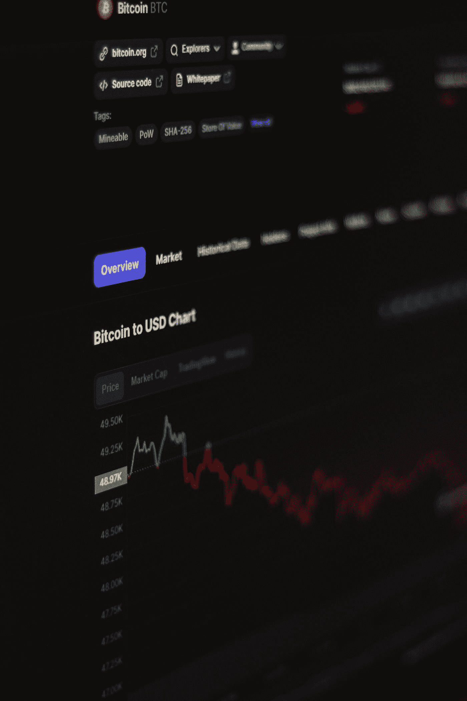
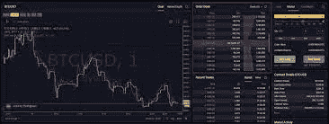
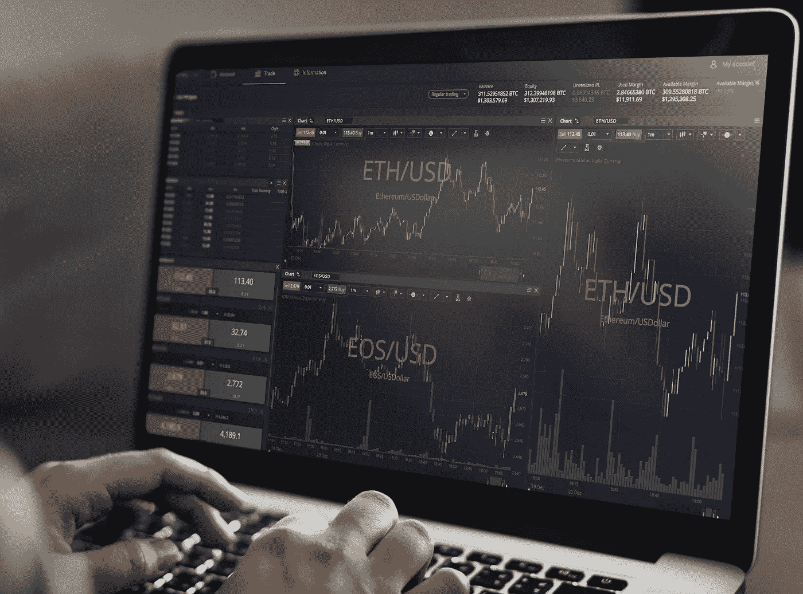

# 你应该知道的关于订单簿的信息”

> 原文：<https://medium.com/coinmonks/what-you-should-know-about-the-order-book-221d2053b6be?source=collection_archive---------44----------------------->

作为一名加密交易员或真正对加密货币感兴趣的人，你应该或一定听说过“订单簿”

也许你已经在想，这是那种 Satoshi 的妈妈会用来记录她美味的复活节煎饼的所有订单的书，或者只是一本随机的书，记录所有薯条的早晨订单！这就是了

先生们或女士们，您好！我是 Emmanuel，我刚刚开始围绕分散金融空间写一些随机的东西，在我继续之前，我希望你尽可能多地给这篇文章鼓掌，并发表评论，当然还有关注，这将大大有助于我找到我们家所有的勺子都跑到哪里去了，我很确定你也想知道，干杯！

[***Newscrypto***](https://app.newscrypto.io/register/sign-up?referral=f386fdb2)*是最大的加密教育平台之一，在这里您可以获得一流的信息，在我们继续之前，请确保您现在就查看 news Crypto！有吗？确定吗？*

行

Photo by [Behnam Norouzi](https://unsplash.com/@behy_studio?utm_source=medium&utm_medium=referral) on [Unsplash](https://unsplash.com?utm_source=medium&utm_medium=referral)

订单簿是某种投资或金融工具的购买和销售订单的分类计算机化目录。指令簿记录了在每个价格点买入或卖出的股票数量，也称为市场深度。它还确定了买卖订单背后的市场参与者。这些名单通过提供重要的交易信息，使交易者受益并提高市场透明度。
一般来说，它通过存储购买和销售订单来提供某项资产的清晰表示。使用电子订单簿的平台使用匹配引擎来自动处理和履行买卖订单，无论它们是完全还是部分履行。

订单簿包含关于某一项目的各种重要信息。首先，它有买家和卖家两部分。接下来是出价和提问部分。在这种情况下，“asks”是销售请求，而“bids”是采购订单。标书在书的左边，而问题在右边。双方都有来自众多商家的买卖价格。出价通常用绿色表示，而请求通常用红色表示。

匹配引擎使用订单簿为交易所成员执行交易，是将购买订单与销售订单匹配的机制。订单匹配系统是所有电子交易所的心脏，决定着交易所的效率和持久性。订单簿中的内容通常是相同的，但是布局可能会因平台而异。

传统上，电子交易所使用集中系统来撮合买卖订单。这仍然是促进电子贸易的最可靠的手段

买家和卖家之间的互动使用表格、线形图、条形图和其他可视化方法来描述。此外，日本蜡烛图与订单簿结合使用，以指示市场的当前和历史状况，并帮助交易者做出明智的交易决策。在大多数情况下，订单簿只包括计划使用交易商指定价格完成的订单。限价单是对某些种类的订单的称呼。市价订单是指使用当前市场价格下单的订单。订单簿的最高出价和最低要价位于顶部。买卖差价是这两个价格之间的差额。它反映了供求关系的强弱

它在纳斯达克等交易所被称为“连续账簿”。仅指定开市或闭市执行的订单单独存储。这些被称为“期初(订单)簿”和“期末(订单)簿”
例如，在纳斯达克市场开始时，开盘价和连续价格组合在一起，产生一个单一的起始价格。当市场关闭时，关闭帐簿和连续帐簿相结合，以提供一个单一的收盘价。

例如，在纳斯达克市场开盘期间，开盘价和连续账簿被组合在一起，形成一个单一的开盘价。当市场关闭时，关闭帐簿和连续帐簿结合起来，给出一个单一的收盘价。
订单簿通常由三部分组成:采购订单、销售订单和订单历史。
购买订单包括买方信息，如所有出价、他们希望购买的数量以及要价。
买入订单类似于卖出订单。
市场订单历史显示所有以前的交易。

最高出价和最低要价都在书的前面。这些指示为了执行订单必须满足的主导市场和价格。这本书经常附有一张蜡烛图，它给出了关于市场现在和以前状态的重要信息。
指令簿帮助交易者做出更明智的交易决策。他们可以识别哪些券商在买卖股票，并确定市场波动是由普通投资者还是机构推动的。订单簿还显示订单不平衡，这可能为股票在非常短的时间内的轨迹提供信号

例如，购买订单与销售订单之间的严重不平衡可能表明，由于购买压力，股票将上涨。交易者也可以使用指令簿来帮助他们识别股票可能的支撑位和阻力位。大订单集中在某一价格可能表示支撑位，而卖单集中在某一价格或其附近可能表示阻力位。

订单簿对交易者来说是必不可少的，因为它们有助于评估不同价位的买卖双方的兴趣。该信息可用于确定支持和反对的可能程度。订单簿中买方或卖方订单的不平衡可能预示着市场可能的方向。例如，在给定水平附近的大量采购订单可能暗示一定程度的支持。与此同时，大量的卖单可能意味着一个阻力区。当然，它们本身既不是买卖指示。利用各种分析来寻找确认通常是个好主意。一些被称为暗池的交易所包含不向公众开放的订单簿。

几乎每个交易所都使用订单簿来列出股票、债券、货币和比特币等加密货币等各种资产的订单。这些订单本质上可以是人工的或计算机化的。虽然它们通常提供相同的信息，但布局可能会因来源不同而有很大差异。买卖信息可能显示在屏幕的顶部和底部，以及左侧和右侧。
一家公司从其客户群收到的订单记录通常被称为订单簿。
动态订单簿是全天定期实时更新的订单簿

尽管订单簿旨在向市场参与者开放，但清单中遗漏了一些数据。其中有“黑暗池塘”这些是由重要的参与者维护的隐藏订单，他们不希望他们的交易意图被其他人知道。

如果暗池不存在，交易所的价格将大幅贬值。当一家大型机构的巨额交易在交易完成前公之于众时，证券价格通常会下跌。但如果交易发生后再进行公示，市场效应可能会大打折扣。

因为没有办法知道订单簿上的订单是否反映了股票的真实供求，暗池的存在在一定程度上降低了订单簿的价值。

**订单示例**

订单簿继续为交易者收集越来越多的信息，以换取费用。纳斯达克 TotalView 承诺提供比任何其他书籍更多的市场信息，展示了其先前 2 级市场深度产品 20 多倍的流动性。

虽然这些额外的信息对于典型的投资者来说可能无关紧要，但是对于日间交易者和有经验的市场专业人士来说可能是有益的，他们依赖于指令簿来做出交易选择。

你可以在[新闻加密](https://app.newscrypto.io/register/sign-up?referral=f386fdb2)中获得更多这些

尝试最快的无感觉加密交易[在这里](https://nanswap.com/?ref=12268ZWPX3ZD)

跟随[同道僧侣队](https://medium.com/u/7fd682ed116d?source=post_page-----221d2053b6be--------------------------------)

> 加入 Coinmonks [电报频道](https://t.me/coincodecap)和 [Youtube 频道](https://www.youtube.com/c/coinmonks/videos)了解加密交易和投资

# 另外，阅读

*   [3 商业评论](/coinmonks/3commas-review-an-excellent-crypto-trading-bot-2020-1313a58bec92) | [Pionex 评论](https://coincodecap.com/pionex-review-exchange-with-crypto-trading-bot) | [Coinrule 评论](/coinmonks/coinrule-review-2021-a-beginner-friendly-crypto-trading-bot-daf0504848ba)
*   [莱杰 vs n rave](/coinmonks/ledger-vs-ngrave-zero-7e40f0c1d694)|[莱杰 nano s vs x](/coinmonks/ledger-nano-s-vs-x-battery-hardware-price-storage-59a6663fe3b0) | [币安评论](/coinmonks/binance-review-ee10d3bf3b6e)
*   [Bybit Exchange 评论](/coinmonks/bybit-exchange-review-dbd570019b71) | [Bityard 评论](https://coincodecap.com/bityard-reivew) | [Jet-Bot 评论](https://coincodecap.com/jet-bot-review)
*   [3 commas vs crypto hopper](/coinmonks/3commas-vs-pionex-vs-cryptohopper-best-crypto-bot-6a98d2baa203)|[赚取秘密利息](/coinmonks/earn-crypto-interest-b10b810fdda3)
*   最好的比特币[硬件钱包](/coinmonks/hardware-wallets-dfa1211730c6) | [BitBox02 回顾](/coinmonks/bitbox02-review-your-swiss-bitcoin-hardware-wallet-c36c88fff29)