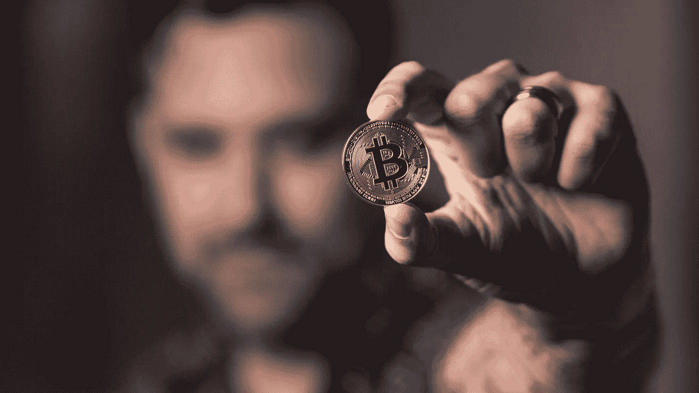
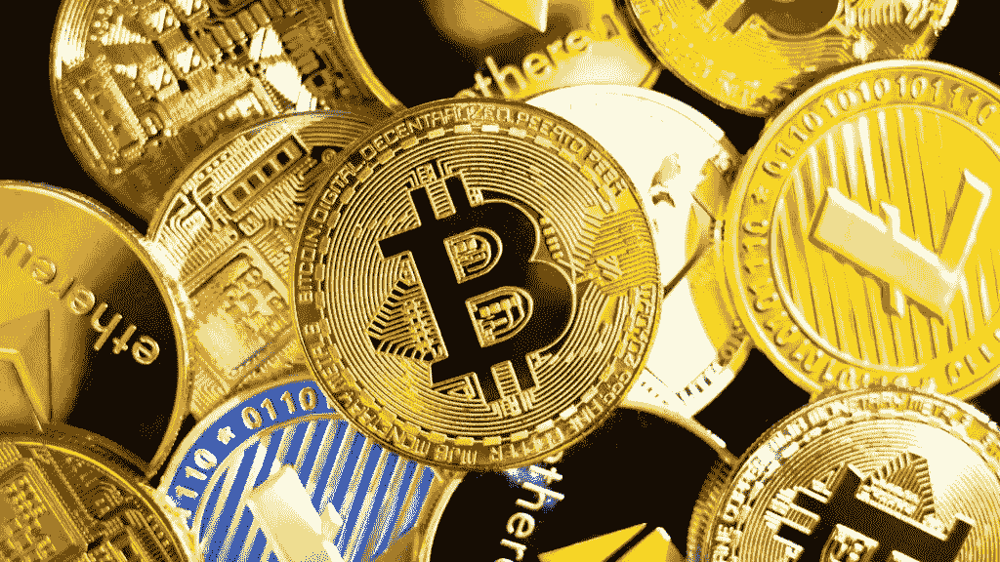

# 在接受加密货币支付之前，你的品牌应该知道什么

> 原文：<https://medium.com/coinmonks/what-your-brand-should-know-before-accepting-cryptocurrency-payments-8aa0a1576468?source=collection_archive---------81----------------------->

加密货币正在成为今天的头条新闻，为什么不呢？这是世界处理金融方式的创新。

加密货币是一种广泛依赖于点对点区块链技术的数字交易媒介，这种技术在本质上是安全和分散的。大多数政府机构不支持它，因此转移资金是在没有第三方干预的情况下完成的。

尽管如此，在 [**加密货币和 NFTs 转移到主流市场**](https://blog.atisfyreach.com/top-nft-stats-trends-brands-need-to-know/) 后，许多商家考虑在其网站上接受加密货币支付。虽然这取决于你是否考虑这种数字货币，但熟悉正确的设置是至关重要的。

# 你的品牌应该考虑接受加密货币支付吗？

加密货币的狂热正在高涨。那么，你应该接受加密货币支付吗，因为它们非常受欢迎？在某种程度上，这个问题是非常固执己见的，考虑到市场领导者正在贬低它，而其他人正在使它值得称赞。

如今，加密货币处于技术前沿。它还能激发已经在使用它的客户的兴趣，而且它还能降低欺诈风险。尽管所有这些特性对你的品牌都至关重要，但选择它就足够了吗？在考虑选择加密支付之前——考虑技术和实用场景。

# 接受加密货币支付的好处

接受 [**加密货币和 NFT 支付**](https://blog.atisfyreach.com/smart-guide-to-nft-influencer-marketing/) **s** 比传统的销售点(POS)系统有几个主要优势:

1.  **支付更低的费用:**商家必须为很多支付处理器支付交易费用和设置费用。即使是小企业最终也要为每次刷卡支付大约 25 美分，外加交易总额的 2%到 4%给信用卡公司(这笔费用可能会增加更多)。加密货币收取的费用更低，事实上，一些比特币交易所提供的价格低于 1%。
2.  **更好的支付安全性:**小型企业经常成为欺诈交易的目标。疫情时代信用卡诈骗激增，许多小品牌成为受害者。Crypto 的分散式网络比信用卡支付更安全，因为没有第三方验证。
3.  **促进销售:**面向您企业的加密货币支付为全球受众打开了大门。由于加密货币被全球接受，经常因为支付问题而拒绝购买的国际买家现在可以访问产品和服务。
4.  **客户便利:**与金融打交道总是与安全联系在一起，但加密货币为客户的信息形成了额外的一层保护。它给买家带来信任和便利感。

# 接受加密货币支付的缺点

加密货币爱好者欣赏这种货币，但一些风险伴随着好处。接受加密货币作为品牌付款的缺点是:

1.  **技术挑战:**接受加密货币支付需要设置一个加密钱包，这本身在技术上可能会让你望而却步。加密货币信息丰富，学习曲线陡峭。因此，它限制了你只关注业务增长。
2.  **波动性:**比特币等加密货币波动性很大。这些年来，价格经历了多次大起大落。这可能是另一个不断上升的担忧，使其价值高度不可预测。
3.  **安全性:**加密货币因其安全产品和额外的安全层而得到保证，免受网络威胁，如被盗的信用卡号码。但这种数字货币仍然不能 100%安全地抵御网络安全威胁。它很容易受到黑客的攻击，而且在任何情况下，都没有权力来处理这件事。原因是加密货币独立运作，没有法律机构的支持。
4.  **监管风险:**接受加密货币的另一个缺点是监管格局可能会很快改变。针对立法者的修正案和法规的出台已经取得了进展。对于任何新的法律，你都需要相应地制定你的商业策略。

# 你怎么能接受比特币加密货币支付？

加密货币是为新世界设计的。它不涉及接受加密货币的繁琐过程。你所需要的是一些基本的东西，这些应该足以让你开始:

# 1.加密钱包

加密钱包是一种数字钱包，用于持有、出售、购买不同的加密货币，如比特币、以太坊、Dogecoin 等。它保存您的私人密钥，以保持加密的安全性和可访问性。钱包保存着你的私人密钥——也就是访问加密货币的密码。加密钱包有几种形式，从硬件钱包(u 盘)到手机应用程序(比特币基地)，功能就像信用卡一样简单。

当有人从你的网站上购买商品时，钱会被过滤成加密专用，但是你可以把它兑换成你喜欢的货币。

# 2.良好的沟通

加入加密货币支付可能需要与受众进行良好的沟通。当添加像比特币这样的加密技术作为一种新的支付方式来实现透明时，你应该向你的观众解释价值主张。你的观众必须同样了解这种新的支付方式对他们的好处。

良好的沟通也展示了你的**品牌形象。开放的沟通也是看到结果的关键，这将推动更多消费者通过比特币支付。**

# **3.平台和集成**

**接收加密货币支付与建立一个让你的业务运行的平台有很大关系。整合您的加密支付主要取决于您的网站托管的平台。**

**例如，Shopify 加密货币支付可以更方便地使用 300 多种数字货币。你可以在 Shopify、WooCommerce (WordPress)和 Magenta 等主流平台上使用不同的插件来快速设置。如果没有插件符合你的网站需求，有潜在的替代品，如比特币支付工具、支付按钮、自定义集成和发票。**

**大多数情况下，插件作为一个网站解决方案无缝工作。但是，get assured crypto 使金融交易无需中介。客户可以随时联系您获取比特币支付选项。**

# **4.加密支付处理器**

**考虑不同的加密支付处理器，为您的客户提供最大价值。当您接受加密货币支付时，评估选项并选择最适合您业务的选项总是好的。**

**考虑加密货币支付处理器时要注意什么:**

*   ****交易费用** —比特币交易费用相对于传统货币来说比较低，但是到底有多低呢？你需要寻找合适的交易，以确定每笔交易收取多少费用。**
*   **支付频率——最终，你会希望你的支付以传统货币兑现。因此，为了确保你的钱快速进入，你需要识别支付频率，当它反映在你的加密钱包。一些加密支付处理器产生每日支付。其他人需要 3-4 天的时间。作为企业主，您必须考虑这一点来选择处理器。**
*   ****支持的国家** —您应该选择一种能够利用与您有业务往来的国家的加密处理器。加密货币仍然是一个敏感的话题(没有权威机构的支持)，并不是每个国家都对其使用开放。每个国家都有自己的规则，你应该保持警惕。**
*   ****客户支持** —技术和客户支持应该非常熟悉。拥有运行良好的客户支持是一种全新的、技术上更加一致的加密货币的理想选择。客户支持在你被困的地方为企业提供安全的指导。因此，加密支付处理器应该支持良好的客户支持。**
*   ****安全** —您对您的客户和业务的交易安全负责。因此，寻找一个支付处理器，认真考虑保护和定期进行网站维护。您还应该确保安装定期更新，并定期对您的钱包进行加密备份。**

****

# **底线:为你的企业接受加密货币支付**

**加密货币市场的巨大增长表明，您的企业应该接受加密货币支付。但是和市场上的每一个新产品一样(crypto 是巨大的)，也有相关的担忧和风险。但是，你不能完全忽略缺点。最佳实践是想象它能带来的增长，然后接受加密支付。**

**使用正确的插件，定期帮助，并选择最好的加密货币支付处理器，你可以航行通过它。简而言之，你不必担心波动性，并为你的客户提供他们应得的价值。**

**虽然您接受加密货币支付，但请放心，它可以帮助提升您的品牌形象，增加您的全球销售额。当你考虑加入加密支付时，让 Atisfyreach 的基于人工智能的影响者营销平台做些跑腿的工作，寻找和管理在该领域是专家的影响者。**

**[今天就在 atisfyreach 注册您的兴趣](https://atisfyreach.com/)！**

> **加入 Coinmonks [电报频道](https://t.me/coincodecap)和 [Youtube 频道](https://www.youtube.com/c/coinmonks/videos)了解加密交易和投资**

# **另外，阅读**

*   **[百无聊赖的猿游艇俱乐部(BAYC)评论](https://coincodecap.com/bored-ape-yacht-club-bayc-review)**
*   **[5 款最佳加密交易终端](https://coincodecap.com/crypto-trading-terminals) | [最佳 DeFi 应用](https://coincodecap.com/best-defi-apps)**
*   **[最佳网上赌场](https://coincodecap.com/best-online-casinos) | [币安评论](/coinmonks/binance-review-ee10d3bf3b6e) | [BitMEX 评论](https://coincodecap.com/bitmex-review)**
*   **[麻雀交换评论](https://coincodecap.com/sparrow-exchange-review) | [纳什交换评论](https://coincodecap.com/nash-exchange-review)**
*   **[美国最佳加密交易机器人](https://coincodecap.com/crypto-trading-bots-in-the-us) | [经常性回顾](https://coincodecap.com/changelly-review)**
*   **[在印度利用加密套利赚取被动收入](https://coincodecap.com/crypto-arbitrage-in-india)**