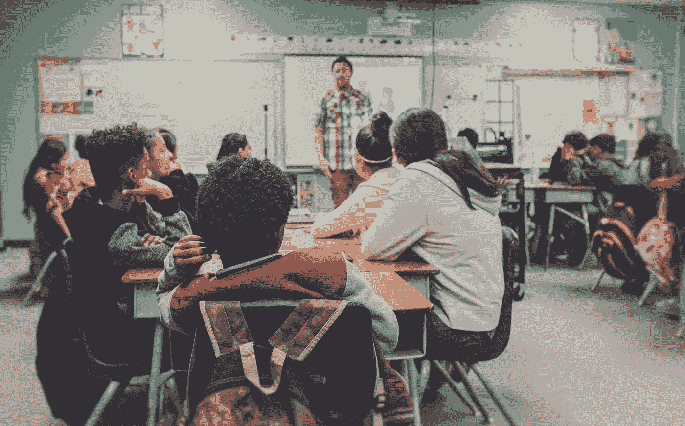

# 相信孩子是我们的未来发生了什么…相反，人类试图通过代码创造生命

> 原文：<https://medium.com/coinmonks/whatever-happened-to-believing-that-the-children-are-our-future-instead-humans-try-to-create-life-dc3574e40958?source=collection_archive---------64----------------------->

source: [Kenny Eliason](https://unsplash.com/@neonbrand)

## 复杂到无法衡量——数字进化

我们生活在破坏性的黎明。我们生活的几乎每个方面都被数字化了。俗话说“神说，要有生命！”…而生活…嗯，变成了！至少俗话是这样说的…