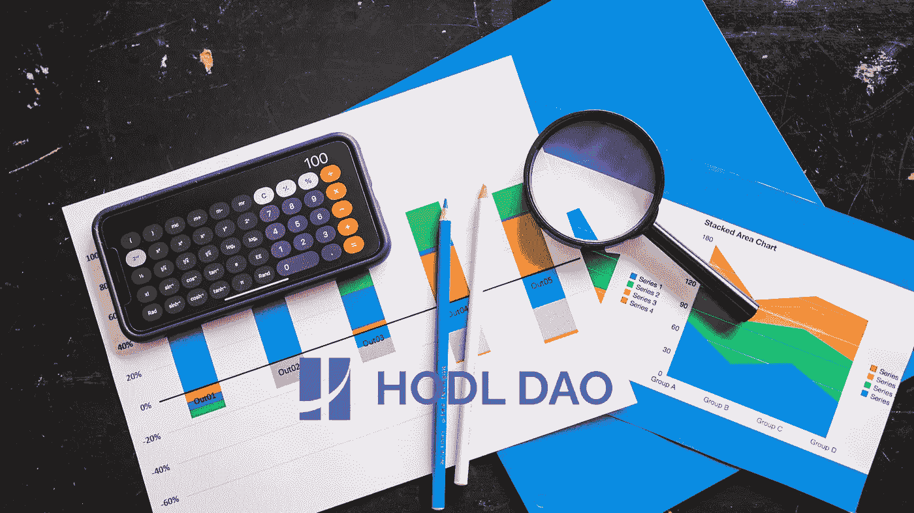

# 什么是前邦德和创世纪

> 原文：<https://medium.com/coinmonks/whatre-pre-bond-and-genesis-4552ecb0d16b?source=collection_archive---------39----------------------->

在 [Genesis](https://thehodl.org/) 中，你可以选择高达 50%的资金进入预债券。预结合和创世纪(非预结合部分)之间有一些主要区别:

1.  *从 Pre-Bond 获得的 BTCH 在 7 天后释放，而从 Genesis 获得的 BTCH 在 180 天内线性释放(10%可在正式开始时申领)。*
2.  *从 Genesis 获得的 BTCH 没有折扣，而从 pre-bond 获得的 BTCH 可能有折扣，如果 Pre-Bond 部分低于总存款的 50%。*
3.  *然而，在协议正式启动后的 180 天内，Genesis part 将获得所有 BTCH 的额外 30%发送到奖励池，这将在债券出售和再平衡时发生，在 Genesis pool 中按比例分配。*

## 我们举个例子。

如果爱丽丝和鲍勃都在创世纪阶段存入 100K USDC，爱丽丝选择 0%进入预绑定，鲍勃选择 50%进入预绑定。起拍价为每个 BTCH 4 USDC，因此爱丽丝第一天将获得 2500，180 天获得 22500 BTCH，鲍勃第一天将获得 1250 BTCH(创世纪部分的 10%，50000 / 4 * 10%)，7 天后获得 13889 BTCH(所有预绑定部分，10%折扣)，180 天获得 11250 BTCH(创世纪部分的 90%，50000 / 4 * 90%)。

在接下来的 180 天里，假设每天从债券销售中购买的 BTCH 为 2K USDC，如果价格不变，则为 526 BTCH，如果有 95%的折扣(2000 / 4 / 95%)，则 526 * 30% = 158 BTCH 将每天奖励给 Genesis 参与者。由于爱丽丝的 100K USDC 是不选择预绑定的创世纪参与者总数的 2/3(爱丽丝的 100K 加上鲍勃的 50K)，那么她每天将获得 158 * 2/3 = 105.33 BTCH，180 天共计 105.33 * 180 = 18960 BTCH。另一方面，Bob 也会每天得到 158 * 1/3 = 52.67 BTCH，180 天得到 9480 BTCH。

在这一点上，爱丽丝似乎比鲍勃获得了更高的回报。但不要忘记赌注回报。假设两人都在每日申领 BTCH，并将其放入赌注池，假设赌注池提供 200%的年回报率。不计算化合物，爱丽丝将获得 2500 * 200%/2+22500/2 * 200%/2+18960/2 * 200%/2 = 23230 BTCH 作为赌注奖励，鲍勃将获得 1250 * 200%/2+13889 * 200%/2+11250/2 * 200%/2+9480/2 * 200%/2 = 25504 BTCH

所以，180 天后，爱丽丝将持有 2500+22500+18960+23230 = 67190 BTCH，鲍勃将持有 1250+13889+11250+9480+25504 = 61373 BTCH。

从长期持有人的角度来看，Alice 不选择预绑定，表现优于 Bob。然而，市场总是变化的，因为 Bob 在 180 天的大部分时间里持有更多的流动性 BTCH，他可以在高位卖出 BTCH，在低位买入 BTCH，以作为交易者或套利者获得更多收益。

## 最后

**最后两天加入** [**Hodl 刀**](https://thehodl.org/) **创世纪，走吧~**

如需了解更多信息，请随时联系我们的团队

网站:thehodl.org

推特:@dao_hodl

电子邮件:team@thehodl.org

> 加入 Coinmonks [电报频道](https://t.me/coincodecap)和 [Youtube 频道](https://www.youtube.com/c/coinmonks/videos)了解加密交易和投资

# 另外，阅读

*   [BigONE 交易所评论](/coinmonks/bigone-exchange-review-64705d85a1d4) | [电网交易机器人](https://coincodecap.com/grid-trading)
*   [氹欞侊贸易评论](https://coincodecap.com/anny-trade-review) | [CoinSpot 评论](https://coincodecap.com/coinspot-review)
*   [新加坡十大最佳加密交易所](https://coincodecap.com/crypto-exchange-in-singapore) | [购买 AXS](https://coincodecap.com/buy-axs-token)
*   [投资印度的最佳加密软件](https://coincodecap.com/best-crypto-to-invest-in-india-in-2021) | [WazirX P2P](https://coincodecap.com/wazirx-p2p)
*   [7 个最佳零费用加密交易平台](https://coincodecap.com/zero-fee-crypto-exchanges)