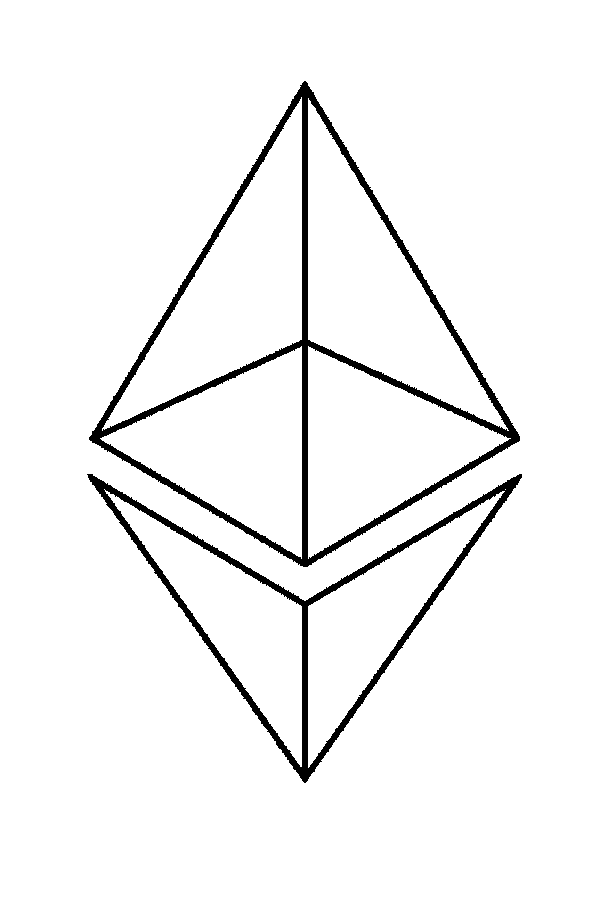

# 以太坊 Dapps 是什么，能做什么？

> 原文：<https://medium.com/coinmonks/whats-an-ethereum-dapp-111fea7648f2?source=collection_archive---------66----------------------->

Image by [Mike Ljung](https://pixabay.com/users/lbokel-300818/?utm_source=link-attribution&utm_medium=referral&utm_campaign=image&utm_content=2458552) from [Pixabay](https://pixabay.com//?utm_source=link-attribution&utm_medium=referral&utm_campaign=image&utm_content=2458552)

Dapp 是一种促进加密货币转移的应用程序。发音为“dee app”，该术语表示一种分散的应用程序，它不依赖于大型集中式服务器进行加密货币或信息交换。这里有更多关于 Dapp 的信息，如何在以太坊的加密货币网络上使用它们，以及正在开发的未来增强功能，以提高 Dapp 的可扩展性。

Dapps 符合严格的标准

Dapps 是支持所有类型的加密货币交换的平台。要被视为 Dapp，应用程序必须满足以下标准:

利用区块链算法技术

完全分散

通过开源编程提供透明度

包括内置的共识机制

用数字资产奖励激励加密矿工

生成自己的数字资产

创建基于以太坊的 Dapps 的程序员、编码员和开发人员必须对用于验证区块链的算法达成一致。用于加密货币交换(包括以太坊和比特币)的加密算法被称为工作验证。

Dapps 实现的不仅仅是购买和销售

现有的或正在为以太网创建的各种 Dapps 比简单的资金转移应用程序更加复杂。Dapps 在加密货币网络中扮演着各种角色，不仅旨在分散应用程序，还旨在强调安全性、缺乏审查、平等使用和透明度。

Dapps 执行以下在线角色:

资产管理

加密借贷

资源规划

投资

预测市场趋势和未来事件

建立和管理自治组织

游戏

雇佣自由职业者或寻找自由职业者

存储加密货币

存储和转移记录和文件

保护用户免受身份盗窃和其他形式的欺诈

使用智能合约平台，基于以太坊的 Dapps 不仅仅能够提供一种更安全的交换加密货币的方式。

Dapps 正在发展，变得更加可扩展

基于以太坊的 Dapps 的一个缺点是它们有限的可扩展性。为了提供用户使用区块链验证所需的分散性和安全性，Dapp 平台开发人员不得不将可伸缩性放在次要位置。

区块链是按时间顺序排列的关于相互连接的密码交换机的数据集合。可以添加区块链中的信息，但不能编辑或移除区块链中的过去信息。区块链验证的这一特性使得加密货币平台透明且安全，不会被篡改。

然而，基于以太坊的 Dapps 的可伸缩性是具有挑战性的，因为以太坊网络上的每个节点(验证计算机)都接收它自己的所有区块链智能合约的副本。随着如此多的数据从一台计算机传输到另一台计算机，随着越来越多的用户参与以太坊交换，验证以太坊网络上的交易的过程会变得非常麻烦。

通过一个称为分片的过程，区块链网络被分割成多个分区。分区(称为碎片)被分配给选定的节点进行验证，而不是将整个区块链发送给所有节点进行智能合约确认。区块链链验证的这种分割优化了区块链交易的验证时间。

不断增长的以太坊网络需要巨大的区块链能力来支持数百万未来用户的 Dapps。有了分片过程的天才(以及解决以太坊验证可伸缩性的其他解决方案)，以太坊 Dapps 的容量和速度只会提高。期待更多可扩展的验证方法，以促进未来快速的加密货币交换和信息传输。

有许多在线资源可以用来了解更多关于以太坊网络上运行的成功 Dapps 的信息。亲自调查各种 Dapps，了解互联网上基于以太坊的平台的巨大范围和潜力。

> 加入 Coinmonks [电报频道](https://t.me/coincodecap)和 [Youtube 频道](https://www.youtube.com/c/coinmonks/videos)了解加密交易和投资

# 另外，阅读

*   [Bookmap 点评](https://coincodecap.com/bookmap-review-2021-best-trading-software) | [美国 5 大最佳加密交易所](https://coincodecap.com/crypto-exchange-usa)
*   [如何在 FTX 交易所交易期货](https://coincodecap.com/ftx-futures-trading) | [OKEx vs 币安](https://coincodecap.com/okex-vs-binance)
*   [CoinLoan 审查](https://coincodecap.com/coinloan-review) | [YouHodler 审查](/coinmonks/youhodler-4-easy-ways-to-make-money-98969b9689f2) | [BlockFi 审查](https://coincodecap.com/blockfi-review)
*   XT.COM 评论[币安评论](https://coincodecap.com/profittradingapp-for-binance) |
*   [SmithBot 评论](https://coincodecap.com/smithbot-review) | [4 款最佳免费开源交易机器人](https://coincodecap.com/free-open-source-trading-bots)